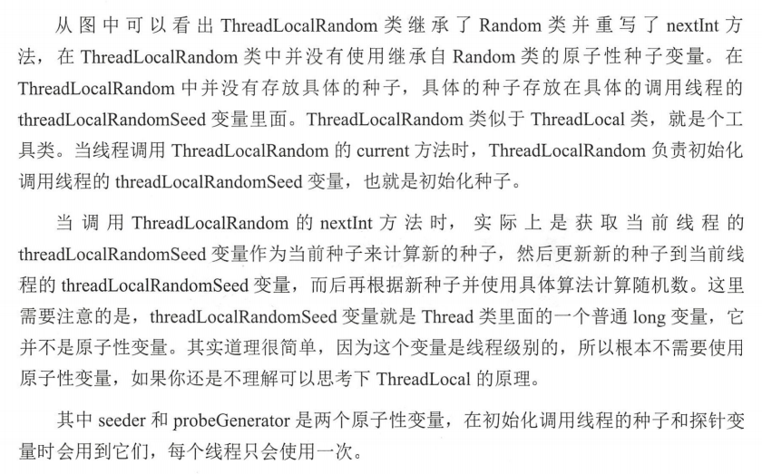
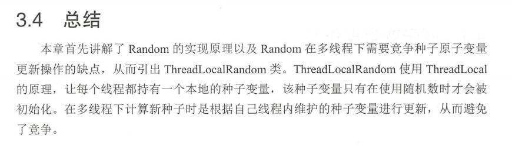
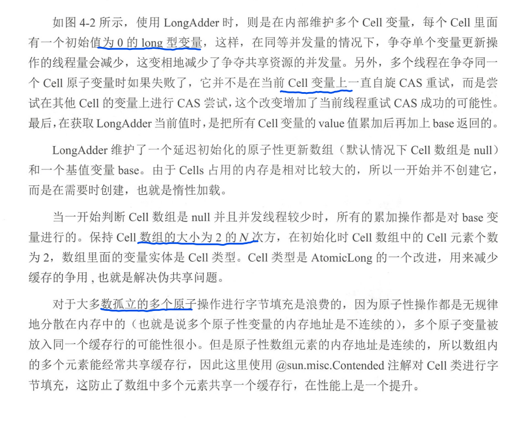
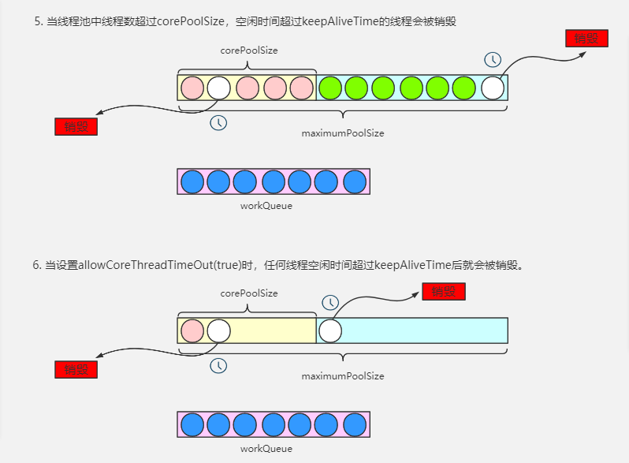

# 第一章 并发编程线程基础

## 并发编程线程基础

### 1.1什么是线程？

​	首先明确什么是进程，进程是系统进行资源分配和调度的基本单位，线程是进程的一个执行路径，一个进程至少有一个线程，进程中多个线程共享进程的资源。

操作系统在分配资源 是把资源分配给进程的， 但是CPU资源它是被分配到线程的。因为真正要占用CPU运行的是线程,所以也说线程是CPU分配的基本单位。

在Java 中，当我 启动 main 函数 其实就启动了一个JVM进程， main 函数在的线程就是这个进程中的一个线程，也称主线程。

> 一个进程中有多个线程，多个线程共享进程的堆和方法区资源， 但是每个线程有自己的程序计数器和栈区域。
>
> 程序计数器是一块内存区域，用来记录线程当前要执行的指令地址。*线程是占用 CPU 执行的基本单位，而 CPU 般是使用时间片轮转方式让线程轮询占用的，所以当前线程 CPU 时间片用完后，要让出 CPU ，等下次轮到 己的时候再执行,那么如何知道之前程序执行到哪 了呢？其实程 计数器就是为了记录该线程让出 CPU 时的执行地址的，待再次分配到时间片时线程就可 以从自己私有的计数器指定地址继续执行。 另外需要注意的是，如果执行的是 native 方法， 那么 pc 计数器记的是 undefined 地址，只有执行的是 Java 代码时 pc 计数器记录的才是 下一条指令的地址。*
>
> 每个线程都有自己的栈资源，用来存储线程的局部变量，这些局部变量是线程私有的，其他线程访问不了，此外，栈还用来存放线程调用的栈帧。
>
> 堆是进程中最大的一块内存，是多个线程共享的。是进程创建时创建的，存放new操作创建的对象实例。
>
> 方法区则是用来存放JVM加载的类、常量、以及静态变量等信息，是线程共享的。


# 第二章 并发编程其他的知识

## 2.1

## 2.2

## 2.3

## 2.4

## 2.5

## 2.6

## 2.7

## 2.8 Java中的CAS

背景：锁在并发处理中占据了一席之地，解决了可见性、原子性相关问题。但是，锁有一个很不好的地方，就是没有获取到锁的线程会被挂起，线程上下文的切换开销其实很大。Java提供了非阻塞的Volatile关键字解决共享变量的可见性问题，但是原子性问题并没有得到解决。

什么是CAS,即compare and swap 比较与交换，是jdk提供的非阻塞的原子操作，它通过 硬件保证了比较-交换的原子性。CAS底层依赖的是Unsafe类，它提供了很多compareAndSwap*的方法，以compareAndSwapLong为例，简单对其进行介绍。
compareAndSwapLong（Object obj,long valueOffset,long expect,long update）

第一个参数：obj  代表对象地址

第二个参数： valueOffset 对象中的变量偏移量

第三个参数：expect 要修改变量的预期值

第四个参数：update 要更新成的最终值

其操作的含义：如果对象obj内存地址偏移量为valueOffset的变量值为expect，则用新的值update更新替换旧的值expect。


什么是ABA问题？

产生的原因：变量的状态产生了环形转换。JDK中的AtomicStampedReference类给每个变量的状态值都配备了一个时间戳，从而避免了ABA问题的产生。


## 2.9

## 2.10

## 2.11  伪共享

### 2.11.1 什么是伪共享

把书上的话，转化成自己的话，这个知识才是真正理解了，被吸收了。

为了减少CPU与主内存之间的速度差问题，通常在CPU和主内存之间会添加一个或者多个Cache。cache一般是集成到CPU内部的，一般也叫CPU cache，

当CPU访问变量时，首先会去Cache中查看有没有，有的话直接获取，没有就会到主内存中查询，然后将指定变量所在内存区域一个Cache行的数据都复制到CPU Cache中。由于复制的是一个Cache行，而不是一个变量，这个Cache行可能包含多个变量。如果多个线程同时修改一个缓存行中的变量，由于同时只能有一个线程可以修改缓存行的数据，相对不同的变量放在不同的缓存行，性能是有所下降的，这就是伪共享。

### 2.11.2 伪共享是怎么出现的

伪共享是因为多个变量放到了同一个缓存行中，并且多个线程去访问缓存行中的多个变量。

```java
package chapter1;

import org.junit.Test;

/**
 * 伪共享
 *  数组内元素的内存地址是连续的，当访问第一元素时，后面的若干个元素也会被加载到cache行
 *  在顺序访问元素时，直接在cache行中命中，无需到主内存中读取。这就是为什么顺序访问数组
 *  中的元素速度要比跳跃式的访问速度快的原因。
 */
public class FalseSharing_ {
    private int X_MAX = 1024;
    private int J_MAX = 1024;

    @Test
    public void method() {
        long[][] array = new long[X_MAX][J_MAX];
        final long l = System.currentTimeMillis();
        for (int i = 0; i < X_MAX; i++) {
            for (int j = 0; j < J_MAX; j++) {
                array[i][j] = i * 2 + j;
            }
        }
        System.out.println(System.currentTimeMillis() -l);
    }

    @Test
    public void method2() {
        long[][] array = new long[X_MAX][J_MAX];
        final long l = System.currentTimeMillis();
        for (int i = 0; i < X_MAX; i++) {
            for (int j = 0; j < J_MAX; j++) {
                array[j][i] = i * 2 + j;
            }
        }
        System.out.println(System.currentTimeMillis() -l);
    }
}
```

### 2.11.2如何解决 伪共享问题

#### 方式一  字节填充

```java
public static class FilledLong{
    private long value;
    private long a1,a2,a3,a4,a5,a6
}
```

假设缓存行的大小是64字节，value为long型占8个字节，其余a1到a6占用4字节，由于FilledLong是一个对象，对象头占用8字节，一共是8+48+8=64字节，刚好可以放一个缓存行。

#### 方式二 使用sun.misc.Contented注解

jdk8提供了一个sun.misc.Contented注解，来解决伪共享问题。

```java
@sun.misc.Contented
public static class FilledLong{
    private long value;
}
```

@Contented注解除了可以修饰类以外还可以修饰字段，在Thread类中有三个字段就使用了这个注解解决伪共享问题。

## 2.12 锁的概述

### 2.12.1  乐观锁和悲观锁

悲观锁指对数据被外界修改持保守的态度，认为数据很容易会被其他线程修改，所以在处理数据前，先对数据加锁，整个数据处理过程中，是数据处于锁定状态。


乐观锁是相对悲观锁来说的，它认为数据在一般情况下不会造成冲突，所以在访问数据前不会加锁，而是在数据正式更新是进行冲突检测。具体怎么做，根据update返回的行数，让用户决定如何处理。


**乐观锁并不会使用数据库提供的锁机制，一般在 表中添加version 字段 者使用业务状态来实现乐观锁，直到提交时才锁定，所以不会产生任何死锁。**

### 2.12.2 公平锁与非公平锁

根据线程获取锁的抢占机制，锁可以分为公平锁和非公平锁，公平锁表示线程获取锁的顺序是按照线程的请求锁的时间早晚来决定的，先到先得。非公平锁不遵循先到先得的规律，随机抢占锁。

在没有公平性需求的前提下，尽量使用非公平锁，因为公平锁会带来额外的性能开销。

### 2.12.3 独占锁与共享锁

根据锁只能被一个线程持有还是多个线程持有，锁可以分为独占锁和共享锁。

独占锁任何时候都只有一个线程持有锁，ReentrantLock就是以独占锁的方式实现的。共享锁则是同时可以由多个线程持有，ReadWriteLock 读写锁，它允许多个线程同时进行读操作。

独占锁是一种悲观锁，每次访问资源都先加上互斥锁，这限制了并发性，因为读操作并不会影响到数据一致性，而独占锁同一时间只允许一个线程读取数据，其它线程必须等待当前线程释放锁才能读取数据。

共享锁是一种乐观锁，他放宽了加锁的条件，运行多个线程同时进行读操作。

### 2.12.4  可重入锁

当一个线程尝试获取其它线程持有的独占锁时，该线程会被阻塞，那么如果该线程再次获取自己已经获取到的锁是否会被阻塞呢？如果不被阻塞，我们就说这个锁是可重入的。

实际上synchronized就是可重入锁。可重入锁原理，是在锁的内部维护了一个线程标识，用来标志锁被那个线程占有，然后关联一个计数器。一开始，计数器等于0，说明锁没有被任何线程持有。当一个线程持有该锁时，计数器会变成1，这时候，其他线程如果再来获取锁，发现锁的持有者不是自己，就会被阻塞挂起。但是当获取了锁的线程再次获取锁时，发现锁的持有者就是自己，就会把计数器+1，当锁释放后计数器-1。当计数器为0时，锁里的线程标识被重置为null，这个时候被阻塞的线程就会被唤醒来竞争获取该锁。

### 2.12.5 自旋锁

java中的线程和操作系统中的线程是一一对应的，当一个线程在获取锁失败后，会被切换到内核态挂起。当该线程获取到锁时，又要切换成用户态而唤醒该线程。从用户态到内核态的切换开销是很大的，在一定程度上影响并并发性能。自旋锁则是：当前线程获取锁时，如果发现锁已经被其他线程持有，它不会立马阻塞自己，在不放弃CPU使用权的情况下，多次尝试获取（默认是10次，可以使用-XX:PreBlockSpinsh）,很有可能在后面的几次尝试中其它线程已经释放了该锁。如果尝试指定次数后，仍然没有获取到锁，当前线程才会被挂起。由此，也可以看出，自旋锁，是使用CPU时间换取线程阻塞与调度的开销，但是很有可能CPU时间白白浪费了。


# 第三章 Java并发包ThreadLocalRandom原理解析

ThreadLocalRandom是JDK7在JUC包中新增的随机数生成器，它弥补了Random类在多线程场景下的缺陷。这章主要研究ThreadLocalRandom的原理。

## 3.1 Random类局限性

Random是Java中使用比较广泛的随机数生成器，java.lang.Math中的随机数也是使用了java.util.Random的实例。

下面图片里是获取int类型随机数的实现步骤：


步骤（4）可以抽象成 newSeed =  f(oldSeed)  = a* oldSeed+ b，步骤（5）可以抽象成 random = g(newSeed,bound) = (bound * newSeed)>>31。单线程场景下，上面的逻辑是没有问题的，但是多线程下，可能多个线程都走到了步骤（4），每个线程拿到的老种子都相同，由于根据老种子获取新种子的算法是一样的，这样就会导致生成的新的种子也是一样的，由于步骤（5）的算法也是固定的，这就导致多个线程产生相同的随机值，这不是我们想要的，我们希望，多个线程根据同一个老种子计算新种子时，第一个线程计算出新种子或，第二个线程用刚刚计算出来的新种子作为老种子计算新的种子。Random函数使用了原子变量达到这个效果。

```java
protected int next(int bits) {
    long oldseed, nextseed;
    AtomicLong seed = this.seed;
    do {
        //---(1) 获取老种子
        oldseed = seed.get();
        //---(2) 根据老种子获取新种子
        nextseed = (oldseed * multiplier + addend) & mask;
    } while (!seed.compareAndSet(oldseed, nextseed));
    return (int)(nextseed >>> (48 - bits));
}
```

多个线程可能同时走到步骤（2）（3），但是在走到seed.compareAndSet(oldseed, nextseed)这里时，可以保证只有一个线程更新老种子为新种子是成功的，失败线程会通过循环重新获取老种子，然后计算新种子，最后更新老种子为新种子。至此，保证了多线程场景，数据的随机性。上面原子变量的更新使用的是自旋的方式，保证同一时刻只有一个线程可以执行成功，失败的线程进行重试，这会降低并发性能，ThreadLocalRandom应用而生。

## 3.2 ThreadLocalRandom原理分析

原理图如下:


## 3.3 ThreadLocalRandom源码分析





```java

private static final Unsafe UNSAFE;
private static final long SEED;
private static final long PROBE;
private static final long SECONDARY;

static {
    try {
        //获取Unsafe实例
        UNSAFE = Unsafe.getUnsafe();
        Class var0 = Thread.class;
        //获取Thread类里面threadLocalRandomSeed变量在Thread实例里的偏移量
        SEED = UNSAFE.objectFieldOffset(var0.getDeclaredField("threadLocalRandomSeed"));
       //获取Thread类里面threadLocalRandomProbe变量在Thread实例里的偏移量
        PROBE = UNSAFE.objectFieldOffset(var0.getDeclaredField("threadLocalRandomProbe"));
        //获取Thread类里面threadLocalRandomSecondarySeed变量在Thread实例里的偏移量
        SECONDARY = UNSAFE.objectFieldOffset(var0.getDeclaredField("threadLocalRandomSecondarySeed"));
    } catch (Exception var1) {
        throw new Error(var1);
    }
}
```


## 3.4 总结




# 第四章 并发包原子类操作原理

JUC包中提供了一系列的原子性操作类，这些类都是使用非阻塞算法CAS实现的，相比于用锁实现原子性操作，性能上有很大提升。

## 4.1 原子变量操作类

JUC包中提供了很多原子变量操作类如AtomicInteger、AtomicLong、AtomicBoolean，它们的原理相似，下面主要研究AtomicLong。AtomicLong内部使用Unsafe类来实现。

```java
public final long getAndIncrement() {
    return unsafe.getAndAddLong(this, valueOffset, 1L);
}

public final long getAndDecrement() {
    return unsafe.getAndAddLong(this, valueOffset, -1L);
}

public final long getAndAdd(long delta) {
    return unsafe.getAndAddLong(this, valueOffset, delta);
}

public final long incrementAndGet() {
    return unsafe.getAndAddLong(this, valueOffset, 1L) + 1L;
}


public final long decrementAndGet() {
    return unsafe.getAndAddLong(this, valueOffset, -1L) - 1L;
}
```

看下Unsafe类

```java
public final long getAndAddLong(Object var1, long var2, long var4) {
    long var6;
    do {
        var6 = this.getLongVolatile(var1, var2);
    } while(!this.compareAndSwapLong(var1, var2, var6, var6 + var4));

    return var6;
}
```

在高并发场景下，AtomicLong还会存在一些性能问题，JDK8提供了一个在高并发场景下性能更好的LongAdder类。下面研究LongAdder类原理。

## 4.2 JDK8 新增的原子操作类LongAdder





## 4.3 LongAccumulator


# 第五章 并发包List源码剖析

## 5.1 介绍

并发包中并发list只有CopyOnWriteArrayList。CopyOnWriteArrayList是一个线程安全的list，对其的修改操作是在底层的一个复制的数组（快照）上进行的，也就是写时复制策略。


存在的问题：迭代器的弱一致性问题。


# 第六章 并发包中锁的原理剖析

## 6.1 LockSupport 工具类

LockSupport位于rt.jar包中，它主要的作用是挂起和唤醒线程，该工具类是创建锁和其他同步类的基础。LockSupport类与每个使用它的线程都会关联一个许可证，LockSupport是用Unsafe类实现的。

## 6.2 AQS

## 6.3 ReentrantLock 源码解析

研究下这个方法：大佬写的代码就是厉害，编程功底真的深，两行代码，就把所有的场景考虑完全了！

hasQueuedPredecessors()方法源码如下：

```java
public final boolean hasQueuedPredecessors() {
    //读取头节点
    Node t = tail; 
   //读取尾节点
    Node h = head;
    //s是首节点h的后继节点
    Node s;
    return h != t &&
        ((s = h.next) == null || s.thread != Thread.currentThread());
}
```

这里先说一下hasQueuedPredecessors()方法的作用，主要是用来判断线程需不需要排队，因为队列是FIFO的，所以需要判断队列中有没有相关线程的节点已经在排队了。有则返回true表示线程需要排队，没有则返回false则表示线程无需排队。

> h 和 t 在不同的时间节点可能出现的值
>
> h = null    t = null      AQS队列还没开始形成
>
> h != null   t = null      AQS队列初始化中，哨兵节点刚开始创建好，tail 还没有来得及指向 哨兵节点  侧面说明已经有一个线程准备入队列了
>
> h !=null    t != null   h == t  AQS 队列中只有哨兵节点
>
> h != null   t != null    h != t  队列中的节点大于等于2个


**返回false的场景，即不需要排队的场景**

:one:情况一： h != t返回false，那么短路与判断就会直接返回false

>  说明：当头节点和尾节点相等时，才会返回false。
>
> 头节点和尾节点都为null，表示队列都还是空的，甚至都没完成初始化，那么自然返回fasle，无需排队。
> 头节点和尾节点不为null,但是相等，说明头节点和尾节点都指向一个元素，表示队列中只有一个节点，这时候自然无需排队，因为队列中的第一个节点是不参与排队的，它持有着同步状态，那么第二个进来的节点就无需排队，因为它的前继节点就是头节点，所以第二个进来的节点就是第一个能正常获取同步状态的节点，第三个节点才需要排队，等待第二个节点释放同步状态。
>
> 就是AQS队列还没有形成   或者AQS队列刚开始形成，这个时候队列里只有哨兵节点，这个时候不需要排队


:two:情况二: `h != t`返回`true`，`(s = h.next) == null`返回`false`以及`s.thread != Thread.currentThread()`返回`false`

> h != t返回true表示队列中至少有两个不同节点存在。头节点是有后继节点且这个后继节点表示的就是当前线程


**返回true,即需要排队的场景**

:one:情况一：` h != t`返回`true`，`(s = h.next) == null`返回`true`

>  AQS队列初始化中，哨兵节点刚开始创建好，tail 还没有来得及指向 哨兵节点  侧面说明已经有一个线程准备入队列了

:two:情况二: `h != t`返回`true`，`(s = h.next) == null`返回`false`，`s.thread !=Thread.currentThread()`返回`true`。

> h != t返回true表示队列中至少有两个不同节点存在。而且第二个节点相关的线程不是当前线程


# 第八章 线程池

## 8.1 线程池的五种状态


:one:.`RUNNING`

> 状态说明：线程池处在RUNNING状态时，能够接收新任务，以及对已添加的任务进行处理。
> 状态切换：线程池的初始化状态是RUNNING。换句话说，线程池被一旦被创建，就处于RUNNING状态，并且线程池中的任务数为0！
> private final AtomicInteger ctl = new AtomicInteger(ctlOf(RUNNING, 0));

:two:.`SHUTDOWN`

> 状态说明：不接收新任务，但能处理已添加的任务。
> 状态切换：调用`shutdown()`接口时，线程池由`RUNNING` -> `SHUTDOWN`。

:three:.`STOP`

> 状态说明：不接收新任务，不处理已添加的任务，并且会中断正在处理的任务。
> 状态切换：调用`shutdownNow()`接口时，线程池由`RUNNING`   -> `STOP`。


:four:.`TIDYING`

> 状态说明：当所有的任务已终止，ctl记录的”任务数量”为0，线程池会变为`TIDYING`状态。
>
> 状态切换：
>
> 当线程池在`SHUTDOWN`状态下，阻塞队列为空并且线程池中执行的任务也为空时，就会由` SHUTDOWN` -> `TIDYING`。
> 当线程池在`STOP`状态下，线程池中执行的任务为空时，就会由`TOP` -> `TIDYING`。

:five:.`TERMINATED`

> 状态说明：线程池彻底终止，就变成TERMINATED状态。


## 8.2 线程池的工作流程


