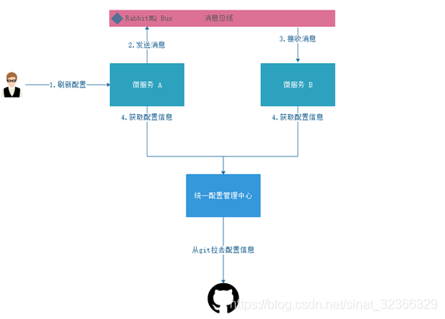
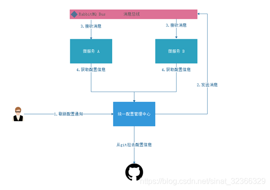

`Spring Cloud Config` + `github` 统一管理配置

动态刷新配置的需要引入了`Spring Cloud Bus`消息总线

## 刷新类型介绍

- Bus消息总线的刷新类型有两类，一类是对client整合，通过client接口刷新一个client后，经过bus通知其他的client刷新信息。如下图：

-  Bus消息总线刷新类型第二种是通知统一配置管理中心，将由统一配置管理中心通知bus，然后告诉其他的微服务获取配置信息。如下图：

>  配置中心的方式发送消息到bus，因为这个更加容易管理。配置中心本来就是统一配置管理中心，那么由它通知所有的微服务更新配置也是属于职责明确。

具体如何实现可参考：[Spring Cloud Bus 原理简介和实现](https://zhuanlan.zhihu.com/p/136478781)

