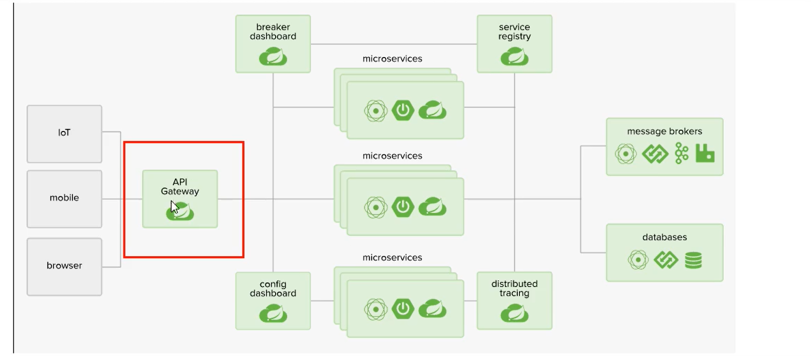
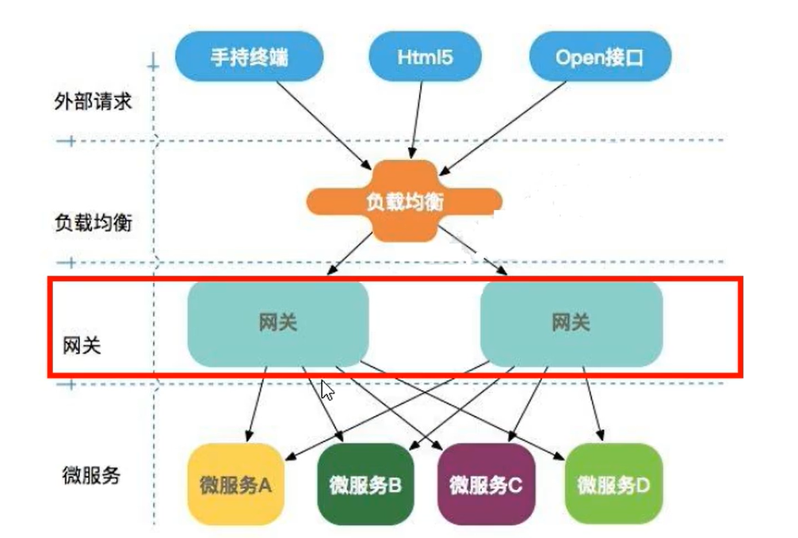
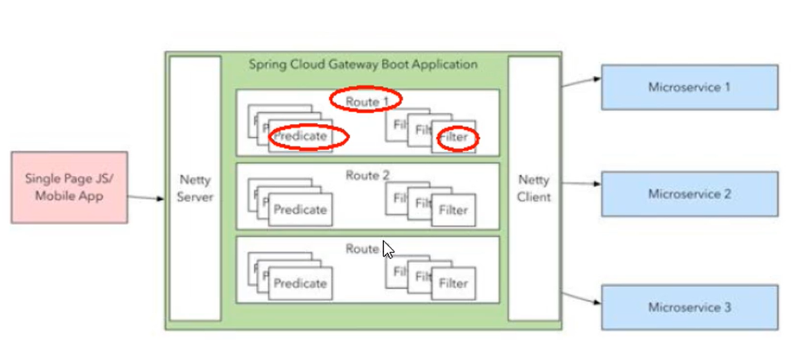
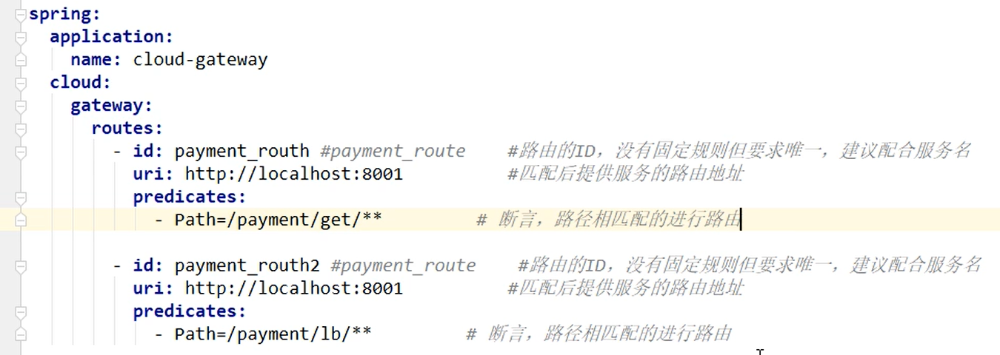
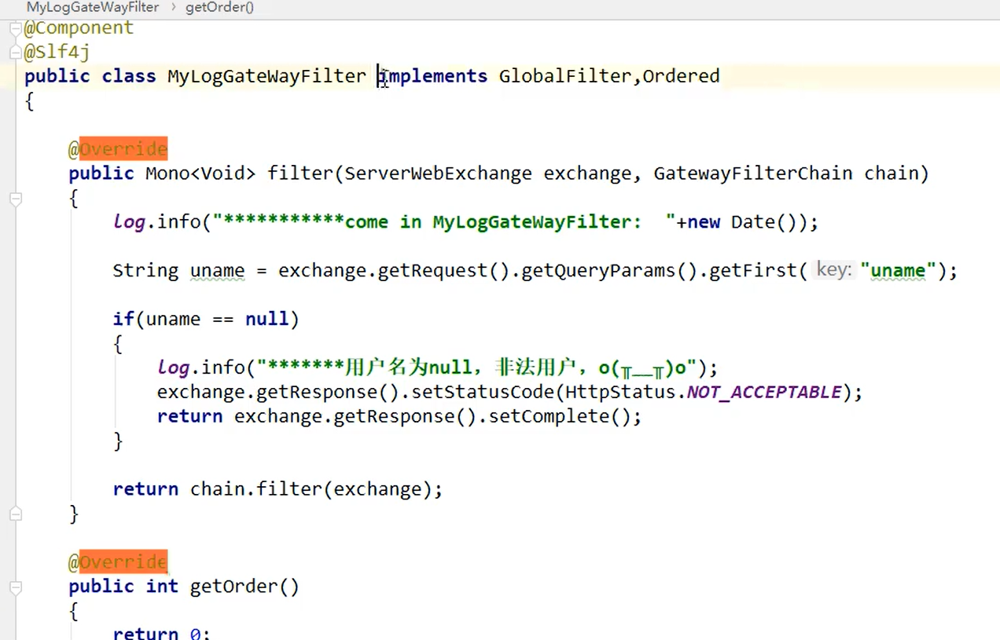

# SpringCloud Gateway

​		`SpringCloud GateWay` 作为`SpringCloud`生态系统中的网关，目标时替代`Zuul`。`SpringCloud 2.0`以上新版本中没有对`Zuul`2.0以上版本做集成，依然使用的时`Zuul` 1.x非`Reactor`模式的老版本。为了提升网关的性能，`SpringCloud Gateway`是基于`WebFlux`框架实现的，而`WebFlux`框架底层使用了高性能的`Reactor`模式通信的`Netty`。

​		`SpringCloud Gateway`提供了统一的路由方式，提供了网关的基本功能，如：安全，监控，限流。

## 2种配置方式：

### 方式1：yml方式

### 方式2：配置类方式 configuration with Java:

### filter

1. 使用内置的过滤器

2. 自定义过滤器

   

