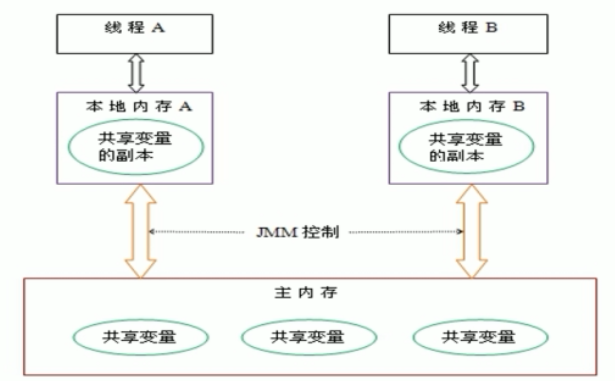
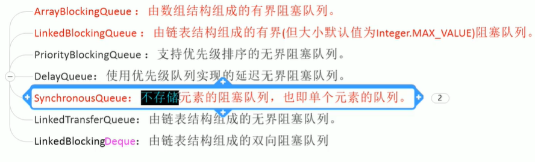
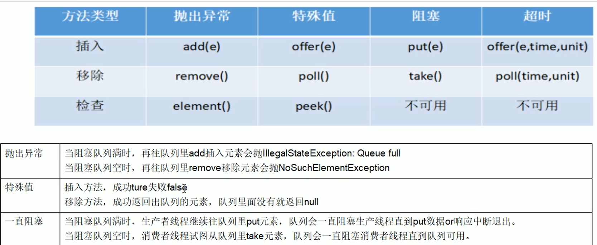

## volatile是什么

volatile是JVM提供的**轻量级**的同步机制

1. 保证可见性
2. 不保证原子性
3. 禁止指令重排（保证有序性）

## JMM内存模型
JMM（Java内存模型Java Memory Model，简称JMM）本身是一种抽象的概念并不真实存在，它描述的是一组规则或规范，通过这组规范定义了程序中各个变量（包括实例字段，静态字段和构成数组对象的元素）的访问方式。

JMM关于同步的规定：

- 线程解锁前，必须把共享变量的值刷新回主内存
- 线程加锁前，必须读取主内存的最新值到自己的工作内存
- 加锁解锁是同一把锁
  由于*JVM运行程序的实体是线程*，而每个线程创建时JVM都会为其创建一个**工作内存**（有些地方称为栈空间），**工作内存**是每个线程的私有数据区域，而Java内存模型中规定所有变量都存储在主内存，主内存是*共享内存区域*，所有线程都可以访问，但线程对变量的操作（读取赋值等）必须在工作内存中进行。
  1. 首先要将变量从主内存拷贝的自己的工作内存空间，然后对变量进行操作，
  2. 操作完成后再将变量写回主内存，不能直接操作主内存中的变量，
  3. 各个线程中的**工作内存**中存储着**主内存**中的**变量副本拷贝**，因此不同的线程间无法访问对方的工作内存，线程间的通信（传值）必须通过主内存来完成，其简要访问过程如下图：




### 线程状态








## 线程池七大参数说明

```java
    public ThreadPoolExecutor(int corePoolSize,
                              int maximumPoolSize,
                              long keepAliveTime,
                              TimeUnit unit,
                              BlockingQueue<Runnable> workQueue,
                              ThreadFactory threadFactory,
                              RejectedExecutionHandler handler) {
    }
```


### 1. `corePoolSize` 核心线程大小

线程池中最小的线程数量，即使处理空闲状态，也不会被销毁，除非设置了allowCoreThreadTimeOut。

### 2.  `maximumPoolSize` 线程池最大线程数量

一个任务被提交后，首先会被缓存到工作队列中，等工作队列满了，则会创建一个新线程，处理从工作队列中的取出一个任务。

### 3. `keepAliveTime` 空闲线程存活时间

当线程数量大于corePoolSize时，一个处于空闲状态的线程，在指定的时间后会被销毁。

### 4. `unit `空间线程存活时间单位

keepAliveTime的计量单位

### 5. `workQueue` 工作队列，`jdk`中提供了四种工作队列
新任务被提交后，会先进入到此工作队列中，任务调度时再从队列中取出任务。
- `ArrayBlockingQueue 基于数组的有界阻塞队列，按FIFO排序。
- `LinkedBlockingQuene`基于链表的无界阻塞队列（其实最大容量为Interger.MAX），按照FIFO排序。
- `PriorityBlockingQueue` 具有优先级的无界阻塞队列，优先级通过参数`Comparator`实现。

### 6. `threadFactory` 线程工厂

创建一个新线程时使用的工厂，可以用来设定线程名、是否为daemon线程等等

### 7. `handler` 拒绝策略

>  当工作队列中的任务已满并且线程池中的线程数量也达到最大，这时如果有新任务提交进来，拒绝策略就是解决这个问题的，jdk中提供了4中拒绝策略：

  #### ①`CallerRunsPolicy 在调用者线程中直接执行被拒绝任务

  #### ②`AbortPolicy` 直接丢弃任务，并抛出RejectedExecutionException异常。

  #### ③`DiscardPolicy`直接丢弃任务，什么都不做。

  #### ④`DiscardOldestPolicy`抛弃最早进入队列的那个任务，然后尝试把这次拒绝的任务放入队列。


