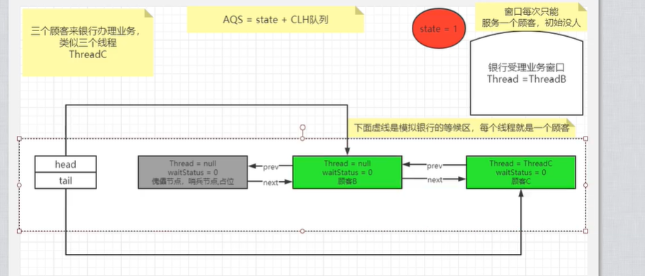

[深度分析：锁升级过程和锁状态  这篇博客写的比较好](https://www.cnblogs.com/lwh1019/p/13093581.html)

### :star:synchronized的原理

> Synchronized锁的前世今生，为什么会有锁升级这一说？下面简单的聊一聊。

​		在JDK1.6之前，Synchronized还是一个重量级锁，阻塞或者唤醒线程涉及到CPU状态的切换，这种切换会耗费处理器时间。如果同步代码块中的逻辑过于简单，这种CPU状态的切换耗时可能大于同步代码块内用户代码执行还要耗时，这是Sychronized最初的设计，这是一个重量级的锁。在JDK1.6之后，对Synchronized做了升级，加入了偏向锁、轻量级锁，从此锁的状态就有了4种(无锁、偏向锁、轻量级锁、重量级锁)。四种锁会随着竞争的激烈逐渐升级，而且是不可逆的过程，如下图所示：

Synchronized的锁指的是什么？指的是monitor

“intrinsic lock”、“monitor lock”、“monitor” 实际上指的是同一个东西，它就是锁。英语当中“锁”和“加锁”是同一个词，可能是为了避免混淆，才添加了 monitor 这个概念。锁存在哪里呢？其答案取决于 JVM 的实现，Java 规范没有强制要求。以当前最流行的 JVM 实现（即 HotSpot）为例，与一个对象关联的锁状态信息是存放在对象头里面的。那么什么是对象头呢？对象内存布局分为对象头、对象实例、填充数据。对象头细分可以分为Mark word,Clazz point,数组长度（对象类型是数组的时候才有）。与一个对象关联的锁状态信息是存放在对象头里面的。对象头长什么样子呢？以32位的虚拟机为例：

根据锁的状态，不同的锁存储的相关信息是不同的。比如偏向锁中存储了偏向锁的线程ID,轻量级锁中存放了指向持有锁线程的lockRecord的指针。

重量级锁就是指向重量级锁的指针。

重量级锁底层又是什么原理？

在HotSpot虚拟机中，Monitor是基于C++的ObjectMonitor类实现的，其主要成员包括：

_owner：指向持有ObjectMonitor对象的线程

_WaitSet：存放处于wait状态的线程队列，即调用wait()方法的线程

_EntryList：存放处于等待锁block状态的线程队列

_count：约为_WaitSet 和 _EntryList 的节点数之和

_cxq: 多个线程争抢锁，会先存入这个单向链表

_recursions: 记录重入次数

ObjectMonitor的基本工作机制：

(1)当多个线程同时访问一段同步代码时，首先会进入 _EntryList 队列中。

(2)当某个线程获取到对象的Monitor后进入临界区域，并把Monitor中的 _owner 变量设置为当前线程，同时Monitor中的计数器 _count 加1。即获得对象锁。

(3)若持有Monitor的线程调用 wait() 方法，将释放当前持有的Monitor，_owner变量恢复为null，_count自减1，同时该线程进入 _WaitSet 集合中等待被唤醒。

(4)在_WaitSet 集合中的线程会被再次放到_EntryList 队列中，重新竞争获取锁。

(5)若当前线程执行完毕也将释放Monitor并复位变量的值，以便其他线程进入获取锁。

线程执行 Object.wait()方法时，会将当前线程加入到 _waitSet 这个双向链表中，然后再运行ObjectMonitor::exit() 方法来释放锁。

可重入锁就是根据 _recursions 来判断的，重入一次就执行 _recursions++，解锁一次就执行 _recursions--，如果 _recursions 减到 0 ，就说明需要释放锁了。

synchronized是由一对monitorenter，monitorexit指令实现的。monitor对象是同步的**基本实现单元**。

==在HotSpot虚拟机里，对象在堆内存中的存储布局可以划分为三个部分：对象头（Header）、实例数据（Instance Data）和对齐填充（Padding）。==

重点说下对象头，里面包含Mark Word(标记字段)和Clazz Point(类型指针)。Mark Word中存储对象的hashcode,锁标志位等信息，这里可以认为是

monitor对象的存储的位置。monitor对象源码是c++写的，它包含了线程重入次数，持有该锁线程的名字等等，（面试人员其实也是不懂。。。）

==简单理解就是锁对象拥有一个锁计数器和一个持有该锁线程的指针。==

在执行monitorenter指令的时候，首先要去尝试获取对象的锁（获取对象锁的过程，其实是获取monitor对象的所有权的过程）。

如果这个对象没被锁定，或者当前线程已经持有了那个对象的锁，就把==锁的计数器==的值+1。

而在执行monitorexit指令时会将==锁计数器==减一。一旦计数器的值为零，锁随即就被释放了。

如果获取对象锁失败，那当前线程就应当被阻塞等待，直到其它线程把锁释放，然后获取到锁。

### :star:锁的升级过程

### :star:说一说你知道的锁有哪些？

可重入锁

独占锁                           Synchronized     

共享锁‘                           CountDownLatch、CyclicBarrier，Semaphore

偏向锁                            Synchronized

自旋锁  也叫无锁           CAS

公平锁  非公平锁          ReentrantLock

### :star::star::star:说一说ReentrantLock 与Synchronized的区别？

:one:使用方式

Synchronized可以修饰实例方法，静态方法，代码块。**自动释放锁。**

ReentrantLock一般需要try catch finally语句，在try中获取锁，在finally释放锁。需要**手动释放锁。**

:two:实现方式

Synchronized 1.6之前是重量级锁，底层使用ObjectMonitor实现。1.6之后对其做了优化，加入了偏向锁，和轻量级锁。

ReentrantLock 采用cas+volatile + LockSupport + AQS 等相关技术实现。

:three:公平和非公平

Synchronized只有非公平锁。

ReentrantLock提供公平和非公平两种锁，默认是非公平的。

:four:可重入锁实现逻辑不同

Synchronized和ReentrantLock都是可重入的，Synchronized是本地方法是C++实现，而ReentrantLock是JUC包用Java实现

:five:条件队列

Synchronized只有一个等待队列。

ReentrantLock中一把锁可以对应多个条件队列。通过newCondition表示。

### JUC中的共享锁你知道哪些？

`CountDownLatch`     门闩    `CyclicBarrier`     美[ˈsaɪklɪk]   栅栏    `SemaPhore`  信号量

`CountDownLatch`    一个线程 等待其他线程执行 countDown();  阻塞的是单个线程。

 `CyclicBarrier`    让一组线程到达一个屏障时被阻塞，直到最后一个线程到达屏障时，屏障才会开门，所有被屏障拦截的线程才会继续运行。

 `SemaPhore`  控制并发执行一段代码的线程数

### 面试官可能会继续问`CountDownLatch`   `CyclicBarrier`    `SemaPhore`  的底层原理？

简单准备下，应付面试

:one:`ArrayBlockingQueue`   

:two:`LinkedBlockingQueue`

:two: `SynchronousQueue` 

## :star::star::star::star::star::star:ReentrantLock底层原理？

CAS  Volatile  LockSupport  AQS

具体细节：

### Executors返回的线程池对象的弊端如下：

      FixedThreadPool 和 SingleThreadPool：
    
      允许的请求队列长度为Integer.MAX_VALUE，可能会堆积大量的请求，从而导致OOM。
    
      CachedThreadPool 和 ScheduledThreadPool :
    
      允许创建的线程数量为Integer.MAX_VALUE，可能会创建大量的线程，从而导致OOM。

### 批量插入数据

MySQL根据配置文件会限制Server接受的数据包大小。

有时候大的插入和更新会受 max_allowed_packet 参数限制，导致写入或者更新失败。(比方说导入数据库,数据表)

### 线程池的工作流程

### 线程池的五种状态

[锁升级的过程简化版](https://blog.csdn.net/z237794193/article/details/88426187)