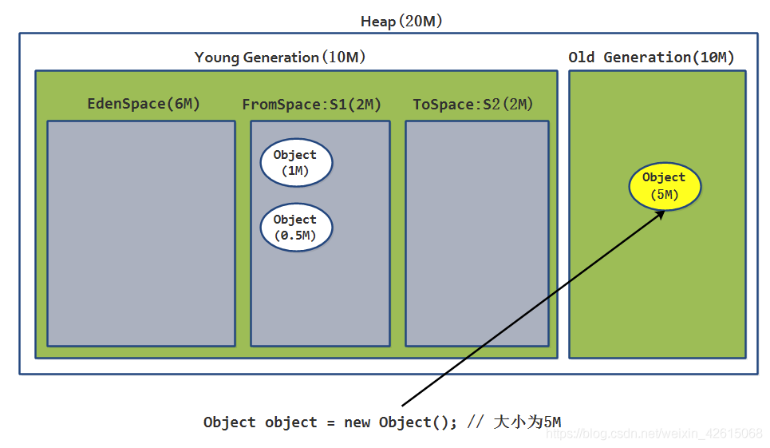

### :white_check_mark: 一 minorGC 和 Full GC区别

>新生代 GC（Minor GC）:指发生新生代的的垃圾收集动作，Minor GC 非常频繁，回收速度一般也比较快。
>
>老年代 GC（Major GC/Full GC）:指发生在老年代的 GC，出现了 Major GC 经常会伴随至少一次的 Minor GC（并非绝对），Major GC 的速度一般会比 Minor GC 的慢 10 倍以上。

### :white_check_mark:二 minorGC过程详解

>:one: 在初始阶段，新创建的对象被分配到Eden区，survivor的两块空间都为空。
>
>
>
>:two: 当Eden区满了的时候，minor garbage 被触发 。
>
>
>
>:three: 经过扫描与标记，存活的对象被复制到S0，不存活的对象被回收， 并且存活的对象年龄都增大一岁。
>
>
>
>:four: 在下一次的Minor GC中，Eden区的情况和上面一致，没有引用的对象被回收，存活的对象被复制到survivor区。当Eden 和 s0区空间满了，S0的所有的数据都被复制到S1，需要注意的是，在上次minor GC过程中移动到S0中的两个对象在复制到S1后其年龄要加1。此时Eden区S0区被清空，所有存活的数据都复制到了S1区，并且S1区存在着年龄不一样的对象，过程如下图所示：
>
>
>
>
>
>
>
>:five: 再下一次MinorGC则重复这个过程，这一次survivor的两个区对换，存活的对象被复制到S0，存活的对象年龄加1，Eden区和另一个survivor区被清空。
>
>
>
>:six: 再经过几次Minor GC之后，当存活对象的年龄达到一个阈值之后（-XX：MaxTenuringThreshold默认是15），就会被从年轻代Promotion到老年代。
>
>
>
>:seven: 随着MinorGC一次又一次的进行，不断会有新的对象被promote到老年代。
>
>
>
>:eight: 上面基本上覆盖了整个年轻代所有的回收过程。最终，MajorGC将会在老年代发生，老年代的空间将会被清除和压缩(标记-清除或者标记整理)。
>
>

> ​		从上面的过程可以看出，Eden区是连续的空间，且Survivor总有一个为空。经过一次GC和复制，一个Survivor中保存着当前还活着的对象，而Eden区和另一个Survivor区的内容都不再需要了，可以直接清空，到下一次GC时，两个Survivor的角色再互换。因此，这种方式分配内存和清理内存的效率都极高，这种垃圾回收的方式就是著名的“停止-复制（Stop-and-copy）”清理法（将Eden区和一个Survivor中仍然存活的对象拷贝到另一个Survivor中），这不代表着停止复制清理法很高效，其实，它也只在这种情况下（基于大部分对象存活周期很短的事实）高效，如果在老年代采用停止复制，则是非常不合适的。

> ​		老年代存储的对象比年轻代多得多，而且不乏大对象，对老年代进行内存清理时，如果使用停止-复制算法，则相当低效。一般，老年代用的算法是标记-压缩算法，即：标记出仍然存活的对象（存在引用的），将所有存活的对象向一端移动，以保证内存的连续。在发生Minor GC时，虚拟机会检查每次晋升进入老年代的大小是否大于老年代的剩余空间大小，如果大于，则直接触发一次Full GC，否则，就查看是否设置了-XX:+HandlePromotionFailure（允许担保失败），如果允许，则只会进行MinorGC，此时可以容忍内存分配失败；**如果不允许，则仍然进行Full GC（**这代表着如果设置-XX:+Handle PromotionFailure，则触发MinorGC就会同时触发Full GC，哪怕老年代还有很多内存，所以，最好不要这样做）。

> **整体描述**
> 		大部分情况，对象都会首先在 Eden 区域分配，在一次新生代垃圾回收后，如果对象还存活，则会进入 s1(“To”)，并且对象的年龄还会加 1(Eden 区->Survivor 区后对象的初始年龄变为 1)，当它的年龄增加到一定程度（默认为 15 岁），就会被晋升到老年代中。对象晋升到老年代的年龄阈值，可以通过参数 -XX:MaxTenuringThreshold 来设置。经过这次GC后，Eden区和"From"区已经被清空。这个时候，“From"和"To"会交换他们的角色，也就是新的"To"就是上次GC前的“From”，新的"From"就是上次GC前的"To”。不管怎样，都会保证名为To的Survivor区域是空的。Minor GC会一直重复这样的过程，直到“To”区被填满，"To"区被填满之后，会将所有对象移动到年老代中。

### :white_check_mark: 三 GC触发条件

Minor GC触发条件：

> Eden区满时

Full GC触发条件：

> （1）调用System.gc时，系统建议执行Full GC，但是不必然执行
> （2）老年代空间不足
> （3）方法区空间不足
> （4）通过Minor GC后进入老年代的平均大小大于老年代的可用内存
> （5）由Eden区、From Space区向To Space区复制时，对象大小大于To Space可用内存，则把该对象转存到老年代，且老年代的可用内存小于该对象大小。

### :white_check_mark: 四 对象进入老年代的四种情况

1. 假如进行Minor GC时发现，存活的对象在ToSpace区中存不下，那么把存活的对象存入老年代

   

2. 大对象直接进入老年代

> 假设新创建的对象很大，比如为5M(这个值可以通过PretenureSizeThreshold这个参数进行设置，默认3M)，
>
> 那么即使Eden区有足够的空间来存放，也不会存放在Eden区，而是直接存入老年代

3. 长期存活的对象将进入老年代

> 此外，如果对象在Eden出生并且经过1次Minor GC后仍然存活，并且能被To区容纳，那么将被移动到To区，并且把对象的年龄设置为1，对象没"熬过"一次Minor GC(没有被回收，也没有因为To区没有空间而被移动到老年代中)，年龄就增加一岁，当它的年龄增加到一定程度(默认15岁，配置参数-XX:MaxTenuringThreshold)，就会被晋升到老年代中

4. 动态对象年龄判定

> 还有一种情况，如果在From空间中，相同年龄所有对象的大小总和大于Survivor空间的一半，
>
> 那么年龄大于等于该年龄的对象就会被移动到老年代，而不用等到15岁(默认)

5. 空间分配担保

  > ​		在发生Minor GC之前，虚拟机会先检查==老年代最大可用的连续空间==**大于**==新生代所有对象总空间==，那么执行Minor GC。
  >
  > ==老年代最大可用的连续空间==小于 ==新生代所有对象总空间== 
  >
  > &==HandlerPromotionFailure=true==
  >
  >  & ==老年代最大可用的连续空间==**大于**==历次晋升到老年代对象的平均大小==
  >
  > 将尝试进行一次Minor GC，尽管这次Minor GC是有风险的；
  >
  > ==HandlerPromotionFailure=true==&==老年代最大可用的连续空间==**小于**==历次晋升到老年代对象====的平均大小==，Minor GC将升级为Full GC
  >
  > ==老年代最大可用的连续空间==**小于**==新生代所有对象总空间==HandlerPromotionFailure=false，那么这次Minor GC将升级为Full GC

