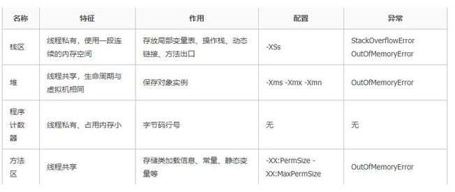

# JVM的逻辑内存模型

这图不够生动没关系还有

# **程序计数器**

**是什么**：　程序计数器是一个记录着当前线程所执行的字节码的行号指示器。

**为什么用**：

> 首先我们要搞清楚JVM的多线程实现方式。JVM的多线程是通过CPU时间片轮转（即线程轮流切换并分配处理器执行时间）算法来实现的。也就是说，某个线程在执行过程中可能会因为时间片耗尽而被挂起，而另一个线程获取到时间片开始执行。当被挂起的线程重新获取到时间片的时候，它要想从被挂起的地方继续执行，就必须知道它上次执行到哪个位置，在JVM中，通过程序计数器来记录某个线程的字节码执行位置。因此，程序计数器是具备线程隔离的特性，也就是说，每个线程工作时都有属于自己的独立计数器。

**特点**

> 1.线程隔离性，每个线程工作时都有属于自己的独立计数器。
>
> 2.执行java方法时，程序计数器是有值的，且记录的是正在执行的字节码指令的地址（参考上一小节的描述）。
>
> 3.执行native本地方法时，程序计数器的值为空（Undefined）。因为native方法是java通过JNI直接调用本地C/C++库，可以近似的认为native方法相当于C/C++暴露给java的一个接口，java通过调用这个接口从而调用到C/C++方法。由于该方法是通过C/C++而不是java进行实现。那么自然无法产生相应的字节码，并且C/C++执行时的内存分配是由自己语言决定的，而不是由JVM决定的。
>
> 4.程序计数器占用内存很小，在进行JVM内存计算时，可以忽略不计。
>
> 5.程序计数器，是唯一一个在java虚拟机规范中没有规定任何OutOfMemoryError的区域。

# **Java 虚拟机栈**

**虚拟机栈生命周期与线程相同。启动一个线程，程序调用函数，栈帧被压入栈中，函数调用结束，相应的是栈帧的出栈。**

**栈帧**由局部变量表，操作数栈，帧数据区组成。

**局部变量表**：存放的是函数的入参，以及局部变量。

**操作数栈**：存放调用过程中的计算结果的临时存放区域。

**帧数据区**：存放的是异常处理表和函数的返回，访问常量池的指针。

举个例子，线程执行进入方法A，则会创建栈帧入栈，A方法调用了B方法，B栈帧入栈，B方法中调用C方法，C创建了栈帧压入栈中，接下来是D入栈

反过来，D方法执行完，栈帧出栈，接着是C，B,A。

# **本地方法栈**

本地方法是由其它语言编写的，编译成和处理器相关的机器代码

本地方法保存在动态链接库中，即.dll(windows系统)文件中，格式是各个平台专有的

拓展：JAVA方法是由JAVA编写的，编译成字节码，存储在class文件中

> java使用起来非常方便，然而有些层次的任务用java实现起来不容易，或者我们对程序的效率很在意时，问题就来了。
>
> **与java环境外交互**：
>
> 有时java应用需要与java外面的环境交互。这是本地方法存在的主要原因，你可以想想java需要与一些底层系统如操作系统或某些硬件交换信息时的情况。本地方法正是这样一种交流机制：它为我们提供了一个非常简洁的接口，而且我们无需去了解java应用之外的繁琐的细节。
>
> **与操作系统交互**：
>
> JVM支持着java语言本身和运行时库，它是java程序赖以生存的平台，它由一个解释器（解释字节码）和一些连接到本地代码的库组成。然而不管怎样，它毕竟不是一个完整的系统，它经常依赖于一些底层（underneath在下面的）系统的支持。这些底层系统常常是强大的操作系统。通过使用本地方法，我们得以用java实现了jre的与底层系统的交互，甚至JVM的一些部分就是用C写的，还有，如果我们要使用一些java语言本身没有提供封装的操作系统的特性时，我们也需要使用本地方法。

**DLL的加载是通过调用System.loadLibrary(String filename)或System.load(String filename)方法实现的。**

# **Java 堆**

存放对象实例，所有的对象的内存都在这里分配。

> Java 堆中还可以细分为：新生代和老年代；
>
> 再细致一点的有Eden 空间、From Survivor 空间、To Survivor 空间等。如果从内存分配
>
> 的角度看，线程共享的Java 堆中可能划分出多个线程私有的分配缓冲区（Thread Local
>
> Allocation Buffer，TLAB）。不过，无论如何划分，都与存放内容无关，无论哪个区域，
>
> 存储的都仍然是对象实例，进一步划分的目的是为了更好地回收内存，或者更快地分配
>
> 内存。

# **方法区**

和java堆一样，方法区是一块所有线程共享的内存区域。

保存系统的类信息，比如，**类的字段，方法，常量池**等。

方法区的大小决定了系统可以保存多少个类，如果系统定义了太多的类，导致方法区溢出，虚拟机同样会抛出内存溢出的错误

jdk1.6和jdk1.7方法区可以理解为永久区。

jdk1.8已经将方法区取消，替代的是元数据区。

jdk1.8的元数据区可以使用参数-XX:MaxMetaspaceSzie设定大小，这是一块堆外的直接内存，与永久区不同，如果不指定大小，默认情况下，虚拟机会耗尽可用系统内存

# 其他拓展

**运行时常量池**

> 运行时常量池（Runtime Constant Pool），它是方法区的一部分。Class文件中除了有类的版本、字段、方法、接口等描述等信息外，还有一项信息是常量池（Constant Pool Table），用于存放编译期生成的各种字面量和符号引用，这部分内容将在类加载后存放到常量池中。
>
> 运行时常量是相对于常量来说的，它具备一个重要特征是：动态性。当然，值相同的动态常量与我们通常说的常量只是来源不同，但是都是储存在池内同一块内存区域。Java语言并不要求常量一定只能在编译期产生，运行期间也可能产生新的常量，这些常量被放在运行时常量池中。这里所说的常量包括：基本类型包装类（包装类不管理浮点型，整形只会管理-128到127）和String（也可以通过String.intern()方法可以强制将String放入常量池）

**直接内存**

> 直接内存（Direct Memory）就是**Java堆外内存**
>
> 在JDK 1.4中新加入了NIO（New Input/Output）类，引入了一种基于通道（Channel）与缓冲区（Buffer）的I/O方式，它可以使用Native函数库直接分配堆外内存，然后通过一个存储在Java堆里面的DirectByteBuffer对象作为这块内存的引用进行操作。这样能在一些场景中显著提高性能，因为避免了在Java堆和Native堆中来回复制数据。
>
> 显然，本机直接内存的分配不会受到Java堆大小的限制，但是，既然是内存，则肯定还是会受到本机总内存（包括RAM及SWAP区或者分页文件）的大小及处理器寻址空间的限制。服务器管理员配置虚拟机参数时，一般会根据实际内存设置-Xmx等参数信息，但经常会忽略掉直接内存，使得各个内存区域的总和大于物理内存限制（包括物理上的和操作系统级的限制），从而导致动态扩展时出现OutOfMemoryError异常。

**面试的时候记录这个图就行**

