## JVM的参数类型

> - [x] 标配参数
>    - [x] java -version
>    - [x] java -help
> - [x] x参数（了解）
>   - [x] -Xcomp：第一次使用就编译成本地代码
>   - [x] -Xint：解释执行
> - [x] xx参数
>   - [x] Boolean类型 
>   			  -XX:+或者-某个属性值   +表示开启  -表示关闭    -XX：-PrintGCDetails / -XX: +PrintGCDetails
>   - [x] KV设值类型
>   		  -XX:属性key=属性值value   -XX:MetaspaceSize=128m/-XX:MaxTenuringThreadhold=15
>   - [x] jinfo举例，如何查看当前运行程序的配置
>


## 请问如何盘点查看jvm系统默认值？

>    ==**打印JVM所有的默认参数设置**==
>
>      ```shell
>      java -XX:+PrintFlagsInitial
>      ```
>    ==**打印JVM最终值**==   
>
>      > 如果某个默认值被新值覆盖，显示新值
>      >
>      > :=   代表修改过
>    ```shell
>    java -XX:+PrintFlagsFinal -version
>    ```
>
>    ==**如何修改JVM参数**==
>
>    > :rage: 注意 ==java -XX:+PrintFlagsFinal== -XX:MetaspaceSize=512m ==-version==  高亮的部分不可以省略
>      >
>      > :warning:     踩过的坑：最开始看到这个设置参数的命令时，理所当然的以为上面的语句很罗嗦，
>      >
>      > ​     认为` java  -XX:MetaspaceSize=512m` 可以设置参数，其实是不可以的。:angry:
>
>      ```shell
>      java -XX:+PrintFlagsFinal -XX:MetaspaceSize=512m -version
>      ```
>
>      > 上面只是列举了`MetaspaceSize`其他的参数参考这个可以设置，比如下面
>
>      ```shell
>      java -XX:+PrintFlagsFinal -XX:MaxTenuringThreshold=13 -version
>      ```
>
>    **==查看默认的垃圾回收器    是打印那些被新值覆盖的项==** :star:
>
>    ```shell
>    java -XX:+PrintCommandLineFlags -version
>    ```
>
>    ==**查看运行的Java服务的JVM参数**==
>
>    > **查看进程号**
>
>    ```shell
>    jps -l
>    ```
>
>    > **根据进程号查看JVM指定参数信息**
>
>    ```shell
>    jinfo -flag MetaspaceSize 1000
>    ```
>
>    > **根据进程号查看JVM所有参数信息**
>
>    ```shell
>    jinfo -flags 1000
>    ```


## Xms  Xmx属于哪一种参数类型？

> Xms  Xmx其实类似数据库别名，Xms等价于InitialHeapSize  Xmx等价于MaxHeapSize

## GC垃圾回收中的垃圾指的是什么？

> 简单的来说是内存中已经不再使用到的空间就是垃圾

## 如何判断一个对象是否应该回收？

> 引用计数法
>
> :white_check_mark: ==枚举根节点可达性分析（GCRoots)==

## JAVA中可以作为GCRoots的对象有哪些？

>:white_check_mark: 虚拟机栈中引用的对象（局部变量）
>
>:white_check_mark: 方法区的静态属性引用的对象
>
>:white_check_mark: 方法区中常量引用的对象
>
>:white_check_mark: 本地方法栈中native方法引用的对象

## 你工作中用的jvm常用基本配置参数有哪些？

> :white_check_mark: 堆初始的大小，默认为物理内存的1/64 
>
> ```shell
> -Xms  
> -XX:InitialHeapSize
> ```
>
> :white_check_mark: 堆内存最大值，默认为物理内存的1/4
>
> ```shell
> -Xmx
> -XX:MaxHeapSize
> ```
>
> :white_check_mark: 设置单个线程==栈==的大小，一般为512k~1024k  
>
> ```shell
> -Xss 
> -XX:ThreadStackSize
> ```
>
> :white_check_mark: 设置新生代大小  一般使用默认值即可
>
> ```shell
> -Xmn
> ```
>
> :white_check_mark: 元空间大小 
>
> ```shell
> -XX:MatespaceSize
> ```
>
> 查看元空间大小  15908 是java服务进程的ID
>
> ```shell
> jinfo -flag MetaspaceSize 15908
> ```
>
> > 元空间并不在虚拟机中而是使用本地内存。因此，默认情况下，元空间的大小受到	本地内存的限制
> >
>


```shell
-XX:+PrintCommandLineFlags
```

> 我们在idea工具的VM Options中配置-XX:+PrintCommandLineFlags，启动项目可以看到
>
> ```shell
> -XX:-BytecodeVerificationLocal 
> -XX:-BytecodeVerificationRemote 
> -XX:InitialHeapSize=265729216 
> -XX:+ManagementServer 
> -XX:MaxHeapSize=4251667456 
> -XX:+PrintCommandLineFlags 
> -XX:TieredStopAtLevel=1 
> -XX:+UseCompressedClassPointers 
> -XX:+UseCompressedOops
> -XX:-UseLargePagesIndividualAllocation 
> -XX:+UseParallelGC   # 并行垃圾回收器
> ```
>
> 我们在idea工具的VM Options中配置如下配置：
>
> ```shell
> -Xms128m  -Xmx4096m -Xss1024k -XX:MetaspaceSize=512m -XX:+PrintCommandLineFlags -XX:+PrintGCDetails -XX:+UseSerialGC
> ```
>
> 可以看到控制台输出如下：
>
> ```shell
> -XX:-BytecodeVerificationLocal 
> -XX:-BytecodeVerificationRemote 
> -XX:InitialHeapSize=134217728 
> -XX:+ManagementServer 
> -XX:MaxHeapSize=4294967296 
> -XX:MetaspaceSize=536870912 
> -XX:+PrintCommandLineFlags 
> -XX:+PrintGCDetails 
> -XX:ThreadStackSize=1024
> -XX:TieredStopAtLevel=1 
> -XX:+UseCompressedClassPointers 
> -XX:+UseCompressedOops 
> -XX:-UseLargePagesIndividualAllocation 
> -XX:+UseSerialGC #串行垃圾回收器
> ```


:white_check_mark: :star: 打印垃圾回收的细节日志

```shell
-XX:+PrintGCDetails
```

> 可以看到输出日志 

```shell
Heap
 PSYoungGen      total 75776K, used 7805K [0x000000076b800000, 0x0000000770c80000, 0x00000007c0000000)
  eden space 65024K, 12% used [0x000000076b800000,0x000000076bf9f6b0,0x000000076f780000)
  from space 10752K, 0% used [0x0000000770200000,0x0000000770200000,0x0000000770c80000)
  to   space 10752K, 0% used [0x000000076f780000,0x000000076f780000,0x0000000770200000)
 ParOldGen       total 173568K, used 0K [0x00000006c2800000, 0x00000006cd180000, 0x000000076b800000)
  object space 173568K, 0% used [0x00000006c2800000,0x00000006c2800000,0x00000006cd180000)
 Metaspace       used 3961K, capacity 4628K, committed 4864K, reserved 1056768K
  class space    used 435K, capacity 464K, committed 512K, reserved 1048576K
```

演示如何触发OutOfMemoryError

```shell
-Xms10m -Xmx10m -XX:+PrintGCDetails
```

```java
    public static void main(String[] args) throws InterruptedException {
        byte[] byteArray = new byte[50*1024*1024];
    }
```

输出如下：

```shell
[GC (Allocation Failure) [PSYoungGen: 2048K->504K(2560K)] 2048K->865K(9728K), 0.0006088 secs] [Times: user=0.00 sys=0.00, real=0.00 secs] 
[GC (Allocation Failure) [PSYoungGen: 2552K->504K(2560K)] 2913K->1178K(9728K), 0.0009785 secs] [Times: user=0.00 sys=0.00, real=0.00 secs] 
[GC (Allocation Failure) [PSYoungGen: 1010K->5 04K(2560K)] 1685K->1282K(9728K), 0.0005856 secs] [Times: user=0.00 sys=0.00, real=0.00 secs] 
[GC (Allocation Failure) [PSYoungGen: 504K->504K(2560K)] 1282K->1330K(9728K), 0.0006516 secs] [Times: user=0.00 sys=0.00, real=0.00 secs] 
[Full GC (Allocation Failure) [PSYoungGen: 504K->0K(2560K)] [ParOldGen: 826K->1026K(7168K)] 1330K->1026K(9728K), [Metaspace: 3956K->3956K(1056768K)], 0.0082664 secs] [Times: user=0.00 sys=0.00, real=0.01 secs] 
[GC (Allocation Failure) [PSYoungGen: 0K->0K(2560K)] 1026K->1026K(9728K), 0.0005166 secs] [Times: user=0.00 sys=0.00, real=0.00 secs] 

[Full GC (Allocation Failure) [PSYoungGen: 0K->0K(2560K)] [ParOldGen: 1026K->1004K(7168K)] 1026K->1004K(9728K), [Metaspace: 3956K->3956K(1056768K)], 0.0218341 secs] [Times: user=0.16 sys=0.00, real=0.02 secs] 
Exception in thread "main" java.lang.OutOfMemoryError: Java heap space
	at com.jvm.VMFlags.main(VMFlags.java:9)
Heap
 PSYoungGen      total 2560K, used 61K [0x00000000ffd00000, 0x0000000100000000, 0x0000000100000000)
  eden space 2048K, 3% used [0x00000000ffd00000,0x00000000ffd0f5f8,0x00000000fff00000)
  from space 512K, 0% used [0x00000000fff00000,0x00000000fff00000,0x00000000fff80000)
  to   space 512K, 0% used [0x00000000fff80000,0x00000000fff80000,0x0000000100000000)
 ParOldGen       total 7168K, used 1004K [0x00000000ff600000, 0x00000000ffd00000, 0x00000000ffd00000)
  object space 7168K, 14% used [0x00000000ff600000,0x00000000ff6fb388,0x00000000ffd00000)
 Metaspace       used 3985K, capacity 4628K, committed 4864K, reserved 1056768K
  class space    used 438K, capacity 464K, committed 512K, reserved 1048576K
```

参数说明：

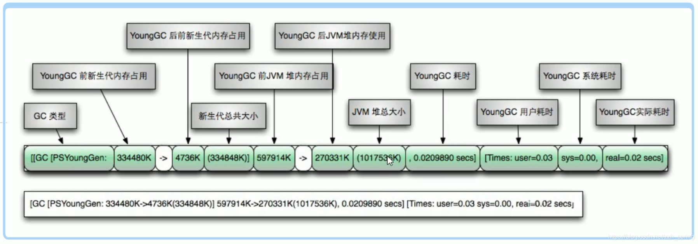


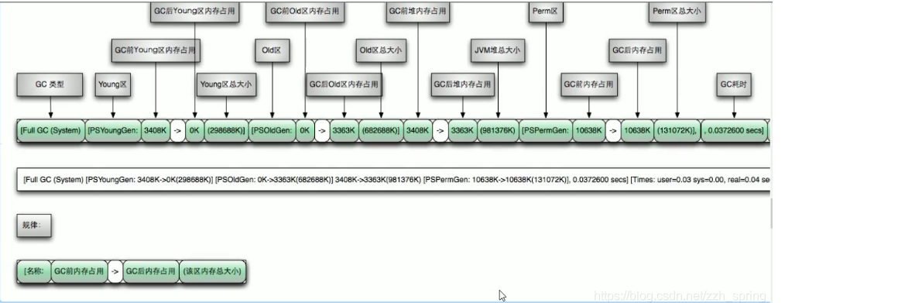


:white_check_mark: 配置新生代中Eden、SO1、SO2区的比例

```shell
-XX:SurvivorRatio
```

> ​	 默认 -XX:SurvivorRatio=8，Eden:SO1:SO2=8:1:1
>
> ​     如果配置成4，意思是Eden:SO1:SO2=4:1:1

:white_check_mark:配置新生代与老年代的比例

```shell
-XX:NewRatio
```

> 默认是 -XX:NewRatio =2 新生代1 老年代2   美[ˈreɪʃioʊ]
>
> 一般不用去修改这个参数

:white_check_mark:设置垃圾最大年龄

```shell
-XX:MaxTenuringThreshold
```

>  默认-XX:MaxTenuringThreshold=15  是有范围的我们修改只能在0-15之间


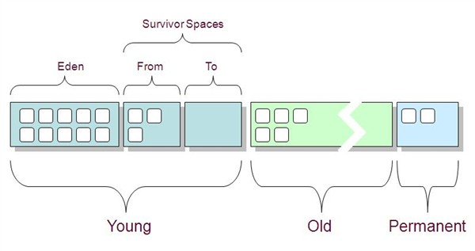


------

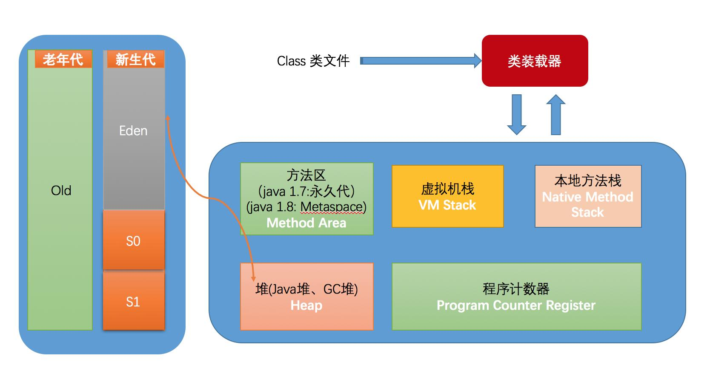


## 四种引用

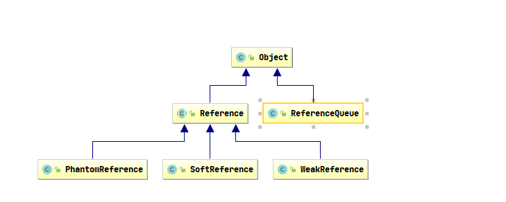

------

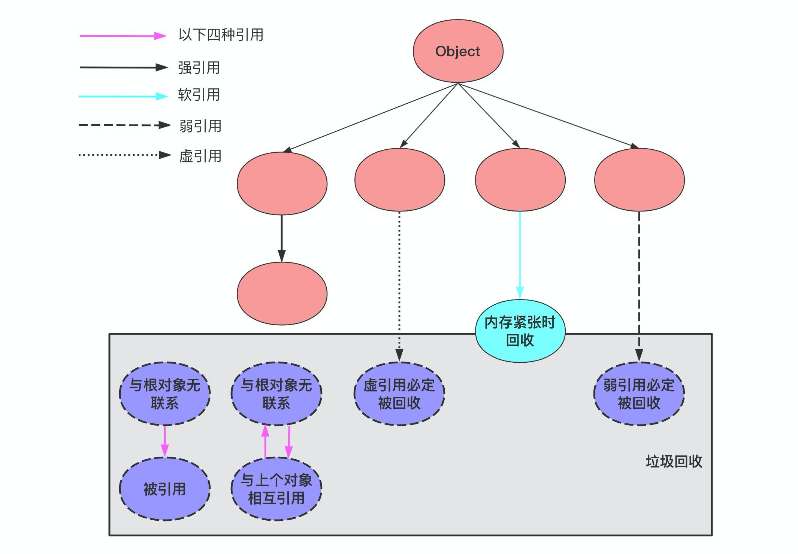

:one: 强引用-StrongReference

> 这是java中最常见的引用方式，当一个对象被一个或一个以上的引用变量所引用时，它不可能被系统垃圾回收机制回收

使用场景：例如数组

:two: 软引用-SoftReference

> 对于只有软引用的对象而言，当系统内存空间足够时，它不会被系统回收；如果内存空间不足了，就会被回收

**使用场景：创建缓存**

:three: 弱引用-WeakReference

> 对于只有弱引用的对象而言，当系统垃圾回收机制运行时，不管系统内存是否足够，该对象所占用的内存一定会被回收。

**使用场景：WeakHashMap类中的key**  `ThreadLocal`类中也是用了弱引用


:four: 虚引用-PhantomReference

> 如果一个对象只有一个虚引用时，那么它和没有引用的效果大致相同

**使用场景：用于对象销毁前的一些操作，比如说资源释放等**

 

:dolphin:  :whale: 🐟  :four_leaf_clover::bell: :pushpin:✏️ 📗🚩 ▶️ 🔷 ✔️✖️ ❌ 🔰

## OOM你了解多少？

>🔷`java.lang.StackOverflowError` 
>
>🔷`java.lang.OutOfMemoryError: Java heap space`   
>
>> ✏️ 堆OOM  解决方法： 增大Xmx值 使用MAT，JProfile等工具进行代码分析与优化
>
>🔷`java.lang.OutOfMemoryError: Direct buffer memory` 
>
>> ✏️ 直接内存OOM 增大MaxDirectMemorySize的值
>
>> ```java
>>     /**
>>      *  -Xmx1g -XX:+PrintGCDetails -XX:MaxDirectMemorySize=100m
>>      */
>>     public static void main(String[] args) {
>>         List<ByteBuffer> byteBuffers = new ArrayList<>();
>>         for (int i = 0; i < 2048; i++) {
>>             System.out.println(i);
>>             byteBuffers.add(ByteBuffer.allocateDirect(1024 * 1024));
>>         }
>>     }
>> ```
>
>🔷`OutOfMemoryError: GC overhead limit exceeded`     美[ɪkˈsiːdɪd]     📗大文件导出**XSSFWorkbook** 会导致这个问题。用**SXSSFWorkbook** 替代
>
>```
>Java VisuaalVM  并在OOM的时候获取了dump文件 
>apache的POI项目推出了一个实现大数据量的流式版本XSSFWorkbook，也称之为SXSSFWorkbook，它允许了我们编写非常大的文件而不会耗尽内存，因为在任何时候只有行的可配置部分保存在内存中，例如合并区域，注释等。
>```
>
>
>
>>>✏️如果`Java`进程花费`98%`以上的时间执行`GC`，并且每次只有不到`2%`的堆被恢复，则`JVM`抛出此错误。
>
>>```java
>>/**
>> * -Xms10m -Xmx10m -XX:+PrintGCDetails -XX:MaxDirectMemorySize=5m
>> */
>>public static void main(String[] args) {
>>    int i = 0;
>>    List<String> list = new ArrayList<>();
>>    try {
>>        while (true) {
>>            list.add(String.valueOf(i + UUID.randomUUID().toString()).intern());
>>        }
>>    } catch (Exception e) {
>>        System.out.println(i);
>>        e.printStackTrace();
>>    }
>>}
>>```
>
>🔷`java.lang.OutOfMemoryError: unable to create new native thread`
>
>> 创建了太多的线程，而能创建的线程数是有限制的，导致了异常的发生
>
>> 系统允许一个进程创建的线程是有限制的，不同的系统这个限制不同。例如Linux系统系统默认允许单个进程可以创建的线程数是1024个
>
>> 如果应用创建的线程数大于这个数，就会报OOM unable to create new native thread;
>
>如何解决这个问题：
>
>> 降低应用程序的线程数量，分析应用是否真的需要创建这么多的线程，如果不是要做调整
>
>> 对于有的应用程序来说，确实需要创建很多的线程，可以修改服务器的配置
>
>> ```shell
>> [root@VM-0-16-centos limits.d]# ulimit -u
>> 7269
>> [root@VM-0-16-centos limits.d]# pwd
>> /etc/security/limits.d
>> [root@VM-0-16-centos limits.d]# vim 20-nproc.conf
>> ```
>
>> 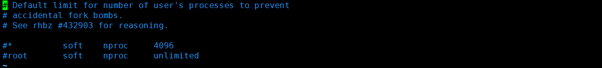


## 字符串常量池到底是在方法区、还是堆里、还是元空间里面呢？

> 这个和jdk的版本有关
>
> 在1.6版本，方法区由  **永久代** （PermGen）实现，字符串常量池在永久代
>
> 在1.7版本 **方法区由永久代和堆实现**   ， 常量池和静态变量放入了堆中
>
> 在1.8版本 把永久代删，除使用元空间，也就是**方法区由元空间(类信息)和堆实现(常量池、静态变量)**。
>
> 堆中包含正常对象和常量池，new String()放入堆中，String::inter会将堆中的String变量放入堆中的常量池中。


## JAVA的三种常量池

**1. 字符串常量池（也叫全局字符串池、string pool、string literal pool）**

**2. 运行时常量池（runtime constant pool）**

当程序运行到某个类时，class文件中的信息就会被解析到内存的方法区里的运行时常量池中。每个类都有一个运行时常量池

**3. class文件常量池（class constant pool）**

class常量池是在编译后每个class文件都有的，class文件中除了包含类的版本、字段、方法、接口等描述信息外，还有一项信息就是 ***常量池\****（constant pool table）*，用于存放编译器生成的各种字面量（Literal）和符号引用（Symbolic References）。*字面量就是我们所说的常量概念，如文本字符串、被声明为final的常量值等。

运行时常量池和静态常量池存放在元空间中，而字符串常量池依然存放在堆中。


## 说说垃圾回收算法和垃圾收集器的关系？

### :one:  复制算法

> 原理：将内存分成两个相等的两小块，每次只使用其中一块。当这一块内存用完了，就将已经存活的对象复制到另一块，然后把这一块内存清理掉。
>
> 缺点：
>
> > 一是，如果大部分对象都是存活的，那么复制会造成大量的内存间复制的开销。
> >
> > 二是，每次只使用了一半的内存空间，空间浪费有点大。

### :two: 标记-清除

>标记出所有要清除的对象，在标记完成后，统一回收所有被标记的对象。
>
>**缺点**：
>
>> 一是，执行效率不稳定，导致标记和清除这两个动作的执行效率随着对象数量的增长而降低。
>>
>> 二是，内存空间不连续、碎片化问题。碎片空间太多，以至于后面要给大对象分配内存时找不到连续的内存空间。

### :three:标记-整理

>​	这个算法是针对老年代回收提出来的，老年代如果使用复制算法需要进行较多的复制操作，效率较低。 
>
>​    标记出所有存活的对象，在标记完成后将存活的对象移到内存空间的一段，然后直接清理端边界以外的内存空间。

### :four:分代收集理论

>Java虚拟机将堆内存分成两块区域：新生代和老年代。这样可以根据各个年代的特点使用不同的回收算法。
>
>**新生代**：每次都有大量的对象死去，选择复制算法，付出复制的成本就能回收大量的对象。
>
>**老年代**：存活的对象比较多，复制时开销大，选择标记-清除算法或者标记-整理算法。


## 垃圾回收的方式有哪？

> ## Serial  
>
> > 这是一个单线程工作的收集器，它在工作时需要停止其他所有工作，就是俗称的`stop the word`。
>
> ## Parallel
>
> >是一种以获取最短回收停顿时间为目标的收集器。它非常符合在注重用户体验的应用上使用。
>
> > 复制算法的新生代收集器，关注于吞吐量。老年代（Parallel Old）基于标记-整理算法
>
> ## CMS
>
> > 是一种 **“标记-清除”算法**实现的,是一种以获取最短回收停顿时间为目标的收集器。它非常符合在注重用户体验的应用上使用。- 
> >
> > >**✔️初始标记**： 暂停所有的其他线程，并记录下直接与 root 相连的对象，速度很快 ；
> > >✔️**并发标记**： 同时开启 GC 和用户线程，用一个闭包结构去记录可达对象。
> > >**✔️重新标记**： 为了修正并发标记期间因为用户程序继续运行而导致标记产生变动的那一部分对象的标记记录
> > >**✔️并发清除**： 开启用户线程，同时 GC 线程开始对未标记的区域做清扫。
>
> ## G1
>
> >​	`G1` (Garbage-First) 是一款面向服务器的垃圾收集器,主要针对配备多颗处理器及大容量内存的机器。
> >
> >过程：
> >
> >>✔️**初始标记**：需要停顿线程
> >>
> >>✔️**并发标记**：可与用户线程并发执行
> >>
> >>✔️**最终标记**：需要停顿线程
> >>
> >>✔️**筛选回收**：可与用户线程并发执行

## 你们项目的垃圾收集器是什么？怎么查看？


>```shell
>java -XX:+PrintCommandLineFlags -version
>```


## 七大垃圾收集器


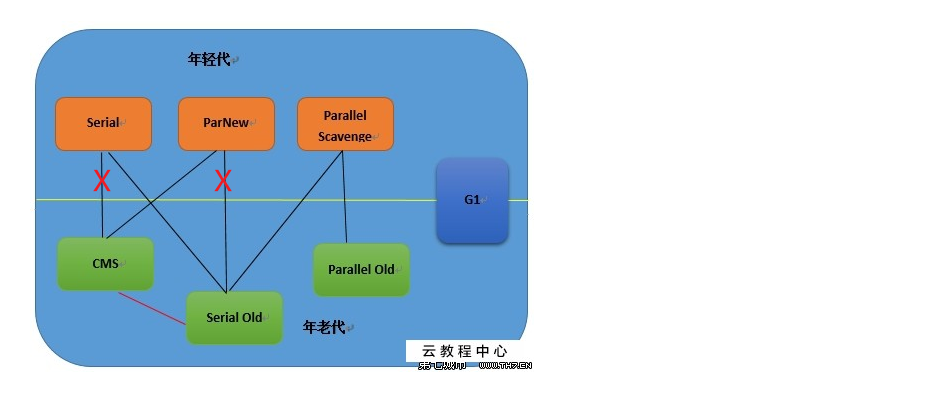

> ```shell
> -X:+UseSerialGC   
> ```


## 常用配查问题的一些Linux命令

```shell
top 
mpstat -P ALL 2
pidstat
free
df
ifstat
```


> vmstat 5 5 #每5秒进行一次采用 一共采样5次

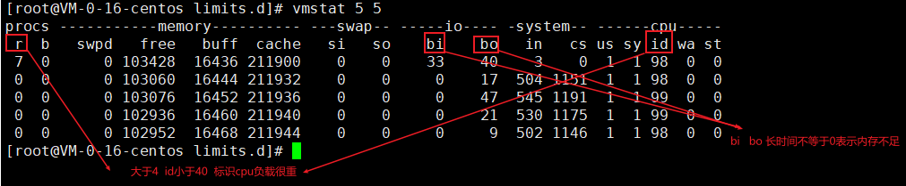

> pidstat   # 需要安装   yum install sysstat

```shell
pidstat -u #各个进程cpu使用统计
pidstat -r #各个进程内存使用统计 
pidstat -d #各个进程IO统计
```

> free 显示Linux系统中物理内存、buffer/cache、swap的使用情况

```shell
free
```

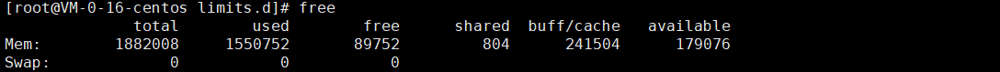

> df  磁盘空间和使用情况

```shell
df -h  #以更易读的方式显示目前磁盘空间和使用情况 
```

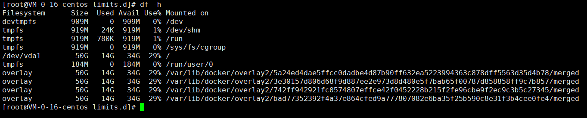


> ifstat

```shell
ifstat -a #网络流量概况。
```

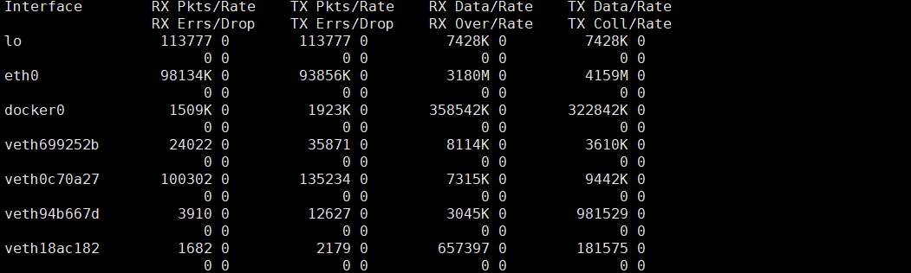