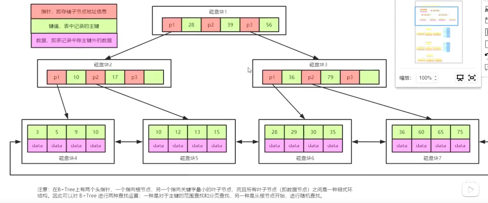

# 常用SQL语句，数据类型，引擎，锁，索引，新特性，SQL优化

[视频链接](https://www.bilibili.com/video/BV1tU4y1p7eV)

### mysql 中有多少存储引擎？


> InnoDB  和 MyISAM 引擎 使用的B+数
>
> MEMORY 引擎使用的数据结构是HASH

### 什么是存储引擎呢？

> 我们打开Mysql安装目录，可以看到不同后缀名的文件。
>
> 比如我们有一张emp表，
>
> 如果是InnoDB引擎，那么就会对应一个emp.frm 和一个emp.ibd文件 。.frm文件存放的是表的结构数据，.ibd存放的是数据+索引。
>
> 如果是MyISAM引擎，那么就会对应3个文件，emp.frm、emp.MYD、emp.MYI 。.frm存放的是表的结构数据，.MYD存放的是数据，.MYI存放的是索引

### MYSQL优化的前置知识

> 数据是存在磁盘中的，数据读取的时候不是直从磁盘读取。数据首先要从磁盘读取到内存，然后从内存读取数据。
> 内存和磁盘数据读取数据的速度相差巨大，内存的速度远远大于磁盘。但是内存的空间是有限的，我们不可能把数据全部读取到内存中，而且如果断电之后，内存的数据会丢失。内存和磁盘就存在了一个数据交换的过程。
>
> **局部性原理：**
>
> ​	空间局部性：程序访问数据都具有聚集成群的倾向，在一个时间段内，仅使用其中一小部分
>
> ​    时间局部性：最近被访问的数据，很快又被访问的概率很大
>
> **磁盘预读：**
>
> ​	知识点一：**==预读的长度一般为页（Page）的整数倍==**
>
> ​	什么是页？页是存储器的逻辑块，操作系统往往将主内存和磁盘存储区分割成连续的大小相等的块，每个存储块成为一页。(在很多操作系统中，页的大小通常为4K),主内存和磁盘以页为单位交换数据。

### 索引文件的结构有哪些？

> - hash表
> - 二叉树
> - B树
> - B+树

### 在InnoDB引擎中为什么使用B+树，没有使用其他的数据结构？

>- hash表
>
>​	1、需要一个使数据很散的hash算法，大多数算法都有一些问题，比如性能上。
>
>​    2、利用hash存储的话需要将所有数据的文件添加到内存，比较耗费内存空间
>
>​    3、由于hash碰撞存在的问题，值查询如果是范围查询，就很不适合。
>
>*Memory引擎使用的就是hash,之所以可以使用，是因为Memory引擎数据都是存储在内存的。*
>
>- BST、AVL、红黑树
>
>  BST、AVL、红黑树都是二叉树，数据大的时候，都会因为树的深度过深造成IO次数变多，影响数据读取的效率。
>
>- 磁盘和内存的交互，有最小的逻辑单元，成为叶，叶的大小和操作系统有关，一般为4k或者8k。实际数据读取时，一般都是读取叶的整数倍，
>
> 对于mysql的innodb引擎来说一次读取的逻辑块大小是16k。
>
>- 基于BST AVL 红黑树 的前车之鉴，我们需要一个树满足1 多叉  有序  这样B树是否可以满足要求。
>
>  但是实际我们存储数据的时候存储的是行记录，这个行记录实际大小影响到每个磁盘块存放数据的数量。
>
>  mysql的innodb引擎来说一次读取的逻辑块大小是16k，方便计算，我们假定一条记录大小为`1kb`，那么每个磁盘块可以存放的数据个数是`16`。3层的`B树`可以存放的数据就是16 * 16 * 16 = 4096，显然这个数据还是不能支持实际生产的要求。如果能在叶子节点存放行数据，其他节点存储指针  和 key  这样存储的数据就能有指数的增长。把行记录存放到叶子节点，其他节点数据就非常小，假定为1byte，16k,一个磁盘块就是能存储1600  3层的结构可以存储1600 * 1600 * 16 =40960000


`B树`如果作为`Mysql`的如下引擎的数据结构，存入数据后如下：


> 磁盘块的大小是固定的时候，数据越小，存入的数据越多。
>
> 上面存在的问题是`data`数据比较大,影响了整个结构存取数据的总量。
>
> 现在把data数据存入叶子节点上，这样树上就能存放更多的节点
>
> `mysql`读取数据磁盘块对应的大小为`16kb`,方便计算我们假定每行数据的大小为`1kb`,那么每个磁盘块可以存放的数据个数是`16`。3层的`B树`可以存放的数据就是
>
> 16 * 16 * 16 = 4096  这个计算是粗略算的，但是可以看出问题。

引入`B+树`后



> 和上面`B树`粗略计算类似，mysql读取数据磁盘块对应的大小为`16kb`,由于数据中的data放到叶子节点了，非叶子节点的数据就非常小了，方便计算我们假定每行数据的大小为`10byte`,那么每个磁盘块可以存放的数据个数是`16kb` / `10byte` = `1000`。3层的B树可以存放的数据就是
>
> 1600* 1600 * 16 = 40960000  这个计算是粗略算的，但是可以看出问题。

### `Mysql`中的`B+树`到底是3层还是4层？

>  这个和索引数据的大小有关系。我们知道mysql读取数据的磁盘块大小为16kb，为了尽可能的利用空间，数据越小，每个磁盘块的可以存储的数据就越多。
>
> 由此我们可以得到另一个结论，在数据库设计索引的时候，存在·`int`  `varchar`  `text ` 等类型是，我们优先使用`int`类型。 使用索引使用`varchar`类型，会导致索引树过深，影响查询速度。

### 在字段上使用部分字段创建索引

```sql
-- 只取前三个字符创建索引
alter table emp add index idx_name(name(3))
```

> ​       有时候需要索引很长的字符串，这会让索引变得大而且查询效率变慢。通常情况下使用某个列开始的部分字符串，这样可以大大节约索引空间，从而提高索引效率，但这个会降低==**索引的选择性**==。索引的选择性是指不重复的索引和数据记录总数的比值，范围在1/T 到 1 之间。唯一索引的选择性是 1，这是最好的索引选择性，性能也是最好的。选择性高的索引可以让mysql过滤掉更多的行。
>
> ​     一般情况下，某个列前缀的选择性也是足够高的，足以满足查询的性能。但是对于BLOB、TEXT、VARCHAR类型的列，必须要求使用前缀索引，`Mysql`不允许索引这些列的完整长度。使用前缀索引的诀窍在于选择合适长的前缀既保证索引的选择性，又不能太长。

### `B+树`数据查询的时候可以使用两种方式

> - 方式1  从根节点一层一层的查询
>
> - 方式2 使用使用叶子节点的双向链表，对主键的范围查找和分页查找


### Mysql B+树 存放数据说明


> 叶子节点存放的主键

### 为什么非分布式的系统`Mysql`建议使用自增主键？

> ​		当我们是自增主键插入数据的时候，主键索引数据插入数据的时候是向最后一个节点添加数据，这个减少了**`页分裂`**和**`页合并`**带来的开销。

### 什么是回表？

> 使用二级索引（也称辅助索引，比如上面在name列创建的索引）的时候，先在二级索引上查询到对应的主键，然后再到主键索引对应的B+树中查询完整数据

### 什么是索引覆盖？

```sql
-- 观察下面的两个sql
select *  from emp where name = 
select id from emp where name = 
```

> name字段上创建了索引，`select * from ` 会触发`回表`
>
> ` select id from emp where name =` 直接在二级索引对象的B+ 树上就可以得到Id，整个过程只涉及到一个B+树的查询  这个 就叫做`索引覆盖`。
>
> `索引覆盖` 的性能要好于要触发回表的场景。

### 什么是最左匹配？

```sql
-- 组合索引name age
select * from emp where name = ? and age = ?
select * from emp where age = ?
select * from emp where name = ?
select * from emp where age = ? and name = ?
```

> 上面1 3 4 都会走到索引
>
> 解释下为什么4也会走到索引？
>
> Mysql 优化器 ,
>
> 优化器有两种模式 
>
> - `CBO`  基于成本的优化（什么样的效率最高，就会选择什么样的模式  现在大多数的数据库在选择的时候都会选择这个模式）
>
> - `RBO`  基于规则优化
>
> Orcal中有上面两种模式，Mysql 优化器只有CBO模式。
>
> 优化器的`CBO`模式下，会对sql进行优化，最终执行的时候是会使用到索引的。

### 什么是索引下推？

```sql 
select * from emp where name = ? and age = ?
```

> 在没有索引下推的时候，查询数据时
>
> 1、先从存储引擎中拉取数据（根据name筛选的数据）。
>
> 2、接着在mysql服务层，根据age进行筛选。
>
> mysql5.6之后
>
> 先从存储引擎中拉取数据直接根据name和age来筛选数据，不需要服务层做数据筛选。这就是索引下推。
>
> 这样的好处，减少了IO的开销。


### 索引下推的缺点是什么？

> 需要在磁盘上多做数据筛选，原来的筛选是放在内存中的，现在放到磁盘中筛选，这样看似成本比较高，但是，磁盘上的数据是存放在B+数上的，数据是有序排列的，所有的数据都是聚集存放的，所以性能不会受到影响。而且整体的IO量会大大的减少，反而会提升性能。


### 什么是MRR

> multi_rang_read  
>
> MRR 通过把「随机磁盘读」，转化为「顺序磁盘读」，从而提高了索引查询的性能。

```sql
mysql > set optimizer_switch='mrr=on';
Query OK, 0 rows affected (0.06 sec)

mysql > explain select * from stu where age between 10 and 20;
+----+-------------+-------+-------+------+---------+------+------+----------------+
| id | select_type | table | type  | key  | key_len | ref  | rows | Extra          |
+----+-------------+-------+-------+------+---------+------+------+----------------+
|  1 | SIMPLE      | tbl   | range | age  |    5    | NULL |  960 | ...; Using MRR |
+----+-------------+-------+-------+------+---------+------+------+----------------+
-- 我们开启了 MRR，重新执行 sql 语句，发现 Extra 里多了一个「Using MRR」。
```

**对于 Myisam，在去磁盘获取完整数据之前，会先按照 rowid 排好序，再去顺序的读取磁盘。**

**对于 Innodb，则会按照聚簇索引键值排好序，再顺序的读取聚簇索引。**

顺序读带来了几个好处：

**1、磁盘和磁头不再需要来回做机械运动；**

**2、可以充分利用磁盘预读**

比如在客户端请求一页的数据时，可以把后面几页的数据也一起返回，放到数据缓冲池中，这样如果下次刚好需要下一页的数据，就不再需要到磁盘读取。

这样做的理论依据是计算机科学中著名的局部性原理：

> *当一个数据被用到时，其附近的数据也通常会马上被使用。*

**3、在一次查询中，每一页的数据只会从磁盘读取一次**


### 什么是FIC?

> fast index creation
>
> 插入和删除数据：
>
> 1. 先创建一个临时表，将数据导入临时表；
> 2. 把原始表删除
> 3. 修改临时表的名字
>
> 给当前表添加一个share锁，不会创建临时文件的资源消耗，还是在源文件中，但是此时如果有人发起dml操作，很明显会导致数据不一致，索引添加share锁，读取时没有问题的，但是DML会有问题


### 数据结构  树

- 二叉树

  > 特点：二叉树特点是每个结点最多只能有两棵子树，且有左右之分  
  >
  > 缺点：查询的时候比较慢

- BST tree (二叉排序树)

  > 特点：
  >
  > （1）若左子树不空，则左子树上所有结点的值均小于它的根结点的值；
  >
  > （2）若右子树不空，则右子树上所有结点的值均大于或等于它的根结点的值；
  >
  > （3）左、右子树也分别为二叉排序树；
  >
  > 优点：查询速度比二叉树要快
  >
  > 存在的缺点：数据不极端的场景下，数据可能成为链表  这样查询效率就变得很低

- AVL tree（二叉平衡树）

  > 特点：最高子树 和 最低子树 高度差不能超过1
  >
  > 存在的缺点：树要求比较严格，插入的性能相对来说比较差

- 红黑树

  > 特点：
  >
  > - 最高子树 和 最低子树 高度差不能超过2
  > - 任何路径行黑色节点数必须保持一致
  > - 每个路径上不能有2个连续的红色节点
  >
  > 优点：在数据的插入和查询中取得了平衡
  >
  > 缺点： 树的深度也会很深，树的每个节点最多只有2个节点

- B树

  > B树和平衡二叉树稍有不同的是B树属于多叉树又名平衡多路查找树

- B+树

  > B+树的层级更少：相较于B树B+每个非叶子节点存储的关键字数更多，树的层级更少所以查询数据更快；


### 如果发现一个`sql`语句执行比较慢，我们应该怎么创建`索引`？


### 在写`sql`的时候，哪些点可能造成`索引`失效？


数据准备：

```sql
CREATE TABLE `staffs` (
`id` INT(11) NOT NULL AUTO_INCREMENT,
`name` VARCHAR(24) DEFAULT NULL,
`age` INT(11) DEFAULT NULL,
`pos` VARCHAR(20) DEFAULT NULL,
`add_time` TIMESTAMP DEFAULT CURRENT_TIMESTAMP,
PRIMARY KEY (`id`) 
)ENGINE = INNODB AUTO_INCREMENT = 1 CHARACTER SET = utf8;

ALTER TABLE staffs ADD INDEX index_name_age_pos ( `name`,`age`,`pos` )

INSERT INTO staffs(`name`,`age`,`pos`)
VALUES ('张三',30,'上海'),
       ('李四',33,'上海'),
       ('王五',31,'上海');
```


### 索引的匹配方式

> 1. 全值匹配
> 2. 匹配最左前缀
> 3. 匹配列前缀
> 4. 匹配范围值
> 5. 精确匹配某一列并范围匹配另一列
> 6. 只访问索引的查询


#### 全值匹配

> 和索引中的所有列都进行匹配


```shell
mysql> show index from staffs;
+--------+------------+--------------------+--------------+-------------+-----------+-------------+----------+--------+------+------------+---------+---------------+
| Table  | Non_unique | Key_name           | Seq_in_index | Column_name | Collation | Cardinality | Sub_part | Packed | Null | Index_type | Comment | Index_comment |
+--------+------------+--------------------+--------------+-------------+-----------+-------------+----------+--------+------+--
| staffs |          0 | PRIMARY            |            1 | id          | A         |           3 |     NULL | NULL   |      | BTREE      |         |               |
| staffs |          1 | index_name_age_pos |            1 | name        | A         |           3 |     NULL | NULL   | YES  | BTREE      |         |               |
| staffs |          1 | index_name_age_pos |            2 | age         | A         |           3 |     NULL | NULL   | YES  | BTREE      |         |               |
| staffs |          1 | index_name_age_pos |            3 | pos         | A         |           3 |     NULL | NULL   | YES  | BTREE      |         |               |
+--------+------------+--------------------+--------------+-------------+-----------+-------------+----------+--------+------+--

```


#### 匹配最左前缀

> 只匹配前面的几列

```sql
EXPLAIN SELECT * FROM staffs WHERE NAME = '张三' AND age = 30;
```


#### 匹配列前缀

> 匹配某一列的值的开头部分

```sql
EXPLAIN SELECT * FROM staffs WHERE NAME LIKE '张%';
```


```sql
EXPLAIN SELECT * FROM staffs WHERE NAME LIKE '%张%';
```


#### 匹配范围值

> 可以查找某一个范围的数据

```sql
EXPLAIN SELECT * FROM staffs WHERE NAME > '张三';
```


```sql
--  多个条件查询，如果中间出现了范围查询找，后续的索引直接失效
EXPLAIN SELECT * FROM staffs WHERE NAME = '张三' AND age > 10 AND pos = '';
```


#### 精确匹配某一列并范围匹配另一列

```sql
EXPLAIN SELECT * FROM staffs WHERE NAME = '张三' AND age > 10
```


#### 只访问索引的查询

```SQL
EXPLAIN SELECT NAME,age,pos FROM staffs WHERE NAME = '张三' AND age = 10 AND pos = '上海';
```


### 索引的分类

>1. `主键索引`  ALTER TABLE `table_name` ADD PRIMARY KEY ( `column` ) 
>2. `唯一索引`   ALTER TABLE `table_name` ADD UNIQUE (`column`)
>3. `普通索引`（`辅助索引`、`二级索引`）  ALTER TABLE `table_name` ADD INDEX index_name ( `column` )
>4. `全文索引`  ALTER TABLE `table_name`  ADD FULLTEXT INDEX idx_message (message);
>5. `组合索引` ALTER TABLE `table_name` ADD INDEX index_name ( `column1`, `column2`, `column3` )

#### `组合索引`

>数据准备
>```sql
>CREATE TABLE abc (
>a INT(11) DEFAULT NULL,
>b INT(11) DEFAULT NULL,
>c INT(11) DEFAULT NULL
>) ENGINE = INNODB AUTO_INCREMENT = 10000 CHARACTER SET = UTF8;
>DESC abc;
>ALTER TABLE abc ADD INDEX a_b_c(a,b,c);
>
>CREATE TABLE abcd(
>	a INT(11) DEFAULT NULL,
>	b INT(11) DEFAULT NULL,
>	c INT(11) DEFAULT NULL,
>	d INT(11) DEFAULT NULL
>) ENGINE = INNODB AUTO_INCREMENT = 1000 CHARACTER SET = utf8;
>
>ALTER TABLE abcd ADD INDEX a_b_c(a,b,c);
>```
>


```sql
SHOW INDEX FROM abc;
```


```sql
SHOW INDEX FROM abcd;
```


```sql
EXPLAIN SELECT * FROM abc WHERE a = '' AND b = '' AND c = '' ;
```


```sql
EXPLAIN SELECT * FROM abcd WHERE a = '' OR b = '';
```


表abc和表abcd都建了组合索引a_b_c，为什么多条件查询中出现or条件，abc索引用到了而abcd没有用到？

> 首先，abc表比较特殊，表中所有字段都创建了组合索引，这个的表实际的开发中几乎不存在。真是这种表or也会走索引。
>
> 然后，说abcd这个表，使用了or后，具体走不走索引，还要看具体情况。下面列举一个走索引，一个不走索引的案例。

- [ ] 没有使用索引

```sql
EXPLAIN SELECT * FROM abcd WHERE a = '' OR b = '' AND c = '';
```


- [x] 使用索引 

```sql
EXPLAIN SELECT a,b,c FROM abcd WHERE a = '' OR b = '' AND c = '';
```


#### `聚簇索引`与`聚簇索引`

##### 聚簇索引

> 不是单独的索引类型，而是一种数据存储方式，指的是数据行跟相邻的键值紧凑的存储在一起
>
> InnoDB引擎用的就是聚簇索引


##### 非聚簇索引

> 数据文件和索引文件分开存储    
>
> MYISAM引擎用的就是非聚簇索引


#### 覆盖索引

> 如果查询列刚好包含在索引列中，或者查询列除了主键这列其他列都包含在索引列中，结果不需要回表就能得到，这就是索引覆盖。

```sql
mysql> desc actor;
+-------------+----------------------+------+-----+-------------------+-----------------------------+
| Field       | Type                 | Null | Key | Default           | Extra                       |
+-------------+----------------------+------+-----+-------------------+-----------------------------+
| actor_id    | smallint(5) unsigned | NO   | PRI | NULL              | auto_increment              |
| first_name  | varchar(45)          | NO   |     | NULL              |                             |
| last_name   | varchar(45)          | NO   | MUL | NULL              |                             |
| last_update | timestamp            | NO   |     | CURRENT_TIMESTAMP | on update CURRENT_TIMESTAMP |
+-------------+----------------------+------+-----+-------------------+-----------------------------+

mysql> show index from actor\G
*************************** 1. row ***************************
        Table: actor
   Non_unique: 0
     Key_name: PRIMARY
 Seq_in_index: 1
  Column_name: actor_id
    Collation: A
  Cardinality: 200
     Sub_part: NULL
       Packed: NULL
         Null: 
   Index_type: BTREE
      Comment: 
Index_comment: 
*************************** 2. row ***************************
        Table: actor
   Non_unique: 1
     Key_name: idx_actor_last_name
 Seq_in_index: 1
  Column_name: last_name
    Collation: A
  Cardinality: 200
     Sub_part: NULL
       Packed: NULL
         Null: 
   Index_type: BTREE
      Comment: 
Index_comment: 
2 rows in set (0.01 sec)

-- 下面演示使用覆盖索引
mysql> explain select actor_id,last_name from actor;
+----+-------------+-------+-------+---------------+---------------------+---------+------+------+-------------+
| id | select_type | table | type  | possible_keys | key                 | key_len | ref  | rows | Extra       |
+----+-------------+-------+-------+---------------+---------------------+---------+------+------+-------------+
|  1 | SIMPLE      | actor | index | NULL          | idx_actor_last_name | 182     | NULL |  200 | Using index |
+----+-------------+-------+-------+---------------+---------------------+---------+------+------+-------------+
-- 下面演示没有使用覆盖索引，发生了回表
mysql> explain select actor_id,last_name,first_name from actor where last_name = '';
+----+-------------+-------+------+---------------------+---------------------+---------+-------+------+-----------------------+
| id | select_type | table | type | possible_keys       | key                 | key_len | ref   | rows | Extra                 |
+----+-------------+-------+------+---------------------+---------------------+---------+-------+------+-----------------------+
|  1 | SIMPLE      | actor | ref  | idx_actor_last_name | idx_actor_last_name | 182     | const |    1 | Using index condition |
+----+-------------+-------+------+---------------------+---------------------+---------+-------+------+-----------------------+

```


### 索引优化细节

###### 1. 当使用索引列进行查询的时候，尽量不要使用表达式，把计算放到业务层而不是数据库层。

```sql
mysql> explain select * from actor where actor_id + 1 = 3;
+----+-------------+-------+------+---------------+------+---------+------+------+-------------+
| id | select_type | table | type | possible_keys | key  | key_len | ref  | rows | Extra       |
+----+-------------+-------+------+---------------+------+---------+------+------+-------------+
|  1 | SIMPLE      | actor | ALL  | NULL          | NULL | NULL    | NULL |  200 | Using where |
+----+-------------+-------+------+---------------+------+---------+------+------+-------------+
```

###### 2. 尽量使用主键查询，而不是其他索引,主键查询不会触发回表。

> `代理主键`  表示和当前业务系统无关的主键
>
> `业务主键`  表示和当前业务系统有关的主键
>
> 建主键的建议使用代理主键

```sql
mysql> explain select * from actor where actor_id  = 3;
+----+-------------+-------+-------+---------------+---------+---------+-------+------+-------+
| id | select_type | table | type  | possible_keys | key     | key_len | ref   | rows | Extra |
+----+-------------+-------+-------+---------------+---------+---------+-------+------+-------+
|  1 | SIMPLE      | actor | const | PRIMARY       | PRIMARY | 2       | const |    1 | NULL  |
+----+-------------+-------+-------+---------------+---------+---------+-------+------+-------+
1 row in set (0.00 sec)
```

###### 3. 使用前缀索引

> 数据准备
>
> ```sql
> create table citydemo (city varchar(50)not null);
> mysql> insert into citydemo(city) select city from city;
> Query OK, 600 rows affected (0.03 sec)
> Records: 600  Duplicates: 0  Warnings: 0
> mysql> insert into citydemo(city) select city from city;
> Query OK, 600 rows affected (0.03 sec)
> Records: 600  Duplicates: 0  Warnings: 0
> mysql> insert into citydemo(city) select city from citydemo;
> Query OK, 1800 rows affected (0.04 sec)
> Records: 1800  Duplicates: 0  Warnings: 0
> mysql> insert into citydemo(city) select city from citydemo;
> Query OK, 3600 rows affected (0.10 sec)
> Records: 3600  Duplicates: 0  Warnings: 0
> mysql> insert into citydemo(city) select city from citydemo;
> Query OK, 7200 rows affected (0.16 sec)
> Records: 7200  Duplicates: 0  Warnings: 0
> mysql> insert into citydemo(city) select city from citydemo;
> Query OK, 14400 rows affected (0.49 sec)
> Records: 14400  Duplicates: 0  Warnings: 0
> mysql> update citydemo set city = (select city from city order by rand() limit 1);
> Query OK, 28747 rows affected (10.05 sec)
> ```
>
> 思考如何创建索引？
>
> > 可以先写sql 进行统计
> >
> > ```sql
> > mysql> select count(*) as cnt,city from citydemo group by city order by cnt desc limit 10;
> > +-----+---------------------+
> > | cnt | city                |
> > +-----+---------------------+
> > |  84 | London              |
> > |  67 | Kimchon             |
> > |  67 | Jelets              |
> > |  67 | Po                  |
> > |  67 | Cianjur             |
> > |  67 | Cuman               |
> > |  66 | Mit Ghamr           |
> > |  66 | Alvorada            |
> > |  65 | Bandar Seri Begawan |
> > |  65 | Baiyin              |
> > +-----+---------------------+
> > -- 首先尝试截取三位 
> > mysql> select count(*) as cnt,left(city,3) as pre from citydemo group by pre order by cnt desc limit 10;
> > +-----+-----+
> > | cnt | pre |
> > +-----+-----+
> > | 615 | San |
> > | 278 | Cha |
> > | 245 | Tan |
> > | 231 | Sal |
> > | 227 | al- |
> > | 204 | Shi |
> > | 202 | Sou |
> > | 201 | Sha |
> > | 200 | Hal |
> > | 195 | Man |
> > +-----+-----+
> > 10 rows in set (0.01 sec)
> > -- 发现重复率太高了，索引的选择性不好 
> > mysql> select count(*) as cnt,left(city,4) as pre from citydemo group by pre order by cnt desc limit 10;
> > +-----+------+
> > | cnt | pre  |
> > +-----+------+
> > | 280 | San  |
> > | 254 | Sant |
> > | 159 | Sout |
> > | 152 | Chan |
> > | 137 | Toul |
> > | 111 | Iwak |
> > | 108 | Mand |
> > | 103 | Sala |
> > | 102 | Shim |
> > | 101 | Kali |
> > +-----+------+
> > 10 rows in set (0.02 sec)
> > 
> > mysql> select count(*) as cnt,left(city,5) as pre from citydemo group by pre order by cnt desc limit 10;
> > +-----+-------+
> > | cnt | pre   |
> > +-----+-------+
> > | 159 | South |
> > | 123 | Santa |
> > | 104 | San F |
> > | 102 | Shimo |
> > |  97 | Valle |
> > |  89 | Toulo |
> > |  88 | Chang |
> > |  85 | al-Qa |
> > |  84 | Londo |
> > |  83 | Saint |
> > +-----+-------+
> > 10 rows in set (0.01 sec)
> > 
> > mysql> select count(*) as cnt,left(city,6) as pre from citydemo group by pre order by cnt desc limit 10;
> > +-----+--------+
> > | cnt | pre    |
> > +-----+--------+
> > | 123 | Santa  |
> > | 104 | San Fe |
> > |  97 | Valle  |
> > |  84 | London |
> > |  78 | Santia |
> > |  67 | Jelets |
> > |  67 | Cuman  |
> > |  67 | Kimcho |
> > |  67 | Cianju |
> > |  67 | Po     |
> > +-----+--------+
> > 10 rows in set (0.02 sec)
> > 
> > mysql> select count(*) as cnt,left(city,7) as pre from citydemo group by pre order by cnt desc limit 10;
> > +-----+---------+
> > | cnt | pre     |
> > +-----+---------+
> > | 104 | San Fel |
> > |  97 | Valle d |
> > |  84 | London  |
> > |  78 | Santiag |
> > |  67 | Jelets  |
> > |  67 | Cuman   |
> > |  67 | Kimchon |
> > |  67 | Cianjur |
> > |  67 | Po      |
> > |  66 | Mit Gha |
> > +-----+---------+
> > 10 rows in set (0.02 sec)
> > 
> > mysql> select count(*) as cnt,left(city,8) as pre from citydemo group by pre order by cnt desc limit 10;
> > +-----+----------+
> > | cnt | pre      |
> > +-----+----------+
> > | 104 | San Feli |
> > |  97 | Valle de |
> > |  84 | London   |
> > |  78 | Santiago |
> > |  67 | Jelets   |
> > |  67 | Cuman    |
> > |  67 | Kimchon  |
> > |  67 | Cianjur  |
> > |  67 | Po       |
> > |  66 | Mit Gham |
> > +-----+----------+
> > 10 rows in set (0.01 sec)
> > -- 从上面可以观察出  当截取到前7个字符的时候，就可以满足要求 既满足了索引的选择性又最大程度上减小了索引的大小
> > -- 另一种方式用来分析截取多少字符满足要求
> > mysql> select count(distinct left(city,3))/count(*) as sel3,
> >     -> count(distinct left(city,4))/count(*) as sel4,
> >     -> count(distinct left(city,5))/count(*) as sel5,
> >     -> count(distinct left(city,6))/count(*) as sel6,
> >     -> count(distinct left(city,7))/count(*) as sel7,
> >     -> count(distinct left(city,8))/count(*) as sel8
> >     -> from citydemo;
> > +--------+--------+--------+--------+--------+--------+
> > | sel3   | sel4   | sel5   | sel6   | sel7   | sel8   |
> > +--------+--------+--------+--------+--------+--------+
> > | 0.0159 | 0.0195 | 0.0203 | 0.0206 | 0.0207 | 0.0207 |
> > +--------+--------+--------+--------+--------+--------+
> > 1 row in set (0.04 sec)
> > 
> > ```
> >
> > > 减少了IO量   
> >
> > 题外话，`Mysql`中最多可以存储64T的数据  但是单体`Mysq`企业中很少会用来存储千万级别的数据。

###### 4. 使用索引扫描来排序

> 题外话  数据库中排序为什么会比较浪费时间？
>
> > 临时表 IO  文件  耗CPU
>
> 为什么要使用索引进行排序？
>
> > 索引本身是有序的    查看sql执行计划时经常看到  using filesort   使用当前文件进行排序
>
> ```sql
> -- 使用到了索引
> mysql> explain select rental_id,staff_id from rental where rental_date='2005-05-25' order by inventory_id,customer_id;
> +----+-------------+--------+------+---------------+-------------+---------+-------+------+-------------+
> | id | select_type | table  | type | possible_keys | key         | key_len | ref   | rows | Extra       |
> +----+-------------+--------+------+---------------+-------------+---------+-------+------+-------------+
> |  1 | SIMPLE      | rental | ref  | rental_date   | rental_date | 5       | const |    1 | Using where |
> +----+-------------+--------+------+---------------+-------------+---------+-------+------+-------------+
> 1 row in set (0.00 sec)
> 
> -- 没有使用索引  order by 后面字段 不符合组合索引要求
> mysql> 
> mysql> explain select rental_id,staff_id from rental where rental_date='2005-05-25' order by customer_id;
> +----+-------------+--------+------+---------------+-------------+---------+-------+------+-----------------------------+
> | id | select_type | table  | type | possible_keys | key         | key_len | ref   | rows | Extra                       |
> +----+-------------+--------+------+---------------+-------------+---------+-------+------+-----------------------------+
> |  1 | SIMPLE      | rental | ref  | rental_date   | rental_date | 5       | const |    1 | Using where; Using filesort |
> +----+-------------+--------+------+---------------+-------------+---------+-------+------+-----------------------------+
> 1 row in set (0.00 sec)
> 
> -- 注意   如果查询语句中没用使用where条件，order by 后面即使满足了组合索引的条件  也不会走到索引
> mysql> explain select rental_id,staff_id from rental order by inventory_id,customer_id;
> +----+-------------+--------+------+---------------+------+---------+------+-------+----------------+
> | id | select_type | table  | type | possible_keys | key  | key_len | ref  | rows  | Extra          |
> +----+-------------+--------+------+---------------+------+---------+------+-------+----------------+
> |  1 | SIMPLE      | rental | ALL  | NULL          | NULL | NULL    | NULL | 16005 | Using filesort |
> +----+-------------+--------+------+---------------+------+---------+------+-------+----------------+
> 1 row in set (0.00 sec)
> 
> -- 范围查找也会导致 order by 走不到索引
> mysql> explain select rental_id,staff_id from rental where rental_date>'2005-05-25' order by inventory_id,customer_id;
> +----+-------------+--------+------+---------------+------+---------+------+-------+-----------------------------+
> | id | select_type | table  | type | possible_keys | key  | key_len | ref  | rows  | Extra                       |
> +----+-------------+--------+------+---------------+------+---------+------+-------+-----------------------------+
> |  1 | SIMPLE      | rental | ALL  | rental_date   | NULL | NULL    | NULL | 16005 | Using where; Using filesort |
> +----+-------------+--------+------+---------------+------+---------+------+-------+-----------------------------+
> 
> -- 涉及多个字段排序时，排序方向不一致 导致索引失效
> mysql> explain select rental_id,staff_id from rental where rental_date>'2005-05-25' order by inventory_id desc ,customer_id asc;
> +----+-------------+--------+------+---------------+------+---------+------+-------+-----------------------------+
> | id | select_type | table  | type | possible_keys | key  | key_len | ref  | rows  | Extra                       |
> +----+-------------+--------+------+---------------+------+---------+------+-------+-----------------------------+
> |  1 | SIMPLE      | rental | ALL  | rental_date   | NULL | NULL    | NULL | 16005 | Using where; Using filesort |
> +----+-------------+--------+------+---------------+------+---------+------+-------+-----------------------------+
> 1 row in set (0.00 sec)
> 
> mysql> explain select rental_id,staff_id from rental where rental_date='2005-05-25' order by inventory_id asc ,customer_id asc;
> +----+-------------+--------+------+---------------+-------------+---------+-------+------+-------------+
> | id | select_type | table  | type | possible_keys | key         | key_len | ref   | rows | Extra       |
> +----+-------------+--------+------+---------------+-------------+---------+-------+------+-------------+
> |  1 | SIMPLE      | rental | ref  | rental_date   | rental_date | 5       | const |    1 | Using where |
> +----+-------------+--------+------+---------------+-------------+---------+-------+------+-------------+
> 1 row in set (0.00 sec)
> 
> mysql> explain select rental_id,staff_id from rental where rental_date='2005-05-25' order by inventory_id desc ,customer_id desc;
> +----+-------------+--------+------+---------------+-------------+---------+-------+------+-------------+
> | id | select_type | table  | type | possible_keys | key         | key_len | ref   | rows | Extra       |
> +----+-------------+--------+------+---------------+-------------+---------+-------+------+-------------+
> |  1 | SIMPLE      | rental | ref  | rental_date   | rental_date | 5       | const |    1 | Using where |
> +----+-------------+--------+------+---------------+-------------+---------+-------+------+-------------+
> 1 row in set (0.00 sec)
> 
> ```
>
> 

###### 5. unin all in or都能使用索引，但是推荐使用in

```sql
-- 实际测试unin all 没有走到索引
mysql> explain select * from actor where actor_id = 1 union all select * from actor where actor_id = 2\G
*************************** 1. row ***************************
           id: 1
  select_type: PRIMARY
        table: actor
         type: const
possible_keys: PRIMARY
          key: PRIMARY
      key_len: 2
          ref: const
         rows: 1
        Extra: NULL
*************************** 2. row ***************************
           id: 2
  select_type: UNION
        table: actor
         type: const
possible_keys: PRIMARY
          key: PRIMARY
      key_len: 2
          ref: const
         rows: 1
        Extra: NULL
*************************** 3. row ***************************
           id: NULL
  select_type: UNION RESULT
        table: <union1,2>
         type: ALL
possible_keys: NULL
          key: NULL
      key_len: NULL
          ref: NULL
         rows: NULL
        Extra: Using temporary
3 rows in set (0.00 sec)
-- 使用到了索引
mysql> explain select * from actor where actor_id in (1,2);
+----+-------------+-------+-------+---------------+---------+---------+------+------+-------------+
| id | select_type | table | type  | possible_keys | key     | key_len | ref  | rows | Extra       |
+----+-------------+-------+-------+---------------+---------+---------+------+------+-------------+
|  1 | SIMPLE      | actor | range | PRIMARY       | PRIMARY | 2       | NULL |    2 | Using where |
+----+-------------+-------+-------+---------------+---------+---------+------+------+-------------+
1 row in set (0.01 sec)
-- 使用到了索引
mysql> explain select * from actor where actor_id = 1 or actor_id =2;
+----+-------------+-------+-------+---------------+---------+---------+------+------+-------------+
| id | select_type | table | type  | possible_keys | key     | key_len | ref  | rows | Extra       |
+----+-------------+-------+-------+---------------+---------+---------+------+------+-------------+
|  1 | SIMPLE      | actor | range | PRIMARY       | PRIMARY | 2       | NULL |    2 | Using where |
+----+-------------+-------+-------+---------------+---------+---------+------+------+-------------+

```

**==特别注意：问题  使用or 会导致索引失效吗？==**

> 这个需要根据索引类型讨论
>
> 如果是组合索引  or  ==**除非是全部列都是包含在组合索引里**==，否则 会导致索引失效
>
> 如果是单列索引  or  不会导致索引失效

###### 6. 范围列可以使用到索引

> 范围条件是： <   <=    >    >=   between
>
> 注意：
>
> -  **组合索引**中  范围列可以使用索引，但是范围列后面的列是无法用到索引的  idx _a_b_c   a = ? and b > ? and c = ?  这个时候c是用不到索引的。
>
> - 索引最多用于一个范围列。

###### 7. 强制类型转换，会触发全表扫描

>数据准备：
>
>```sql
>mysql> create table user (id int,name varchar(10),phone varchar(11));
>mysql> alter table user add index idx_l(phone);
>```
>
>```sql
>mysql> explain select * from user where phone = 1;
>+----+-------------+-------+------+---------------+------+---------+------+------+-------------+
>| id | select_type | table | type | possible_keys | key  | key_len | ref  | rows | Extra       |
>+----+-------------+-------+------+---------------+------+---------+------+------+-------------+
>|  1 | SIMPLE      | user  | ALL  | idx_l         | NULL | NULL    | NULL |    1 | Using where |
>+----+-------------+-------+------+---------------+------+---------+------+------+-------------+
>1 row in set (0.00 sec)
>
>mysql> explain select * from user where phone = '123';
>+----+-------------+-------+------+---------------+-------+---------+-------+------+-----------------------+
>| id | select_type | table | type | possible_keys | key   | key_len | ref   | rows | Extra                 |
>+----+-------------+-------+------+---------------+-------+---------+-------+------+-----------------------+
>|  1 | SIMPLE      | user  | ref  | idx_l         | idx_l | 14      | const |    1 | Using index condition |
>+----+-------------+-------+------+---------------+-------+---------+-------+------+-----------------------+
>1 row in set (0.00 sec)
>```


###### 8. 更新十分频繁，数据区分度不高的字段上不适合创建索引

> -  更新会变更`B+树`，更新频繁，会大大降低数据库性能
> - 一般区分度在80%以上的时候就是创建索引，区分度可以用`count`(`distinct`(列名))/`count`(*)来计算

###### 9. 创建索引的列，不允许为null,可能会得到不符合预期的结果

###### 10. 当进行表连接的时候，最好不要超过3张表，需要join的字段类型必须一致

###### 11. 能使用limit的时候尽量使用limit

###### 12. 单表索引建议控制在5个以内

###### 13. 单表中组合索引包含的字段不允许超过5个

###### 14. 创建索引的时候，避免以下错误观念

> - 索引越多越好
> - 过早优化，在不了系统的情况下进行优化

### 索引监控

- 使用的sql

  ```sql
  mysql> show status like 'Handler_read%';
  +-----------------------+--------+
  | Variable_name         | Value  |
  +-----------------------+--------+
  | Handler_read_first    | 16     |
  | Handler_read_key      | 345628 |
  | Handler_read_last     | 0      |
  | Handler_read_next     | 0      |
  | Handler_read_prev     | 0      |
  | Handler_read_rnd      | 1298   |
  | Handler_read_rnd_next | 439001 |
  +-----------------------+--------+
  7 rows in set (0.00 sec)
  
  mysql> show session status like 'Handler_read%';
+-----------------------+-------+
  | Variable_name         | Value |
+-----------------------+-------+
  | Handler_read_first    | 0     |
  | Handler_read_key      | 0     |
  | Handler_read_last     | 0     |
  | Handler_read_next     | 0     |
  | Handler_read_prev     | 0     |
  | Handler_read_rnd      | 0     |
  | Handler_read_rnd_next | 40    |
  +-----------------------+-------+
  7 rows in set (0.00 sec)
  
  ```
  
  - 参数说明
  
    > - Handler_read_first：
    >
    >   > 索引中第一条被读的次数。如果较高，它表示服务器正执行大量全索引扫描；
    >   >
    >   > 例如，SELECT col1 FROM foo，假定col1有索引（这个值越低越好）。
    >
    > - Handler_read_key：
    >
    >   >  如果索引正在工作，这个值代表一个行被索引值读的次数，如果值越低，表示索引得到的性能改善不高，
    >   >
    >   > 因为索引不经常使用（这个值越高越好）。
    >
    > - Handler_read_next ：
    >
    >   > 按照键顺序读下一行的请求数。如果你用范围约束或如果执行索引扫描来查询索引列，该值增加。
    >
    > - Handler_read_prev：
    >
    >   > 按照键顺序读前一行的请求数。该读方法主要用于优化ORDER BY ... DESC。
    >
    > - Handler_read_rnd ：
    >
    >   >  根据固定位置读一行的请求数。如果你正执行大量查询并需要对结果进行排序该值较高。你可能使用了大量需要MySQL扫描整个表的查询或你的连接没有正确使用键。这个值较高，意味着运行效率低，应该建立索引来补救。
    >
    > - Handler_read_rnd_next：
    >
    >   > 在数据文件中读下一行的请求数。如果你正进行大量的表扫描，该值较高。通常说明你的表索引不正确或写入的查询没有利用索引。


### InnoDB 与 MyISAM 区别？

>  |                              | InnoDB | MyISAM |
>| ---------------------------- | ------ | ------ |
> | 事务                         |    :white_check_mark:    | ❌ |
>| 表锁                         | :white_check_mark: | ❌ |
> | 行锁                         | :white_check_mark: | :white_check_mark: |
>| 全文索引                     | :white_check_mark:  5.6之后 | :white_check_mark: |
> | 索引的叶子节点 | 直接存放数据 | 存放的是地址 |
>


###   `Mysql`架构图

> 
>
> 8之后 查询缓存去掉了


### 事务

#### 事务的特性

`ACID`

>- [x] 原子性    undo log  保存的跟执行操作相反的操作
>
>- [x] 一致性
>
>- [x] 隔离性     锁
>
>- [x] 持久性     redo log  如果发送异常，就算数据没有持久化成功，只要日志持久化成功了，数据依然可以恢复
>
>  >redo log 属于InnoDB引擎层log 
>  >
>  >binlog是属于MySQL Server层面的 又称为归档日志，属于逻辑日志
>  >
>  >日志写入  大概是

#### 知道Mysql的crash-safe吗，简单说下原理

> *CrashSafe*指MySQL服务器宕机重启后，能够保证：- 所有已经提交的事务的数据仍然存在。- 所有没有提交的事务的数据自动回滚。
>
> 原理是什么呢？
>
> > `InnoDB`有一个重要的模块: `redo-log`，它是InnoDB支持事物的重要模块。`redo-log`是物理日志，它记录了哪一个数据页上做了什么修改。可以说如果没有`redo-log`，`InnoDB`就不具有`crash-safe`的能力
> >
> > `redo-log`是由一组分别为==4个固定大小文件==组成。可以通过`MySQL`的参数来指定文件的大小。作为日志文件，`redo-log`是顺序写的，所以写对磁盘来说是非常高效的。数据的结构可以看成是下面的图
> >
> > 
> >
> > `Check-point`是当前的数据擦除指针，标识了当前`redo-log`的擦除文件位置。`write-point`是写指针，标识了当前的数据写文件位置。`InnoDB`要保证的是`write-point`不能超过`check-point`。`check-point`要一直保持在`write-point`之前的一段距离。
> >
> > #### bin-log
> >
> > `bin-log`是`MySQL`的`server`层实现的逻辑日志，相当于记录的SQL语句的操作逻辑。
> >
> > #### 两阶段提交
> >
> > `InnoDB`是如何实现`crash-safe`的呢？一个需要知道的理论就是==两阶段提交==
> >
> > 两阶段提交用简单点的话讲就是：
> >
> > 1. 先读取数据，并更新然后将新行数据保存在内存中
> > 2. 将物理更新记录写入`redo-log`，并标记这条记录为`prepare`状态（第一步）
> > 3. `InnoDB`将操作提交到执行器，执行器再将逻辑更新记录写入`bin-log`，同时调用引擎的写入和更新接口将磁盘文件更新
> > 4. 上一步操作完成后再提交事物，将`redo-log`中对应的记录状态改为`commit`状态（第二步）
> > 5. 返回更新结果
> >
> > #### 崩溃后的数据恢复阶段
> >
> > ​		如果在更新或写入数据的过程中，机器出现崩溃。
> >
> > ​		那么在机器在重启后，`MySQL`会首先去验证`redolog`的完整性，如果`redolog`中没有`prepare`状态的记录，则记录是完整的，就日记提交。
> >
> > ​	如果`redolog`中存在`prepare`记录，那么就去验证这条`redolog`对应的`binlog`记录，
> >
> > ​	如果这条`binlog`是完整的，那么完整提交`redolog`，否则执行回滚逻辑

#### 事务的隔离级别

> - [x] 读未提交
>
> - [x] 读已提交
>
> - [x] 可重复读
>
> - [x] 串行化
>
>   隔离级别解决了哪些问题？
>
>   |          | 脏读               | 不可重复读         | 幻读               |
>   | -------- | ------------------ | ------------------ | ------------------ |
>   | 读未提交 | ❌                  | ❌                  | ❌                  |
>   | 读已提交 | :white_check_mark: | ❌                  | ❌                  |
>   | 可重复读 | :white_check_mark: | :white_check_mark: | ❌                  |
>   | 串行化   | :white_check_mark: | :white_check_mark: | :white_check_mark: |


### 什么是`MVCC`?

> 全称`Multi-Version Concurrency Control`，即多版本并发控制。
>
> `MVCC`是一种并发控制的方法，一般在数据库管理系统中，实现对数据库的并发访问,在编程语言中实现事务内存。
>
> `MVCC`在`MySQL` ` InnoDB`中的实现主要是为了提高数据库并发性能，用更好的方式去处理读-写冲突，
>
> 做到即使有读写冲突时，也能做到不加锁，非阻塞并发读
>
> **说白了`MVCC`就是为了实现读-写冲突不加锁，而这个读指的就是`快照读`, 而非当前读，当前读实际上是一种加锁的操作，是悲观锁的实现**


