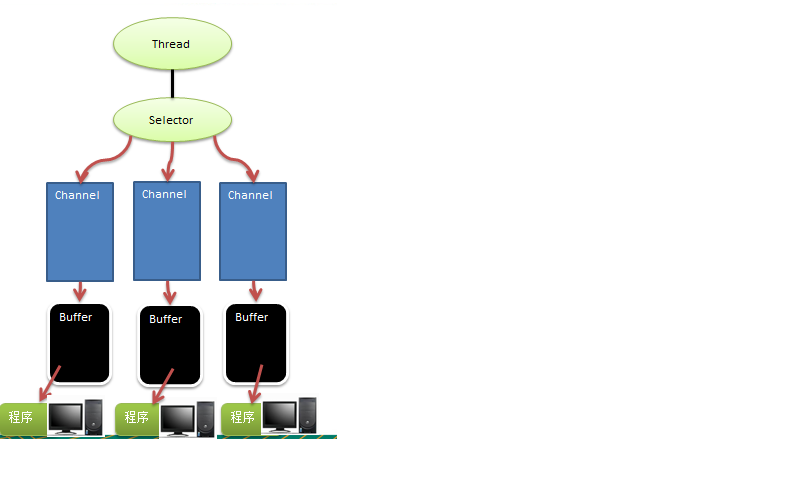
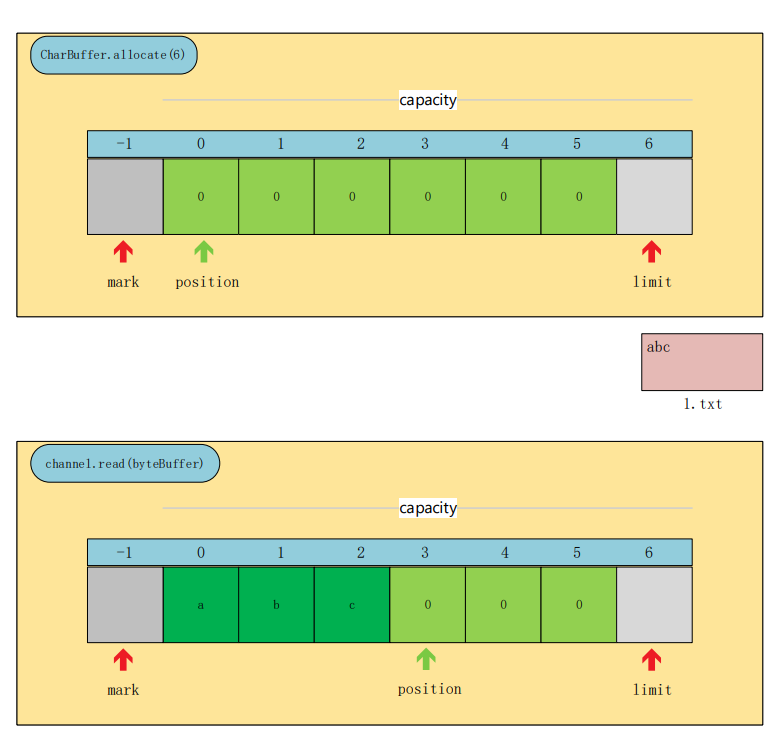
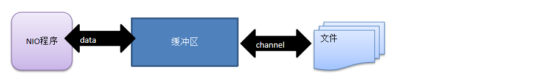
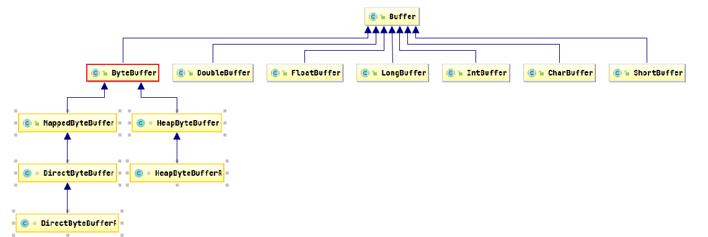
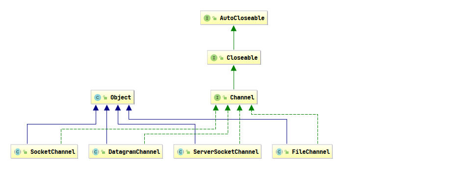
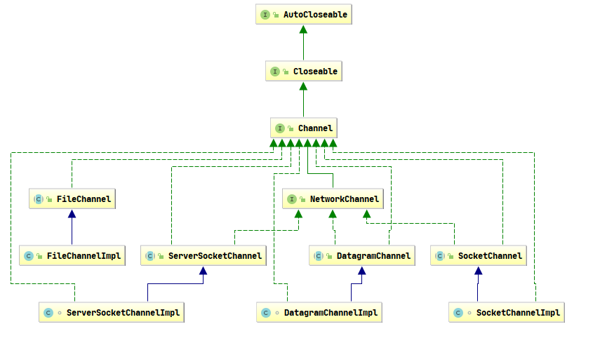
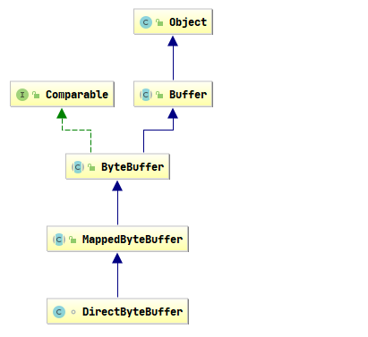
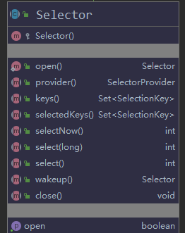
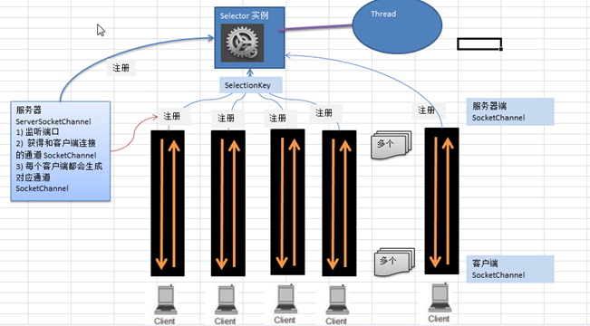

# Netty核心技术

## I/O模型

> I/O模型是什么？就是用什么样的通道进行数据的发送和接收，很大程度上决定了程序通信的性能

## Java共支持3种网络编程模型/IO模式：BIO、NIO、AIO

>:one:BIO ： 同步并阻塞(传统阻塞型)  
>
>:two:NIO：  同步非阻塞
>
>:three:AIO(NIO.2)：异步非阻塞

## BIO

>服务器实现模式为一个连接一个线程，即客户端有连接请求时服务器端就需要启动一个线程进行处理，如果这个连接不做任何事情会造成不必要的线程开销，可以通过线程池机制改善
>
>IO方式适用于连接数目比较小且固定的架构，这种方式对服务器资源要求比较高，并发局限于应用中，JDK1.4以前的唯一选择，程序简单易理解

>```java
>public class BIOServer {
>
>    //telnet 127.0.0.1 6666
>    public static void main(String[] args) throws IOException {
>        ExecutorService executorService = Executors.newCachedThreadPool();
>        ServerSocket serverSocket = new ServerSocket(6666);
>        System.out.println("服务器启动了");
>                while (true){
>                    System.out.println(Thread.currentThread().getName() + "- 等待客户端建立连接----");
>                    Socket accept = serverSocket.accept();
>                    System.out.println("----与客户端建立连接----");
>                    System.out.println(Thread.currentThread().getName() + " 连接一个客户端");
>                    executorService.execute(()->handler(accept));
>                }
>    }
>
>    public static void handler(Socket socket){
>        System.out.println();
>
>        byte[] bytes = new byte[1024];
>        try {
>            InputStream inputStream = socket.getInputStream();
>            while (true){
>                System.out.println(Thread.currentThread().getName() + "- 等待客户端发送消息----");
>                int read = inputStream.read(bytes);
>                if (read != -1) {
>                    System.out.println(Thread.currentThread().getName() + " : " +new String(bytes,0,read));
>                }else {
>                    break;
>                }
>            }
>        } catch (IOException e) {
>            e.printStackTrace();
>        }finally {
>            System.out.println("关闭和客户端的连接");
>            try {
>                socket.close();
>            } catch (IOException e) {
>                e.printStackTrace();
>            }
>        }
>    }
>}
>
>```
>
><u>serverSocket.accept()   与inputStream.read(bytes)方法都是阻塞的</u>


## NIO

> NIO 全称 java non-blocking IO
>
> 从 JDK1.4 开始，Java 提供了一系列改进的输入/输出的新特性，被统称为 NIO(即 New IO)，是同步非阻塞的
>
> NIO 相关类都被放在 java.nio 包及子包下，并且对原 java.io 包中的很多类进行改写。

### NIO 有三大核心部分：

:one:Channel(通道)

:two:Buffer(缓冲区)

:three:Selector(选择器) 



```
上图是三个Channel注册到了Selector上
```


> Buffer是一个内存块，底层是一个数组
>
> 每个Channel都对应一个buffer
>
> 一个Selector对应一个线程 
>
> 一个线程对应多个Channel
>
> 程序切换到哪个Channel是由事件决定的
>
> Selector可以根据不同的事件在不同的Channel切换
>
> 数据的读取写通过过Buffer,这个和BIO是不同的，但是NIO的Buffer是可以写，也可以读
>
> Selector可以感知通道的事件，它可以选择处理哪些事件。一个线程可以处理多个操作


### NIO 和 BIO 的比较 

>BIO 以流的方式处理数据,而 NIO 以块的方式处理数据,块 I/O 的效率比流 I/O 高很多
>BIO 是阻塞的，NIO 则是非阻塞的
>BIO基于字节流和字符流进行操作，而 NIO 基于 Channel(通道)和 Buffer(缓冲区)进行操作，数据总是从通道读取到缓冲区中，或者从缓冲区写入到通道中。Selector(选择器)用于监听多个通道的事件（比如：连接请求，数据到达等），因此使用单个线程就可以监听多个客户端通道


### IntBuffer

>```java
>    public static void main(String[] args) {
>        IntBuffer buffer = IntBuffer.allocate(5);
>        buffer.put(10);
>        buffer.put(11);
>        buffer.put(12);
>        //将buffer进行读写切换
>        Buffer flip = buffer.flip();
>        //remaining 美[rɪˈmeɪnɪŋ] 还需处理的
>        while (buffer.hasRemaining()) {
>            System.out.println(buffer.get());
>    }
>      
>    public final Buffer flip() {
>        limit = position;
>        position = 0;
>        mark = -1;
>        return this;
>    }
>```



### 缓冲区(Buffer)

>缓冲区（Buffer）：缓冲区本质上是一个可以读写数据的内存块，可以理解成是一个容器对象(含数组)，该对象提供了一组方法，可以更轻松地使用内存块，，缓冲区对象内置了一些机制，能够跟踪和记录缓冲区的状态变化情况。Channel 提供从文件、网络读取数据的渠道，但是读取或写入的数据都必须经由 Buffer



### 缓冲区类及其子类




> public abstract class Buffer {
>     //JDK1.4时，引入的api
>     **<font color='red'>public final int capacity( )</font>**//返回此缓冲区的容量
>     **<font color='red'>public final int position( )//返回此缓冲区的位置</font>**
>    <font color='red'> **public final Buffer position (int newPositio)//设置此缓冲区的位置**</font>
>    <font color='red'> **public final int limit( )//返回此缓冲区的限制**</font>
>     <font color='red'>**public final Buffer limit (int newLimit)//设置此缓冲区的限制**</font>
>     public final Buffer mark( )//在此缓冲区的位置设置标记
>     <font color='red'>**public final Buffer reset( )//将此缓冲区的位置重置为以前标记的位置**</font>
>     <font color='red'>**public final Buffer clear( )//清除此缓冲区, 即将各个标记恢复到初始状态，但是数据并没有真正擦除, 后面操作会覆盖**</font>
>    <font color='red'> **public final Buffer flip( )//反转此缓冲区**</font>
>     public final Buffer rewind( )//重绕此缓冲区
>    <font color='red'> **public final int remaining( )//返回当前位置与限制之间的元素数**</font>
>    <font color='red'> **public final boolean hasRemaining( )//告知在当前位置和限制之间是否有元素**</font>
>     public abstract boolean isReadOnly( );//告知此缓冲区是否为只读缓冲区
>
> ​    //JDK1.6时引入的api
> ​    public abstract boolean hasArray();//告知此缓冲区是否具有可访问的底层实现数组
> ​    public abstract Object array();//返回此缓冲区的底层实现数组
> ​    public abstract int arrayOffset();//返回此缓冲区的底层实现数组中第一个缓冲区元素的偏移量
> ​    public abstract boolean isDirect();//告知此缓冲区是否为直接缓冲区
> }


>public abstract class ByteBuffer {
>//缓冲区创建相关api
><font color='red'>**public static ByteBuffer allocateDirect(int capacity)//创建直接缓冲区**</font>
><font color='red'>**public static ByteBuffer allocate(int capacity)//设置缓冲区的初始容量**</font>
>public static ByteBuffer wrap(byte[] array)//把一个数组放到缓冲区中使用
>//构造初始化位置offset和上界length的缓冲区
>public static ByteBuffer wrap(byte[] array,int offset, int length)
>//缓存区存取相关API
><font color='red'>**public abstract byte get( );//从当前位置position上get，get之后，position会自动+1**</font>
><font color='red'>**public abstract byte get (int index);//从绝对位置get**</font>
><font color='red'>**public abstract ByteBuffer put (byte b);//从当前位置上添加，put之后，position会自动+1**</font>
><font color='red'>**public abstract ByteBuffer put (int index, byte b);//从绝对位置上put**</font>
> }


### 通道（Channel）

>  NIO 中的通道(Channel)是双向的，可以读操作，也可以写操作。






> 1. FileChannel 用于文件的数据读写，DatagramChannel 用于 UDP 的数据读写，
>
> 2. ServerSocketChannel 和 SocketChannel 用于 TCP 的数据读写。
>
> 3. FileChannel主要用来对本地文件进行 IO 操作


#### FileChannel

> public int read(ByteBuffer dst) ，从通道读取数据并放到缓冲区中  <font color='green'> **通道  -> 缓冲区**</font>
> public int write(ByteBuffer src) ，把缓冲区的数据写到通道中          <font color='green'>**缓冲区->通道**</font>
> public long transferFrom(ReadableByteChannel src, long position, long count)，从目标通道中复制数据到当前通道
> public long transferTo(long position, long count, WritableByteChannel target)，把数据从当前通道复制给目标通道


> 使用前面学习后的ByteBuffer(缓冲) 和 FileChannel(通道)， 将 "hello,尚硅谷" 写入到file01.txt 中

```java
    @Test
    public void writeToFile() throws IOException {
        FileOutputStream outputStream = new FileOutputStream("NIOFileChannel01.txt");
        FileChannel outChannel = outputStream.getChannel();
        ByteBuffer buffer = ByteBuffer.allocate(1024);
        buffer.put("你好，NIO".getBytes());
        buffer.flip();
        outChannel.write(buffer);
        outputStream.close();
    }
```

> 读取文件，输出到控制台

```java
    @Test
    public void readFileToConsole() throws IOException {
        File file = new File("NIOFileChannel01.txt");
        FileInputStream inputStream = new FileInputStream(file);
        //获取channel
        FileChannel inputStreamChannel = inputStream.getChannel();
        ByteBuffer buffer = ByteBuffer.allocate(1024);
        //创建缓冲区
        //ByteBuffer buffer = ByteBuffer.allocate((int)file.length());
        //把数据读取到buffer
        inputStreamChannel.read(buffer);
        //读写反转
        buffer.flip();
        byte[] array = buffer.array();
//        System.out.println(new String(array));
        System.out.println(new String(array,0,buffer.limit()));

    }
```

> 用一个buffer完成文件copy

```java
    @Test
    public void readFileToFile() throws IOException {
        File fromFile = new File("D:\\LocalDataStore\\netty\\src\\main\\filetmp\\NIOFileChannel01.txt");
        File fileCopy = new File("D:\\LocalDataStore\\netty\\src\\main\\filetmp\\NIOFileChannel01-copy.txt");
        FileInputStream intputStream = new FileInputStream(fromFile);
        FileOutputStream outputStream = new FileOutputStream(fileCopy);
        FileChannel intputStreamChannel = intputStream.getChannel();
        ByteBuffer buffer = ByteBuffer.allocate(8);
        //创建缓冲区
        //ByteBuffer buffer = ByteBuffer.allocate((int)file.length());
        while (true){
            int read = intputStreamChannel.read(buffer);
            if (read == -1 || read == 0) {
                break;
            }else {
                buffer.flip();
                FileChannel outputStreamchannel = outputStream.getChannel();
                outputStreamchannel.write(buffer);
                buffer.clear();
            }
        }
        outputStream.close();
    }
```


> 把buffer 转成只读buffer   只读buffer写的时候抛出java.nio.ReadOnlyBufferException

```java
    @Test
    public void onlyRead() throws IOException {
        ByteBuffer byteBuffer = ByteBuffer.allocate(64);
        for (int i = 0; i < 64; i++) {
            byteBuffer.put((byte) i);
        }
        byteBuffer.flip();
        ByteBuffer readOnlyBuffer = byteBuffer.asReadOnlyBuffer();
        System.out.println(readOnlyBuffer.getClass());
        while (readOnlyBuffer.hasRemaining()){
            System.out.println(readOnlyBuffer.get());
        }
        readOnlyBuffer.put((byte) 1);
    }
```


#### MappedByteBuffer

> 可以让文件只在堆外内存中修改，操作系统不需要copy一次  操作是系统级别，性能比较好



```java
@Test
public void modifyNonHeap() throws IOException {
    RandomAccessFile randomAccessFile = new RandomAccessFile("1.txt", "rw");
    FileChannel channel = randomAccessFile.getChannel();
    MappedByteBuffer mappedByteBuffer = channel.map(FileChannel.MapMode.READ_WRITE, 0, 5);
    mappedByteBuffer.put(0,(byte)'a');
    mappedByteBuffer.put(3,(byte)'C');
    randomAccessFile.close();
}
-- 123456789 -> a23C56789
```


## Selector

> 
>
> ```java
> public abstract class Selector implements Closeable { 
>     //得到一个选择器对象
> 	public static Selector open();
>     //监控所有注册的通道，当其中有 IO 操作可以进行时，将对应的 SelectionKey 加入到内部集合中并返回，参数用来设置超时时间
> 	public int select(long timeout);
>     //从内部集合中得到所有的 SelectionKey
> 	public Set<SelectionKey> selectedKeys();	
> }
> ```
>`NIO`中的` ServerSocketChannel`功能类似`ServerSocket`，`SocketChannel`功能类似`Socket`


### NIO 非阻塞 网络编程原理分析

> 
>
> :one:当客户端连接时，会通过`ServerSocketChannel `得到`SocketChannel`
>
> :two:`​Selector `进行监听 select 方法, 返回有事件发生的通道的个数.
>
> :three:将`SocketChannel`注册到`Selector`上, register(Selector sel, **int** ops), 一个selector上可以注册多个SocketChannel
>
> :four:注册后返回一个` SelectionKey`, 会和该`Selector `关联(集合)
>
> :five:进一步得到各个` SelectionKey `(有事件发生)
>
> :six:在通过` SelectionKey ` 反向获取 `SocketChannel `, 方法 channel()
>
> :seven:通过channel  , 完成业务处理

------


### 手写NIOSocketServer和NIOClient

> **NIOSocketServer**
>
> > ```java
> > package com.netty.chapter6;
> > 
> > import java.io.IOException;
> > import java.net.InetSocketAddress;
> > import java.nio.ByteBuffer;
> > import java.nio.channels.*;
> > import java.util.Iterator;
> > import java.util.Set;
> > 
> > public class NIOSocketServer {
> > 
> >     public static void main(String[] args) throws IOException {
> >         //创建一个ServerSocketChannel
> >         final ServerSocketChannel serverSocketChannel = ServerSocketChannel.open();
> >         //创建一个Selector
> >         final Selector selector = Selector.open();
> >         //监听端口6666
> >         serverSocketChannel.bind(new InetSocketAddress(6666));
> >         //设置为非阻塞
> >         serverSocketChannel.configureBlocking(false);
> >         serverSocketChannel.register(selector, SelectionKey.OP_ACCEPT);
> >         while (true) {
> >             if (selector.select(1000) == 0) {
> > //                System.out.println("服务器等待1秒，没有连接");
> >                 continue;
> >             }
> >             //获取有事件发生的selectionKey集合
> >             final Set<SelectionKey> selectionKeys = selector.selectedKeys();
> >             final Iterator<SelectionKey> iterator = selectionKeys.iterator();
> >             if (iterator.hasNext()) {
> >                 final SelectionKey selectionKey = iterator.next();
> >                 //根据事件类型，分别做不同处理
> >                 if (selectionKey.isAcceptable()) {
> >                     //selectionKeys反向获取channel
> >                     //方法执行到这里，说明确实有连接事件发生了，accept()方法不会阻塞在这里
> >                     final SocketChannel socketChannel = serverSocketChannel.accept();
> >                     //设置channel为非阻塞
> >                     socketChannel.configureBlocking(false);
> >                     //将客户端的channel注册到Selector,并绑定一个Buffer
> >                     socketChannel.register(selector, SelectionKey.OP_READ, ByteBuffer.allocate(1024));
> >                 }
> >                 if (selectionKey.isConnectable()) {
> > 
> >                 }
> >                 //发生了读的事件
> >                 if (selectionKey.isReadable()) {
> >                     //selectionKeys反向获取channel
> >                     final SocketChannel socketChannel = (SocketChannel) selectionKey.channel();
> >                     final ByteBuffer buffer = (ByteBuffer) selectionKey.attachment();
> >                     System.out.println("attachment buffer:"+buffer.hashCode());
> >                     socketChannel.read(buffer);
> >                     System.out.println("from 客户端 " + new String(buffer.array(),0,buffer.position()));
> >                     //这里需要注意 和当前selectorKey 绑定的 buffer 每次用完需要 clear 否则下次用的时候里面有上次的数据
> >                     buffer.clear();
> >                 }
> >                 //手动从集合中移除当前selectorKey
> >                 iterator.remove();
> >             }
> >         }
> >     }
> > }
> > 
> > ```
>
> **NIOClient**
>
> > ```java
> > package com.netty.chapter6;
> > 
> > import java.io.IOException;
> > import java.net.InetSocketAddress;
> > import java.nio.ByteBuffer;
> > import java.nio.channels.SocketChannel;
> > import java.util.Scanner;
> > 
> > public class NIOClientSocket {
> > 
> >     public static void main(String[] args) throws IOException {
> >         final SocketChannel socketChannel = SocketChannel.open();
> >         socketChannel.configureBlocking(false);
> >         final InetSocketAddress inetSocketAddress = new InetSocketAddress("127.0.0.1", 6666);
> >         //是非阻塞的
> >         if (!socketChannel.connect(inetSocketAddress)) {
> >             while (!socketChannel.finishConnect()) {
> >                 System.out.println("如果客户端没有连接上服务端，客户端也不会阻塞connect这里，可以去做其他工作");
> >             }
> >         }
> >         //连接到服务端了
> >         final Scanner scanner = new Scanner(System.in);
> >         while (true) {
> >             System.out.println("请输入你要发送的信息");
> >             String msg = scanner.next();
> >             final ByteBuffer buffer = ByteBuffer.wrap(msg.getBytes());
> >             System.out.println("客户端buffer:" + buffer.hashCode());
> >             //将buffer数据写入buffer
> >             socketChannel.write(buffer);
> >         }
> >     }
> > }
> > 
> > ```

------


### SelectionKey解读

> **SelectionKey，表示 Selector 和网络通道的注册关系**
>
> 共四种:
>
> - int OP_ACCEPT：有新的网络连接可以 accept，值为 16
>
> - int OP_CONNECT：代表连接已经建立，值为 8
>
> - int OP_READ：代表读操作，值为 1 
>
> - int OP_WRITE：代表写操作，值为 4


### 群聊系统

> Server端
>
> > ```java
> > import java.io.IOException;
> > import java.net.InetSocketAddress;
> > import java.nio.ByteBuffer;
> > import java.nio.channels.*;
> > import java.util.Iterator;
> > 
> > public class GroupChatServer {
> >     //定义属性
> >     private Selector selector;
> >     private ServerSocketChannel listenChannel;
> >     private static final int PORT = 6667;
> >     //构造器
> >     //初始化工作
> >     public GroupChatServer() {
> >         try {
> >             //得到选择器
> >             selector = Selector.open();
> >             //ServerSocketChannel
> >             listenChannel =  ServerSocketChannel.open();
> >             //绑定端口
> >             listenChannel.socket().bind(new InetSocketAddress(PORT));
> >             //设置非阻塞模式
> >             listenChannel.configureBlocking(false);
> >             //将该listenChannel 注册到selector
> >             listenChannel.register(selector, SelectionKey.OP_ACCEPT);
> >         }catch (IOException e) {
> >             e.printStackTrace();
> >         }
> > 
> >     }
> > 
> >     //监听
> >     public void listen() {
> >         System.out.println("监听线程: " + Thread.currentThread().getName());
> >         try {
> >             //循环处理
> >             while (true) {
> >                 int count = selector.select();
> >                 if(count > 0) {//有事件处理
> >                     //遍历得到selectionKey 集合
> >                     Iterator<SelectionKey> iterator = selector.selectedKeys().iterator();
> >                     while (iterator.hasNext()) {
> >                         //取出selectionkey
> >                         SelectionKey key = iterator.next();
> > 
> >                         //监听到accept
> >                         if(key.isAcceptable()) {
> >                             SocketChannel sc = listenChannel.accept();
> >                             sc.configureBlocking(false);
> >                             //将该 sc 注册到seletor
> >                             sc.register(selector, SelectionKey.OP_READ);
> > 
> >                             //提示
> >                             System.out.println(sc.getRemoteAddress() + " 上线 ");
> > 
> >                         }
> >                         if(key.isReadable()) { //通道发送read事件，即通道是可读的状态
> >                             //处理读 (专门写方法..)
> > 
> >                             readData(key);
> > 
> >                         }
> >                         //当前的key 删除，防止重复处理
> >                         iterator.remove();
> >                     }
> > 
> >                 } else {
> >                     System.out.println("等待....");
> >                 }
> >             }
> >         }catch (Exception e) {
> >             e.printStackTrace();
> > 
> >         }finally {
> >             //发生异常处理....
> >         }
> >     }
> > 
> >     //读取客户端消息
> >     private void readData(SelectionKey key) {
> >         //取到关联的channle
> >         SocketChannel channel = null;
> >         try {
> >             //得到channel
> >             channel = (SocketChannel) key.channel();
> >             //创建buffer
> >             ByteBuffer buffer = ByteBuffer.allocate(1024);
> >             int count = channel.read(buffer);
> >             //根据count的值做处理
> >             if(count > 0) {
> >                 //把缓存区的数据转成字符串
> >                 String msg = new String(buffer.array());
> >                 //输出该消息
> >                 System.out.println("form 客户端: " + msg);
> >                 //向其它的客户端转发消息(去掉自己), 专门写一个方法来处理
> >                 sendInfoToOtherClients(msg, channel);
> >             }
> >         }catch (IOException e) {
> >             try {
> >                 System.out.println(channel.getRemoteAddress() + " 离线了..");
> >                 //取消注册
> >                 key.cancel();
> >                 //关闭通道
> >                 channel.close();
> >             }catch (IOException e2) {
> >                 e2.printStackTrace();;
> >             }
> >         }
> >     }
> >     //转发消息给其它客户(通道)
> >     private void sendInfoToOtherClients(String msg, SocketChannel self ) throws  IOException{
> > 
> >         System.out.println("服务器转发消息中...");
> >         System.out.println("服务器转发数据给客户端线程: " + Thread.currentThread().getName());
> >         //遍历 所有注册到selector 上的 SocketChannel,并排除 self
> >         for(SelectionKey key: selector.keys()) {
> > 
> >             //通过 key  取出对应的 SocketChannel
> >             Channel targetChannel = key.channel();
> > 
> >             //排除自己
> >             if(targetChannel instanceof  SocketChannel && targetChannel != self) {
> > 
> >                 //转型
> >                 SocketChannel dest = (SocketChannel)targetChannel;
> >                 //将msg 存储到buffer
> >                 ByteBuffer buffer = ByteBuffer.wrap(msg.getBytes());
> >                 //将buffer 的数据写入 通道
> >                 dest.write(buffer);
> >             }
> >         }
> > 
> >     }
> >     public static void main(String[] args) {
> >         //创建服务器对象
> >         GroupChatServer groupChatServer = new GroupChatServer();
> >         groupChatServer.listen();
> >     }
> > }
> > 
> > //可以写一个Handler
> > class MyHandler {
> >     public void readData() {
> >     }
> >     public void sendInfoToOtherClients(){
> > 
> >     }
> > }
> > 
> > 
> > ```
> >
> > 
>
> Client端
>
> > ```java
> > import java.io.IOException;
> > import java.net.InetSocketAddress;
> > import java.nio.ByteBuffer;
> > import java.nio.channels.SelectionKey;
> > import java.nio.channels.Selector;
> > import java.nio.channels.SocketChannel;
> > import java.util.Iterator;
> > import java.util.Scanner;
> > 
> > public class GroupChatClient {
> >     //定义相关的属性
> >     private final String HOST = "127.0.0.1"; // 服务器的ip
> >     private final int PORT = 6667; //服务器端口
> >     private Selector selector;
> >     private SocketChannel socketChannel;
> >     private String username;
> > 
> >     //构造器, 完成初始化工作
> >     public GroupChatClient() throws IOException {
> >         selector = Selector.open();
> >         //连接服务器
> >         socketChannel = socketChannel.open(new InetSocketAddress("127.0.0.1", PORT));
> >         //设置非阻塞
> >         socketChannel.configureBlocking(false);
> >         //将channel 注册到selector
> >         socketChannel.register(selector, SelectionKey.OP_READ);
> >         //得到username
> >         username = socketChannel.getLocalAddress().toString().substring(1);
> >         System.out.println(username + " is ok...");
> >     }
> >     //向服务器发送消息
> >     public void sendInfo(String info) {
> >         info = username + " 说：" + info;
> >         try {
> >             socketChannel.write(ByteBuffer.wrap(info.getBytes()));
> >         }catch (IOException e) {
> >             e.printStackTrace();
> >         }
> >     }
> >     //读取从服务器端回复的消息
> >     public void readInfo() {
> >         try {
> >             int readChannels = selector.select();
> >             if(readChannels > 0) {//有可以用的通道
> >                 Iterator<SelectionKey> iterator = selector.selectedKeys().iterator();
> >                 while (iterator.hasNext()) {
> >                     SelectionKey key = iterator.next();
> >                     if(key.isReadable()) {
> >                         //得到相关的通道
> >                         SocketChannel sc = (SocketChannel) key.channel();
> >                         //得到一个Buffer
> >                         ByteBuffer buffer = ByteBuffer.allocate(1024);
> >                         //读取
> >                         sc.read(buffer);
> >                         //把读到的缓冲区的数据转成字符串
> >                         String msg = new String(buffer.array());
> >                         System.out.println(msg.trim());
> >                     }
> >                 }
> >                 iterator.remove(); //删除当前的selectionKey, 防止重复操作
> >             } else {
> >                 //System.out.println("没有可以用的通道...");
> >             }
> >         }catch (Exception e) {
> >             e.printStackTrace();
> >         }
> >     }
> >     public static void main(String[] args) throws Exception {
> >         //启动我们客户端
> >         GroupChatClient chatClient = new GroupChatClient();
> >         //启动一个线程, 每个3秒，读取从服务器发送数据
> >         new Thread() {
> >             public void run() {
> >                 while (true) {
> >                     chatClient.readInfo();
> >                     try {
> >                         Thread.currentThread().sleep(3000);
> >                     }catch (InterruptedException e) {
> >                         e.printStackTrace();
> >                     }
> >                 }
> >             }
> >         }.start();
> >         //发送数据给服务器端
> >         Scanner scanner = new Scanner(System.in);
> >         while (scanner.hasNextLine()) {
> >             String s = scanner.nextLine();
> >             chatClient.sendInfo(s);
> >         }
> >     }
> > }
> > 
> > ```

------


## NIO与零拷贝

> ​		我们说零拷贝，是从操作系统的角度来说的。传统文件copy，需要经过 **4 次用户态与内核态的上下文切换** 以及**4 次数据拷贝**，其中两次是 DMA 的拷贝，另外两次则是通过 CPU 拷贝。上下文切换到成本并不小，一次切换需要耗时几十纳秒到几微秒，虽然时间看上去很短，但是在高并发的场景下，这类时间容易被累积和放大，从而影响系统的性能。文件传输的过程，我们只是搬运一份数据，结果却搬运了 4 次，过多的数据拷贝无疑会消耗 CPU 资源，大大降低了系统性能。为了提高文件传输的性能，就需要减少上下文的切换和文件copy的次数。
>
> **因为我们没有在内存层面去拷贝数据，也就是说全程没有通过 CPU 来搬运数据，所有的数据都是通过 DMA 来进行传输的。**零拷贝技术的文件传输方式相比传统文件传输的方式，减少了 2 次上下文切换和数据拷贝次数，**只需要 2 次上下文切换和数据拷贝次数，就可以完成文件的传输，而且 2 次的数据拷贝过程，都不需要通过 CPU，2 次都是由 DMA 来搬运。，**零拷贝技术可以把文件传输的性能提高至少一倍以上**。
>
> ```
> 什么是 DMA(（Direct Memory Access）) 技术？
> 简单理解就是，在进行 I/O 设备和内存的数据传输的时候，数据搬运的工作全部交给 DMA 控制器，而 CPU 不再参与任何与数据搬运相关的事情，
> 这样 CPU 就可以去处理别的事务。
> ```

