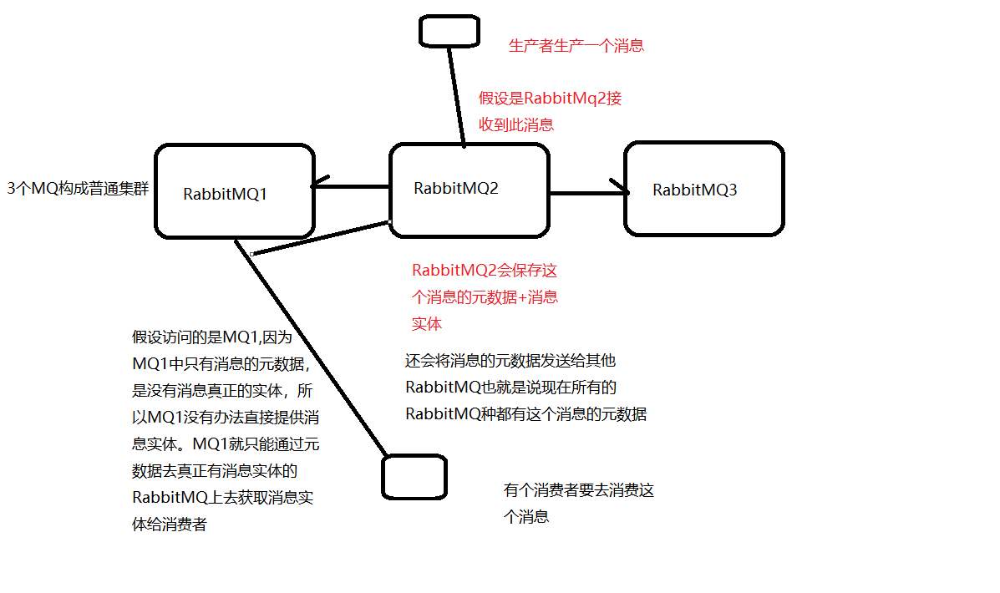
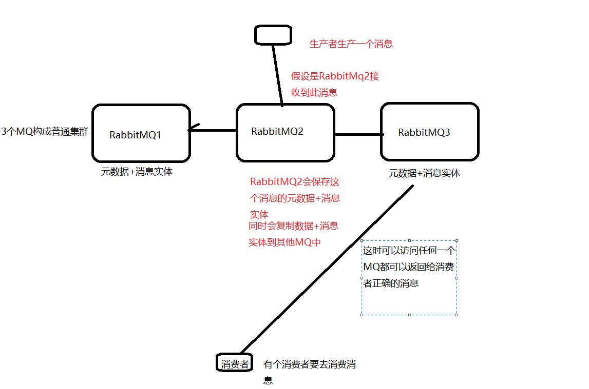
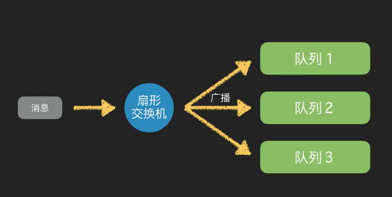
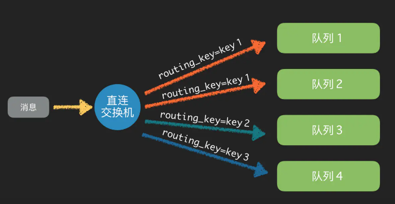
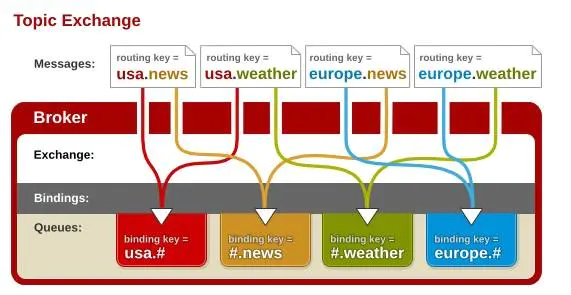

# RabbitMQ面试题

## 1、什么是RabbitMQ？为什么使用RabbitMQ？

> 答：RabbitMQ是一款开源的，Erlang编写的，基于AMQP协议的，消息中间件

## 2、RabbitMQ有什么优缺点？

> 优点：
>
> - 解耦
>
> - 异步
>
> - 削峰
>
> 缺点：
>
> - 降低了系统的稳定性：本来系统运行好好的，现在你非要加入个消息队列进去，那消息队列挂了，你的系统不是呵呵了。因此，系统可用性会降低；
>- 增加了系统的复杂性：加入了消息队列，要多考虑很多方面的问题，比如：一致性问题、如何保证消息不被重复消费、如何保证消息可靠性传输等。

------

## 3、如何保证RabbitMQ的高可用？

> 答：没有哪个项目会只用一搭建一台RabbitMQ服务器提供服务，风险太大；

## 4、rabbitmq 有三种模式？

> RabbitMQ有三种模式，其中集群模式有两种：
>
> - **单一模式：**
>
> 单机版的，不做集群，单独运行一个RabbitMQ。
>
> 
>
> - **普通模式集群**
>
> 默认的集群方式
>
> 
>
> 缺点：
> 可以带来一定的效率，但在带来效率的同时也增加了一些负担？就是增加了MQ节点之间的通信，这部分通信也会占用资源，增加时间成本。
> 所有这种方式并没有提供多少高可用！
>
> - **镜像模式集群** 可以真正带来高可用！！
>
>   

------

## 5、如何保证RabbitMQ不被重复消费？

> 先说为什么会重复消费：
>
> 正常情况下，消费者在消费消息的时候，消费完毕后，会发送一个确认消息给消息队列，消息队列就知道该消息被消费了，就会将该消息从消息队列中删除；
>
> 但是因为网络传输等等故障，确认信息没有传送到消息队列，导致消息队列不知道自己已经消费过该消息了，再次将消息分发给其他的消费者。
>
> 针对以上问题，一个解决思路是：保证消息的唯一性，就算是多次传输，不要让消息的多次消费带来影响；保证消息等幂性；
>
> 比如：在写入消息队列的数据做唯一标示，消费消息时，根据唯一标识判断是否消费过；

------

 

## 6、如何保证RabbitMQ消息的可靠传输？

> **丢失又分为：生产者丢失消息、消息列表丢失消息、消费者丢失消息；**
>
> **生产者丢失消息**：从生产者弄丢数据这个角度来看，RabbitMQ提供transaction和confirm模式来确保生产者不丢消息；
>
> **transaction机制**就是说：发送消息前，开启事务（channel.txSelect()）,然后发送消息，如果发送过程中出现什么异常，事务就会回滚（channel.txRollback()）,如果发送成功则提交事务（channel.txCommit()）。然而，这种方式有个缺点：吞吐量下降；
>
> **confirm模式**用的居多：一旦channel进入confirm模式，所有在该信道上发布的消息都将会被指派一个唯一的ID（从1开始），一旦消息被投递到所有匹配的队列之后；rabbitMQ就会发送一个ACK给生产者（包含消息的唯一ID），这就使得生产者知道消息已经正确到达目的队列了；如果rabbitMQ没能处理该消息，则会发送一个Nack消息给你，你可以进行重试操作。
>
>  
>
> **消息队列丢数据**：消息持久化。
>
> **处理消息队列丢数据的情况，一般是开启持久化磁盘的配置。**
>
> **这个持久化配置可以和confirm机制配合使用，你可以在消息持久化磁盘后，再给生产者发送一个Ack信号。**
>
> 这样，如果消息持久化磁盘之前，rabbitMQ阵亡了，那么生产者收不到Ack信号，生产者会自动重发。
>
> **那么如何持久化呢？**
>
> 这里顺便说一下吧，其实也很容易，就下面两步
>
> 1. 将queue的持久化标识durable设置为true,则代表是一个持久的队列  [发音](https://www.baidu.com/s?ie=utf-8&f=8&rsv_bp=1&tn=baidu&wd=durable&oq=delivery&rsv_pq=9e94af550003aafc&rsv_t=bbf2BW7gqbeG5LqtMiZzFrmWLziibJgfiWNvmiXzHal51dtZC7tWa%2BV8mVY&rqlang=cn&rsv_enter=0&rsv_dl=tb&rsv_n=2&rsv_sug3=1&rsv_sug1=1&rsv_sug7=100&rsv_btype=t&prefixsug=durable&rsp=0&inputT=997&rsv_sug4=997) 美[ˈdʊrəbl]
> 2. 发送消息的时候将deliveryMode=2   [发音](https://www.baidu.com/s?ie=utf-8&f=8&rsv_bp=1&tn=baidu&wd=delivery&oq=deliveryMode&rsv_pq=f34a2247000a7b40&rsv_t=27c27vra8Qhi4BnOhwoeRsr2pHyIgN2lOARqRkx%2BI%2FOQNEnOJL1Ie3VHKVg&rqlang=cn&rsv_enter=0&rsv_dl=tb&rsv_btype=t&inputT=386&rsv_sug3=53&rsv_sug1=68&rsv_sug7=100&rsv_sug2=0&prefixsug=delivery&rsp=0&rsv_sug4=1256) 美[dɪˈlɪvəri]
>
> 这样设置以后，即使rabbitMQ挂了，重启后也能恢复数据  
>
>  
>
> **消费者丢失消息**：消费者丢数据一般是因为采用了自动确认消息模式，改为手动确认消息即可！
>
> 消费者在收到消息之后，处理消息之前，会自动回复RabbitMQ已收到消息；
>
> 如果这时处理消息失败，就会丢失该消息；
>
> 解决方案：处理消息成功后，手动回复确认消息。

------

## 7、如何保证RabbitMQ消息的顺序性？

> 答：单线程消费保证消息的顺序性；对消息进行编号，消费者处理消息是根据编号处理消息。

## 8、RabbitMQ四种交换机类型

> - 直连交换机：Direct exchange  扇形交换机是最基本的交换机类型，它所能做的事情非常简单———广播消息
>
>   > 
>
> - 扇形交换机：Fanout exchange  [发音](https://www.baidu.com/s?ie=utf-8&f=8&rsv_bp=1&tn=baidu&wd=Fanout&oq=rabbitmq%E4%BA%A4%E6%8D%A2%E6%9C%BA%E7%B1%BB%E5%9E%8B&rsv_pq=fb4b4294000c5994&rsv_t=52982yRUAlp3afkpft5wTkoLS%2FVoopVhxo8gZSJDMje6uxDVYqzFsSzBbFg&rqlang=cn&rsv_enter=0&rsv_dl=tb&rsv_btype=t&inputT=962&rsv_n=2&rsv_sug3=68&rsv_sug1=86&rsv_sug7=100&rsv_sug4=962)
>
>   > 
>
> - 主题交换机：Topic exchange  主题交换机的`routing_key`需要有一定的规则，交换机和队列的`binding_key`需要采用`*.#.*.....`的格式，每个部分用`.`分开，其中：
>
>   - `*`表示一个单词
>   - `#`表示任意数量（零个或多个）单词。
>
>   > 
>
> - 首部交换机：Headers exchange
>
>   > 首部交换机是忽略`routing_key`的一种路由方式。路由器和交换机路由的规则是通过`Headers`信息来交换的，这个有点像`HTTP`的`Headers`。