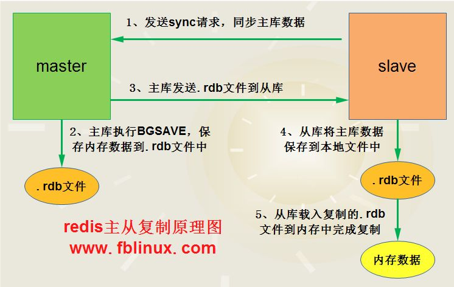

# 什么是redis?

> ​		Redis:REmote DIctionary Server(远程字典服务器)
> 是完全开源免费的，用C语言编写的，遵守BSD协议，是一个高性能的(key/value)分布式内存数据库，基于内存运行
> 并支持持久化的NoSQL数据库，是当前最热门的NoSql数据库之一,也被人们称为数据结构服务器。

# redis的三个特点

>  - [x] Redis支持数据的持久化，可以将内存中的数据保持在磁盘中，重启的时候可以再次加载进行使用
>   - [x] Redis不仅仅支持简单的key-value类型的数据，同时还提供list，set，zset，hash等数据结构的存储
>   - [x] Redis支持数据的备份，即master-slave模式的数据备份

# Redis的五大数据类型：

>:one:**string（字符串）**
>
> - [x] string是redis最基本的类型，你可以理解成与Memcached一模一样的类型，一个key对应一个value。
>
> - [x] string类型是二进制安全的。**意思是redis的string可以包含任何数据。比如jpg图片或者序列化的对象 。**
>
> - [x] string类型是Redis最基本的数据类型，**==一个redis中字符串value最多可以是512M==**
>
>:one:hash（哈希，类似java里的Map）**
>
> - [x] Redis hash是一个string类型的field和value的映射表，hash特别适合用于存储对象。类似Java里面的Map
>
>:two:**list（列表）**
>
> - [x] Redis 列表是简单的字符串列表，按照插入顺序排序。你可以添加一个元素导列表的头部（左边）或者尾部（右边）。
>   它的底层实际是个链表
>
>:three:**set（集合）**
>
> - [x] Redis的Set是string类型的无序集合。它是通过HashTable实现实现的，
>
>:four:**zset(sorted set：有序集合)**
>
> - [x] Redis zset 和 set 一样也是string类型元素的集合,且不允许重复的成员。 不同的是每个元素都会关联一个double类型的分 数。 redis正是通过分数来为集合中的成员进行从小到大的排序。zset的成员是唯一的,但分数(score)却可以重复。
>

# Reids数据持久化方式有哪些？

> :one:RDB
>
> :two:AOF

# 请你介绍下RDB与AOF

> - ==**RDB（Redis DataBase）**==
>
>   > ​		RDB持久化是指在指定的时间间隔内将内存中的数据集快照写入磁盘。
>   >
>   > 也是默认的持久化方式，这种方式是就是将内存中数据以快照的方式写入到二进制文件中,默认的文件名为**dump.rdb**。
>
>   过程：
>
>   > 📗 在我们安装了redis之后，所有的配置都是在redis.conf文件中，里面保存了RDB和AOF两种持久化机制的各种配置。
>
>   触发RDB机制的三种方式是什么，简单介绍下。
>
>   > 1. save方式，该命令会阻塞当前Redis服务器，执行save命令期间，Redis不能处理其他命令，直到RDB过程完成为止
>   >
>   > 2. bgsave方式，执行该命令时，Redis会在后台异步进行快照操作，快照同时还可以响应客户端请求。
>   >
>   > 3. 自动触发，自动触发是由我们的配置文件来完成的。具体的配置在redis.conf中。
>
> - Redis会单独fork一个子进程来进行持久化，会先将数据写入到一个**临时文件**中，待持久化过程都结束了，再用这个临时文件**替换**上次持久化好的文件。整个过程中，主进程是不进行任何IO操作的，这就确保了极高的性能,如果需要进行大规模数据的恢复，且对于数据恢复的完整性不是非常敏感，那**RDB方式要比AOF方式更加的高效**。RDB的缺点是最后一次持久化后的数据可能丢失。**rdb 保存的是dump.rdb文件**
>
> - ==**AOF（Append Only File）**==
>   
>   > ​		redis会将每一个收到的写命令都通过write函数追加到文件中。通俗的理解就是日志记录。AOF ：Redis 默认不开启。
>   
>   AOF文件重写原理？
>   
>   >​		持久化文件会变的越来越大。为了压缩aof的持久化文件。redis提供了bgrewriteaof命令。将内存中的数据以命令的方式保存到临时文件中，同时会fork出一条新进程来将文件重写。重写aof文件的操作，==并没有读取旧的aof文件==，而是将整个内存中的数据库内容用命令的方式重写了一个新的aof文件，这点和快照有点类似。
>   
>   AOF的触发机制？
>   
>   >1. 每修改同步always：同步持久化 每次发生数据变更会被立即记录到磁盘 性能较差但数据完整性比较好
>   >
>   >2. 每秒同步everysec：异步操作，每秒记录 如果一秒内宕机，有数据丢失

# 默认AOF方式是开启还是关闭?

> 关闭

# 如何开启AOF？

>修改默认的appendonly no，为yes

# 两种持久化方式是否能够同时开启？

> 可以
> RDB的数据不实时，同时使用两者时服务器重启也只会找AOF文件。

# 那要不要只使用AOF呢？

> 作者建议不要，因为RDB更适合用于备份数据库(AOF在不断变化不好备份)，快速重启，而且不会有AOF可能潜在的bug，留着作为一个万一的手段。

# Redis的复制(Master/Slave)  ,能干嘛？

> 1. 避免redis单点故障
> 2. 构建读写分离架构，满足读多写少的应用场景
> 3. 容灾恢复

# Redis主从数据复制过程：

>1. 当从库与主库建立主从关系后，会向主库发送SYNC命令，请求同步主库数据；
>
>2. 主库接收到SYNC命令，开始在后台保存快照数据（RDB持久化过程），并将其接收到的写命令写入缓存。
>
>3. 当快照完成后，主库Redis会将快照文件和所有缓存的写命令发送给从库。
>
>4. 从库Redis接收到命令后，会载入快照文件并执行收到的缓存命令。
>
>5. 然后，主库每收到写命令时就会将命令发送给从库Redis，从而保证数据的一致性。
>
>

 -  # **哨兵模式(sentinel)**
	
	能够后台监控主机是否故障，如果故障了根据投票数自动将从库转换为主库
	
	
	
	# 如果之前的master重启回来，会不会双master冲突？
	
	> 不会，master重启回来会成为slave
	
	