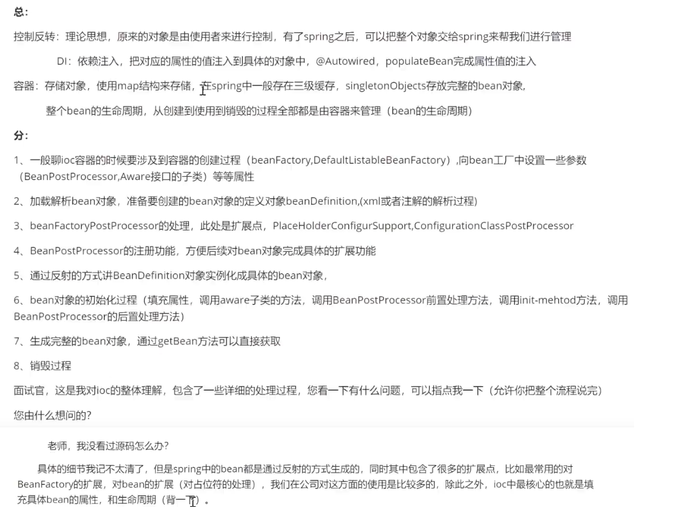
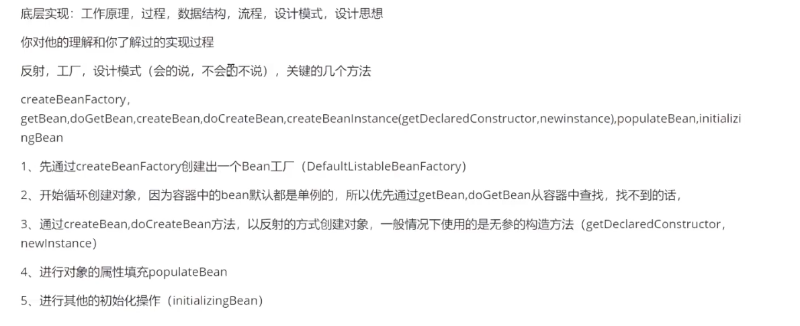
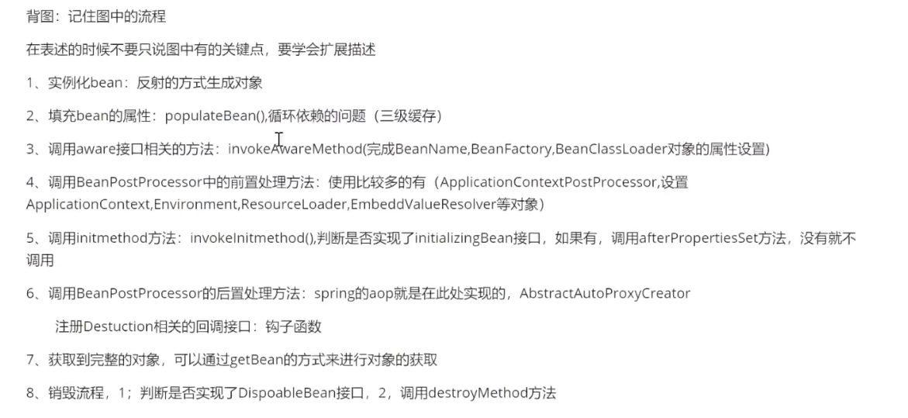

## 1、请说下`BeanFactory`和`ApplicationContext`的区别。

:one:从类的继承体系上来说，`ApplicationContext`是`BeanFactory`的子类，准确的说，`ApplicationContext`的父类是`ListableApplicationContext`，`ListableApplicationContext`的父类是`BeanFactory`。

:two:`BeanFactory`是懒加载机制，`bean`的初始化是在调用`getBean`方法之后才会实例化。`ApplicationContext`在容器启动后就会初始化。

:three:因为`ApplicationContext`是`BeanFactory`的子类，它处理有`BeanFactory`有的方法外，自身还扩展了很多方法。比如`BeanFactoryPostProcessor`的注册，`BeanPostProcessor`的注册。`applicationEvent`的发布，`initMessageSource` 初始化Massage源用于国际化的支持等等。

:four:`Spring`官方建议使用`ApplicationContext`。`ApplicationContext`包含`BeanFactory`所有功能，而且在`spring2.0`及更高的版本大量使用`BeanPostProcessor`作为扩展点。如果直接是有`BeanFactory`，比如事务和`AOP`之类的大量支持都不会生效。`BeanFactory`不提供对注解的支持。


## 2、谈下你对`springEvent`的理解？

标志着Application从启动开始到启动完成，各个阶段的分割点。

在Spring程序启动时，过程中分为几个阶段，每进行一个阶段，发出一个事件，依次对应ApplicationStartingEvent到ApplicationReadyEvent。

> SpringApplicationEvent 有6种事件：
>
> ApplicationStartingEvent：除了基础的注册监听和初始化之外，在开始运行时做任何处理动作之前发送
> ApplicationEnvironmentPreparedEvent 在上下文中使用的环境已知，但是Context尚未创建之前发送
> ApplicationPreparedEvent 在Spring刷新Context开始之前，而仅当加载bean定义之后发送
> ApplicationStartedEvent 在刷新上下文之后，但在调用任何应用程序（ApplicationRunner）和命令行运行程序（CommandLineRunner）之前发送
> ApplicationReadyEvent 在调用应用程序和命令行运行程序后发送。 它表示应用程序已准备好为请求提供服务。
> ApplicationFailedEvent 在启动过程中出现异常

如果我们需要对这些阶段做一些其他的事情，就可以监听这些事件 。

应用场景，比如说我们希望在分布式的微服务体系中，监控某些微服务启动是否失败，如果失败了，可以发送邮件通知管理员。那我们就可以监听ApplicationFailedEvent。再比如说，之前有一个场景，几个微服务之间有一定的依赖关系，启动顺序要求一个启动成功之后才能启动另一个。我们想要监听启动之前的事件和启动完成的事件，只需关注ApplicationStartingEvent和ApplicationReadyEvent：@Component
public class ApplicationEventListener implements ApplicationListener<SpringApplicationEvent >{
    
```java
@Value("${spring.application.name}")
private String appName;
private Logger log = Logger.getLogger(this.getClass());
@Override
public void onApplicationEvent(SpringApplicationEvent event) {
 
        if(event instanceof ApplicationStartingEvent) {//启动之前
            //创建一个文件，当做是锁
        }
    else if(event instanceof ApplicationReadyEvent ){//启动成功之后
        //删除这个文件
   }
}    
```

从配置文件配置监听类

在META-INF/spring.factories中添加下面配置

```properties
org.springframework.context.ApplicationListener=com.xxx.listener.ApplicationEventListener
```

写一个启动脚本，传入对应的applicationName,第一个程序启动后几秒后启动下一个应用，如果发现lock文件在，就休眠几秒，如此循环。


## 3、你在项目中用到了哪些设计模式？

:one:模板方法        可以说文件上传的处理流程

:two:策略设计模式            这个可以先扯spring的三级缓存，这里用到了一个lambda表达式，其实就是策略模式的体现。然后可以举例，两个数得出一个结果，使用策略模式，使代码具有很高的扩展性。在举例比如，我有一个苹果类，现在有一个需要需要将苹果进行分类，如果没有用设计模式，我们可能会写一个方法叫做groupByColor();但是后面又有一个新需求，需要将苹果安装重量分类，比如大于300克的在一组，小于300克的在一组我们不得不在加一个方法，后面又来了需求，我们不得不在加方法，其实这个时候用策略模式就非常的适合，我们可以写一个方法就叫做，groupByApple(List<Apple> appList，predicate)。我们在调用groupby方法的时候传递   一个分组的断言，这样代码的扩展性就会很好。

:three:观察者模式    被观察者持有观察者的引用列表，在特定的事件下，执行观察者的某个方法。安全云平台中云应用有一个应用池，可以理解成一个类似iphone里的App Store，当管理后台发布一个新的应用时，希望在发布应用的代码里做到无代码的侵入实现通过websocket推送消息给client端，以便及时刷新资源池。这个时候就可以使用观察者模式。大体的思路，

```java
package net.biancheng.c.observer;

import java.util.Observer;
import java.util.Observable;

public class CrudeOilFutures {
    public static void main(String[] args) {
        OilFutures oil = new OilFutures();
        Observer bull = new Bull();
        Observer bear = new Bear(); 
        oil.addObserver(bull);
        oil.addObserver(bear);
        oil.setPrice(10);
        oil.setPrice(-8);
    }
}

class OilFutures extends Observable {
    private float price;

    public float getPrice() {
        return this.price;
    }

    public void setPrice(float price) {
        super.setChanged(); 
        super.notifyObservers(price); 
        this.price = price;
    }
}

class ObserverA implements Observer {
    public void update(Observable o, Object arg) {
        Float price = ((Float) arg).floatValue();
        if (price > 0) {
            System.out.println();
        } else {
            System.out.println();
        }
    }
}

class ObserverB implements Observer {
    public void update(Observable o, Object arg) {
        Float price = ((Float) arg).floatValue();
        if (price > 0) {
            System.out.println();
        } else {
            System.out.println();
        }
    }
}
```


# 1.谈谈对SpringIOC的理解,原理与实现？

>
>
>

# 2.谈一下springIOC的底层实现

>

# 3.描述一下bean的生命周期

> 


# 4.Spring是如何解决循环依赖问题的？

> **Spring通过三级缓存解决了循环依赖**
>
> - 一级缓存为单例池（`singletonObjects`）,
> - 二级缓存为早期曝光对象`earlySingletonObjects`，
> - 三级缓存为早期曝光对象工厂（`singletonFactories`）。
>
> 当A、B两个类发生循环引用时，在A完成实例化后，就使用实例化后的对象去创建一个对象工厂，并添加到三级缓存中。
>
> 如果A被AOP代理，那么通过这个工厂获取到的就是A代理后的对象，如果A没有被AOP代理，那么这个工厂获取到的就是A实例化的对象。
>
> 当A进行属性注入时，会去创建B，同时B又依赖了A，所以创建B的同时又会去调用getBean(a)来获取需要的依赖，此时的getBean(a)会从缓存中获取，
>
> 第一步，先获取到三级缓存中的工厂；
>
> 第二步，调用对象工工厂的getObject方法来获取到对应的对象，得到这个对象后将其注入到B中。
>
> 紧接着B会走完它的生命周期流程，包括初始化、后置处理器等。
>
> 当B创建完后，会将B再注入到A中，此时A再完成它的整个生命周期。
>
> 至此，循环依赖结束！
>
> **面试官：”为什么要使用三级缓存呢？二级缓存能解决循环依赖吗？“**
>
> 答：如果要使用二级缓存解决循环依赖，意味着所有Bean在实例化后就要完成AOP代理，这样违背了Spring设计的原则，Spring在设计之初就是通过`AnnotationAwareAspectJAutoProxyCreator`这个后置处理器来在Bean生命周期的最后一步来完成AOP代理，而不是在实例化后就立马进行AOP代理。

