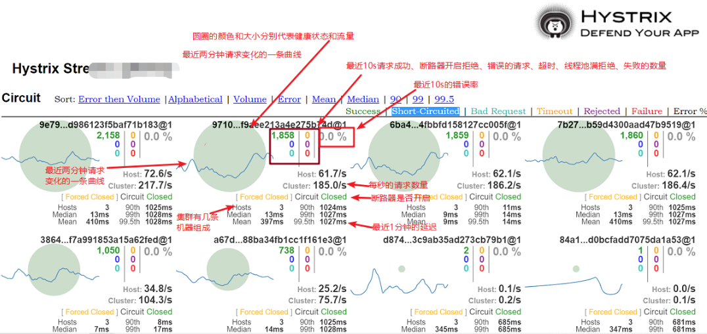
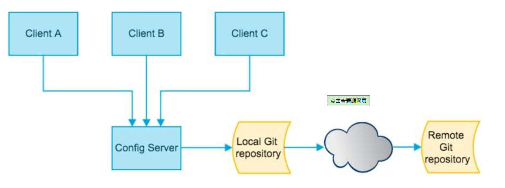
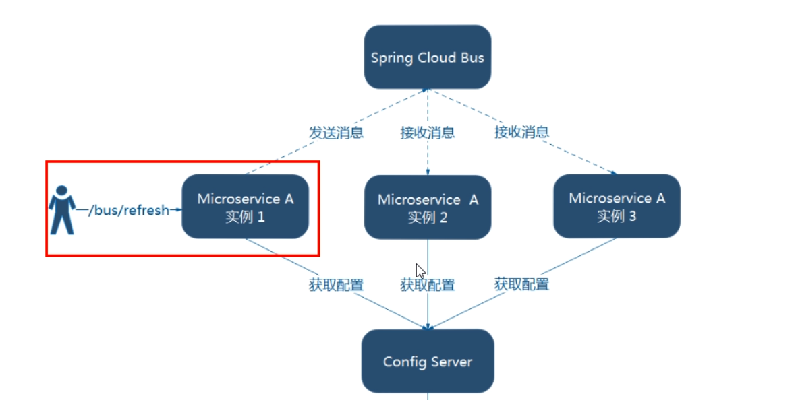
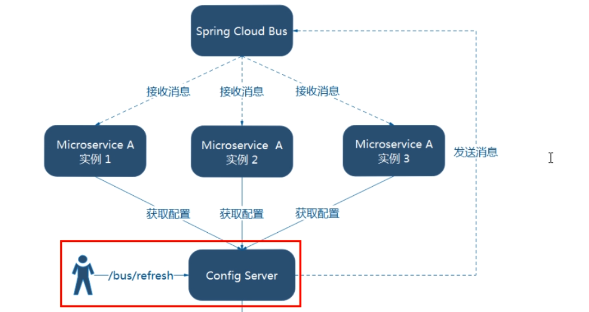

# SpringCloud面试准备

## 列举你所知道的微服务技术栈？:dog2:

> - 注册中心     Eureka    consul  zookeeper  nacos
> - 服务调用     RestTemplate Ribbon  
> - 服务调用2   OpenFeign
> - 服务熔断 服务降级      Hystrix
> - 服务监控  Hystrix
> - 服务网关    Gateway
> - 配置中心    Config
> - 消息总线    Bus


## 什么是服务治理

> 管理微服务之间的关系，可以实现服务的注册于发现，服务之间的调用，负载均衡等。


## 服务注册与发现之Eureka

**两大核心组件**

### Eureka Server 

> 提供服务注册功能

### Eureka Client  

> 是一个java客户端，用于简化和Eureka Server的交互,服务启动后会向Eureka Server 发送心跳。如果Eureka Server 
>
> 在多个心跳周期内没有收到某个节点的心跳，那么Eureka Server会从服务注册表中把这个节点移除。

------


## Eureka自我保护机制是什么？

> 自我保护机制出现的背景：**默认情况下，如果Eureka在一定时间内没有收到某个微服务实例的心跳，EurekaServer将会注销该实例（默认90秒）**
>
> 这样会存在一个问题，如果这段时间也为网路分区故障导致没有收到心跳，这个时候如果在注册表中注销这个客户端实例，就会导致服务不可以用，但是实际的服务是可用的。为了避免这种不合理事件的发生，出现了Eureka的自我保护机制。
>
> Eureka的自我保护机制目的在于提高整个系统的高可用性。Eureka即使在设定的时间内没有收到客户端心跳，就会进入自我保护模式，不会从注册表中删除此实例，直到收到的客户端心跳数达到阈值以上，该服务退出自我保护模式。
>
> 开发环境，因为服务频繁重启，可以通过 eureka.server.enable-self-preservation=false关闭自我保护机制，
>
> 实际的生成环境，为了整个集群的高可用，一定要开启自我保护模式。

------


## @LoadBalanced赋予RestTemplate负载均衡的能力

```java
    @Bean
    @LoadBalanced
    public RestTemplate getRestTemplate(){
        return new RestTemplate();
    }

    restTemplate.postForObject("http://CLOUD-PAYMENT-SERVICE/payment/create", payment, CommonResult.class);
```


## Eureka监控页面，如何设置在鼠标移至客户端实例上显示该实例的真实Ip

> 可以在配置yml或者properties文件中设置 eureka.prefer-ip-address: true


## 如何主动获取Eureka Server中的服务列表？

> 主启动类上使用注解@EnableDiscoveryClient
>
> 从容器中获取DiscoveryClient对象，调用该对象的getServices()或者getInstances()


## 如何配置Eureka集群

> 和配置单机版的eureka类似，
>
> 不同点：
>
> ​     单机的场景：eureka.client.service-url  配置自身的信息
>
> ​	 集群的场景：eureka.client.service-url  配置其他eureka信息
>
> 举栗子： 需要配置  节点数为3的eureka集群，a b c 3三个节点。
>
> ​	集群配置：
>
> ​		a:   eureka.client.service-url=http://b-ip:7001/eureka/ ,http://c-ip:7001/eureka/ 
>
> ​		b:  eureka.client.service-url=http://a-ip:7001/eureka/ ,http://c-ip:7001/eureka/ 
>
> ​		c:   eureka.client.service-url=http://a-ip:7001/eureka/ ,http://b-ip:7001/eureka/ 

------


## 停止更新了怎么办？

> 可以用 Consul、ZooKeeper等组件替代。SpringCloud对其做了集成
>
> 比如我们要使用zookeeper作为服务注册中心，可以使用引入下面的maven依赖
>
> ```xml
>  <dependency>
>      <groupId>org.springframework.cloud</groupId>
>      <artifactId>spring-cloud-starter-zookeeper-discovery</artifactId>
>  </dependency>
> ```
> 要使用consul可以引用`spring-cloud-starter-consul-discovery`依赖
> ```xml
>  <dependency>
>       <groupId>org.springframework.cloud</groupId>
>       <artifactId>spring-cloud-starter-consul-discovery</artifactId>
>   </dependency>
> ```
>

------


## Eureka、Zookeeper、Consul 这三种注册中心有什么区别？

>Eureka和Zookeeper是Java语言开发的
>
>Consul是Go语言开发的
>
>从CAP理论上做区分:
>
>- Eureka 是AP架构
>
>		 - Zookeeper Consul 是CP架构
>
>> zookeeper和consul中，检测到服务掉线后，就会立刻移除。而Eureka服务掉线后，该服务仍会存活一段时间（可设置），仍然不在线才会移除该服务。

------


## 当zookeeper宕机的时候，Dubbo服务会不会受影响？

> ​		这是一个简单的dubbo服务过程，生产者启动后，把自身的信息写入到zookeeper中，让zookeeper以心跳机制查询生产者是否活着。
>
> 然后消费者启动时，向zookeeper获取生产者的信息，保存在内存中， 如果zookeeper活着，会实时更新 。当调用消费者进行消费的时候，是根据获取到的 地址，以及 状态 直接进行 RPC 调用。
>
> ​	那么这时候问题来了， zoookeeper宕机了!
>
> ​	无论是消费者还是生产者，这时候在控制台都疯狂报错，因为它们都在不断地尝试连接zookeeper。这时候，有意思的地方来了，我们上面说到过，消费者是根据内存中保存的生产者的信息进行通信的，而在zookeeper宕机之前，这份信息已经保存在在内存里面，所以，即使这时候zookpper宕机了，消费者还是能与生产者通信。

------


## 如果两台生产者也有一台在zookeeper宕机之后宕机了？

> 这个问题就有点刁钻了
>
> 一般情况下，如果zookeeper还活着，因为有心跳检测机制，能检测到生产者是宕机了，那么它就会直接通知消费者，让消费者修改内存信息，这样消费者就不会去连接宕掉的服务。
>
> 要是发生这种情况，首先看负载均衡配置了哪一种，如果分发的调用是访问好的生产者，那自然没问题。如果是访问到了坏的生产者，那么消费者会立即修改内存里面的生产者的 状态位，并且立即访问好的那一台。
>
> 那用户会不会受到影响呢？其实是会的，但是！非常小，小到用户几乎感受不到。

------


## SpringCloud Ribbon是什么？

> SpringCloud Ribbon 是基于Netflix Ribbon实现的一套客户端负载均衡工具，默认使用轮询的负载均衡算法。


## 什么是集中式LB？什么是进程内LB?

> 集中式LB： 即服务的消费方和提供方之间使用独立的LB设施（可以是硬件F5,也可以是软件如Nginx）,由于该设施负载把请求通过某种策略转发至服务提供方。
>
> 进程内LB：将LB逻辑集成到消费方，消费方从服务注册中心获取可用服务列表，然后按照某种策略，决定最终调用哪个服务。Ribbon就属于进程式LB。


## Ribbon的几种使用方式列举

> 方式一：Ribbon + RestTemplate
>
> 方式二：Fegin + Ribbon


## Ribbon内置的七种负载均衡策略有哪些？

> **轮询** com.netflix.loadbalancer.RoundRobinRule   
>
> **随机** com.netflix.loadbalancer.RandomRule
>
> **先按照轮询策略获取服务，如果获取服务失败则在指定时间内会进行重试**  com.netflix.loadbalancer.RetryRule
>
> **对轮询策略的扩展，响应速度越快的实例选择权重越大，越容易被选择** WeightedResponseTimeRule 
>
> **会先过滤掉由于多次访问故障而处于断路器跳闸状态的服务，然后选择一个并发量最小的服务** BestAvailableRule 
>
> 先过滤掉故障实例，再选择并发较小的实例  AvailabilityFilteringRule 
>
> 默认规则，复合判断server所在区域的性能和server的可用性选择服务器 ZoneAvoidanceRule

------


## Feign能做什么？

> 用于简化微服务架构下，各个微服务之间的调用。


## Feign 和 OpenFeign 两者区别

> Feign是Springcloud组件中的一个轻量级Restful的HTTP服务客户端，Feign内置了Ribbon，用来做客户端负载均衡，去调用服务注册中心的服务。Feign的使用方式是：使用Feign的注解定义接口，调用这个接口，就可以调用服务注册中心的服务
>
> OpenFeign是springcloud在Feign的基础上支持了SpringMVC的注解，如@RequestMapping等等。OpenFeign的@FeignClient可以解析SpringMVC的@RequestMapping注解下的接口，并通过动态代理的方式产生实现类，实现类中做负载均衡并调用其他服务。

------


## 什么是服务雪崩？

> 扇出链路上某个微服务响应时间过长或者不可用，会导致依赖该服务的上游微服务也不可用，整个调用链路的调用就会占用更多的资源，进而导致整个服务不可应，这就是服务雪崩。


## 服务降级和服务熔断分别是什么，有什么区别和联系？

> **服务降级：**从整个系统的角度考量的，当服务器压力剧增的时候，或者流量超出系统预设的阈值时，根据业务的实际情况，对非核心的模块有策略的不处理或者简单处理，从而保证核心业务正常或者高效运转。舍车保帅？
>
> **哪些场景可能造成服务降级呢？**
>
> 1. 服务不可用，比如服务宕机了
> 2. 接口响应时间超出阈值
> 3. 接口失败次数超出指定的阈值
> 4. 程序运行异常
> 5. 限流降级，当流量达到指定限流阈值时，后续请求会被降级
> 6. 线程池或者信号量打满
>
> **服务熔断：**应对微服务雪崩效应的一种链路保护机制，类似于保险丝。当扇出链路中，某个微服务响应时间过长，或者服务不可用时会进行**服务熔断**。当再有请求过来时，会快速的返回错误的响应信息。当检测到该节点的服务调用正常之后，就会恢复链路调用。在SpringCloud中，熔断机制通过Hystrix实现。
> Hystrix会监控服务的调用情况，当失败的调用达到一定的阈值之后，缺省是5秒内失败20次失败调用，就会启动熔断机制。
>
> 服务熔断解决一下问题：
>
> 1. 所依赖的服务不稳定，达到快速失败的目的。
> 2. 快速失败后，可以根据一定的算法，动态试探所依赖的服务是否恢复。
>
> **服务熔断，服务降级，服务限流的区别？**
>
> > 服务降级：服务分优先级，牺牲优先级低的服务，保证优先级高的服务稳定可用，考虑的是整个服务体系稳定性。
> >
> > 服务熔断：依赖的某个服务不可用时触发熔断，防止扇出链路雪崩效应。系统会自动执行和恢复。
> >
> > 服务限流：限制并发的访问，超出阈值拒绝访问。

------


## Fallback可以是服务提供方，也可以是服务调用方

> **进行服务降级代码实现大概思路：**
>
> > 使用到的核心注解：<font color='red'>**@HystrixCommand**</font>
> >
> > 自身找问题：服务提供方实现服务降级
> >
> > :one: 主启动类上使用注解**<font color='red'>@EnableHystrix</font>**
> >
> > :two:处理需要服务降级的接口
> >
> > > ```java
> > >   
> > >     @HystrixCommand(fallbackMethod = "paymentInfo_TimeOutHandler",commandProperties = {
> > >     	//3秒钟以内就是正常的业务逻辑    
> > >     	@HystrixProperty(name = "execution.isolation.thread.timeoutInMilliseconds",value = "3000")
> > >     })
> > >     public String paymentInfo_TimeOut(Integer id){
> > >        // int timeNumber = 5;
> > >         int age = 10/0;
> > >        // try { TimeUnit.SECONDS.sleep(timeNumber); }catch (Exception e) {e.printStackTrace();}
> > >         //return "线程池："+Thread.currentThread().getName()+"   paymentInfo_TimeOut,id：  "+id+"\t"+"呜呜呜"+" 耗时(秒)"+timeNumber;
> > >         return "线程池："+Thread.currentThread().getName()+"   paymentInfo_TimeOut,id：  "+id+"\t"+"呜呜呜"+" 耗时(秒)";
> > >     }
> > > 
> > >     //兜底方法
> > >     public String paymentInfo_TimeOutHandler(Integer id){
> > >         return "线程池："+Thread.currentThread().getName()+"   系统繁忙, 请稍候再试  ,id：  "+id+"\t"+"哭了哇呜";
> > >     }
> > > 
> > > }
> > > ```
> >
> > 接口消费端更好的保护自己：服务消费方实现服务降级
> >
> > :one:主启动类上使用注解**<font color='red'>@EnableHystrix</font>**
> >
> > :two: 修改配置文件，设置feign.hystrix.enable=true
> >
> > :three:需要降级的业务逻辑：
> >
> > > ```java
> > > @GetMapping("/consumer/payment/hystrix/timeout/{id}")
> > > @HystrixCommand(fallbackMethod = "paymentTimeOutFallbackMethod",commandProperties = {
> > >     //3秒钟以内就是正常的业务逻辑
> > >         @HystrixProperty(name = "execution.isolation.thread.timeoutInMilliseconds",value = "1500")  
> > > })
> > > public String paymentInfo_TimeOut(@PathVariable("id") Integer id){
> > >     String result = paymentHystrixService.paymentInfo_TimeOut(id);
> > >     return result;
> > > }
> > > 
> > > //兜底方法
> > > public String paymentTimeOutFallbackMethod(@PathVariable("id") Integer id){
> > >         return "我是消费者80，对付支付系统繁忙请10秒钟后再试或者自己运行出错请检查自己,(┬＿┬)";
> > > }
> > > ```
> >
> > 上面方式为每一个需要服务降级的方法都配置了一个fallback，这个会导致代码膨胀，可不可以配置一个全局的fallback？
> >
> > > 可以，使用**<font color='red'>@DefaultProperties</font>**注解
> > >
> > > 具体做法：
> > >
> > > :one:定义一个全局fallback，
> > >
> > > :two:在类上使用**@DefaultProperties**
> > >
> > > :three:在方法上使用**@HystrixCommand**，这个时候，不需要设置属性
> > >
> > > > ```java
> > > > @RestController
> > > > @Slf4j
> > > > //全局的
> > > > @DefaultProperties(defaultFallback = "payment_Global_FallbackMethod") 
> > > > public class OrderHystrixController {
> > > > 
> > > >     @Resource
> > > >     private PaymentHystrixService paymentHystrixService;
> > > > 
> > > >     @GetMapping("/consumer/payment/hystrix/ok/{id}")
> > > >     public String paymentInfo_OK(@PathVariable("id") Integer id){
> > > >         String result = paymentHystrixService.paymentInfo_OK(id);
> > > >         return result;
> > > >     }
> > > > 
> > > >     @GetMapping("/consumer/payment/hystrix/timeout/{id}")
> > > >     @HystrixCommand
> > > >     public String paymentInfo_TimeOut(@PathVariable("id") Integer id){
> > > >         int age = 10/0;
> > > >         String result = paymentHystrixService.paymentInfo_TimeOut(id);
> > > >         return result;
> > > >     }
> > > > 
> > > >     //下面是全局fallback方法
> > > >     public String payment_Global_FallbackMethod(){
> > > >         return "Global异常处理信息，请稍后再试,(┬＿┬)";
> > > >     }
> > > > }
> > > > ```
> > >
> > > **一通操作之后，代码还能再优雅些吗？**
> > >
> > > > 可以，上面的几种做法，fallback方法都和业务方法混在一个类中了，不利于维护和管理。
> > >
> > > **下面演示如何将fallback方法抽到一个类中统一管理：**
> > >
> > > 下面以服务消费方作为演示对象
> > >
> > > :one:主启动类上使用注解**<font color='red'>@EnableHystrix</font>**
> > >
> > > :two: 修改配置文件，设置feign.hystrix.enable=true
> > >
> > > :three:定义一个Service,然后实现我们需要降级处理的方法所在的接口（这个接口是标有@FeignClient的接口）：
> > >
> > > > ```java
> > > > 
> > > > @Component
> > > > public class PaymentFallbackService implements PaymentHystrixService {
> > > >     @Override
> > > >     public String paymentInfo_OK(Integer id) {
> > > >         return "-----PaymentFallbackService fall back-paymentInfo_OK , (┬＿┬)";
> > > >     }
> > > > 
> > > >     @Override
> > > >     public String paymentInfo_TimeOut(Integer id) {
> > > >         return "-----PaymentFallbackService fall back-paymentInfo_TimeOut , (┬＿┬)";
> > > >     }
> > > > }
> > > > ```
> > >
> > > :four:在接口上使用的注解**<font color='red'>@FeignClient</font>** 指定<font color='red'>**fallback**</font>对应的类
> > >
> > > > ```java
> > > > @Component
> > > > @FeignClient(value = "CLOUD-PROVIDER-HYSTRIX-PAYMENT",fallback = PaymentFallbackService.class)
> > > > public interface PaymentHystrixService {
> > > > 
> > > >     @GetMapping("/payment/hystrix/ok/{id}")
> > > >     public String paymentInfo_OK(@PathVariable("id") Integer id);
> > > > 
> > > >     @GetMapping("/payment/hystrix/timeout/{id}")
> > > >     public String paymentInfo_TimeOut(@PathVariable("id") Integer id);
> > > > }
> > > > ```

------


## 断路器（Hystrix）几个重要参数？

> :one:快照时间窗口  默认值是10s
>
> :two:请求总数阈值，达到这个阈值才有资格熔断，具体受否熔断还需要看其他的熔断条件是否满足  默认值是20
>
> :three:错误百分比阈值   默认值是50%
>
> 上面几个条件加起来：就是10s内请求数大于20且失败率大于50%，这个时候会触发熔断。

------


## 断路器熔断后如何恢复？

> ​		发生熔断后，一段时间（默认是5s）后，断路器就会为半开状态，这个时候会让一部分请求进行转发，如果成功，断路器会关闭，如果失败断路器又会置为断开状态。


## 服务监控

> ​		Hystrix除了提供服务降级，服务熔断的功能外，还提供了服务监控的功能。Hystrix会持续记录所有经过Hystrix发起的请求的执行信息，以统计报表的形式展示给用户，包括每秒执行多少请求，多少成功，多少失败。


## 服务监控，具体的实现步骤，简要概括下

> :one:<font color='red'>新建一个独立的微服务A</font>
>
> :two:引入相关依赖
>
> > 最重要的两个依赖
> >
> > > ```xml
> > > spring-cloud-starter-netflix-hystrix-dashboard  
> > > spring-boot-starter-actuator 艾克说的
> > > ```
> > 
>
> :three:在主启动类上使用注解**<font color='red'>@EnableHystrixDashboard</font>**
>
> :four:在需要监控的微服务B上 引入依赖 **<font color='red'>spring-boot-starter-actuator</font>**
>
> > :warning:新版本的Hystrix需要在主启动类上指定监控路路径
> >
> > > ```java
> > > @Bean
> > > public ServletRegistrationBean getServlet(){
> > >     HystrixMetricsStreamServlet streamServlet = new HystrixMetricsStreamServlet();
> > >     ServletRegistrationBean registrationBean = new ServletRegistrationBean(streamServlet);
> > >     registrationBean.setLoadOnStartup(1);
> > >     registrationBean.addUrlMappings("/hystrix.stream");
> > >     registrationBean.setName("HystrixMetricsStreamServlet");
> > >     return registrationBean;
> > > }
> > > ```
>
> :five:浏览器访问微服务A 
>
> > http://A-ip:A-port/hystrix
>
> :six:填写监控地址
>
> > http://B-ip:B-port/hystrix.stream

------


## Hystrix服务监控的仪表盘怎么看？

> :one:实心圆： 
>
> > ​	共有两种含义。
> >
> > 1. 通过颜色的变化代表了实例的健康程度，它的健康度从绿色、黄色、橙色、红色递减。
> >
> > 2. 通过圆的大小来代表请求流量的大小，流量越大该实心圆就越大。
>
>
> :two:曲线： <font color='orange'>记录2分钟内流量的相对变化，可以通过它来观察到流量的上升和下降趋势。</font>
>
> 

------


## 什么是SpringCloud Gateway?

[相关博客](https://www.cnblogs.com/crazymakercircle/p/11704077.html)

> ​		Spring Cloud Gateway是Spring官方基于Spring 5.0，Spring Boot 2.0和Project Reactor等技术开发的网关，Spring Cloud Gateway旨在为微服务架构提供一种简单而有效的统一的API路由管理方式。Spring Cloud Gateway作为Spring Cloud生态系中的网关，目标是替代ZUUL，其不仅提供统一的路由方式，并且**基于Filter链**的方式提供了网关基本的功能，例如：<font color='red'>反向代理</font>、<font color='red'>鉴权</font>、<font color='red'>流量控制</font>、<font color='red'>熔断</font>、<font color='red'>日志监控</font>等。


## 已经`Zuul`了，怎么又出来了`Gateway`?(我们为什么选择`Gateway`)

> ​		先说简单说下Zuul1.x,SpringCloud中所集成的Zuul版本，采用的是tomcat容器，基于Servlet IO处理模型。
>
> ​	Servler 由Servlet 容器进行生命周期管理。
>
> - 容器启动时，创建servlet对象，并调用init()方法进行初始化。
>
> - 当有请求过来时，容器从线程池中获取一个空闲线程，调用servlet service方法。
>
> - 容器关闭时，调用servlet 的destory()销毁servlet。
>
>   上述模型是有缺点的，高并发场景下，因为每个请求都会绑定一个线程，一方面线程资源本身很昂贵，另一方如果线程池信号量打满，将会严重影响请求的响应时间，甚至导致请求失败。
>
> 另一方面，zuul1.0已经进入了维护阶段，zuul2.0迟迟没有发布。
>
> 而GateWay是SpringCloud团队研发的，自然而然和SpringCloud现有组件天然的适配，比如集成了Hystrix，集成了SpringCloud的服务注册和发现功能。
>
> 此外，GateWay是基于Spring5，SpringBoot2.0和Project Reactor开发的，底层使用了异步非阻塞的IO模型,性能上先对Zuul1.0也有了较大的改善。

------


## 微服务架构中网关在哪？

> 

------


## 简单介绍下Gateway的三大组件？

> :one:Route（路由）  路由是构建网关的基本模块，它由一个ID,一个目标URI,一组断言和一组过滤器定义。如果断言为真，匹配该路由。  
>
> :two:Predicate(断言)  参考的是java8 java.util.function.Predicate  请求中的所有参数都可以进行断言，断言为真，则匹配该路由。
>
> :three:Filter(过滤)  过滤器可以在请求被路由前或者之后对请求进行修改。

------


## GateWay流程图

> 
>
> 
>
> ```
> 	客户端向 Spring Cloud Gateway 发出请求。然后在 Gateway Handler Mapping 中找到与请求相匹配的路由，将其发送到 Gateway Web Handler。Handler 再通过指定的过滤器链来将请求发送到我们实际的服务执行业务逻辑，然后返回。过滤器之间用虚线分开是因为过滤器可能会在发送代理请求之前（“pre”）或之后（“post”）执行业务逻辑。
> ```


## 搭建网关Gateway简要流程

> <font color='cornflowerblue'>**首先有一点，需要注意，网关是一个单独的微服务，不集成在其他的MicroService。**</font>
>
> **搭建网关微服务：**
>
> > 1. 创建一个Springboot项目
> >
> > 2. 引入核心的pom依赖，之前提到过网关集成了Hystrix和注册中心，所以相关的依赖也是需要引入的
> >
> >    > ```xml
> >    >         <dependency>
> >    >             <groupId>org.springframework.cloud</groupId>
> >    >             <artifactId>spring-cloud-starter-gateway</artifactId>
> >    >         </dependency>
> >    >         <dependency>
> >    >             <groupId>org.springframework.cloud</groupId>
> >    >             <artifactId>spring-cloud-starter-netflix-hystrix</artifactId>
> >    >         </dependency>
> >    >         <dependency>
> >    >             <groupId>org.springframework.cloud</groupId>
> >    >             <artifactId>spring-cloud-starter-netflix-eureka-client</artifactId>
> >    >         </dependency>
> >    > ```
> >
> > 3. 修改yml文件
> >
> >    > ```yaml
> >    > server:
> >    >   port: 9527
> >    > spring:
> >    >   application:
> >    >     name: api-gateway
> >    >   cloud:
> >    >     gateway:
> >    >       routes:
> >    >         -id: url-proxy-1
> >    >           uri: https://blog.csdn.net
> >    >           predicates:
> >    >             -Path=/csdn
> >    > 
> >    > eureka:
> >    >   instance:
> >    >     hostname: cloud-gateway-service
> >    >   client:
> >    >     service-url:
> >    >       register-with-eureka: true
> >    >       fetch-registry: true
> >    >       defaultZone: http://eureka7001.com:7001/eureka
> >    > ```
> >    >
> >    > 简要参数说明：
> >    >
> >    > > ```
> >    > > id：我们自定义的路由 ID，保持唯一
> >    > > uri：目标服务地址
> >    > > predicates：路由条件，Predicate 接受一个输入参数，返回一个布尔值结果。该接口包含多种默认方法。
> >    > > 		   多个Predicate 组合成其他复杂的逻辑（比如：与，或，非）。
> >    > > 
> >    > > 上面这段配置的意思是，配置了一个 id 为 url-proxy-1的URI代理规则，路由的规则为：
> >    > > 当访问地址http://localhost:8080/csdn/1.jsp时，
> >    > > 会路由到上游地址https://blog.csdn.net/1.jsp。
> >    > > ```
> >
> > 4. 启动类使用@EnableEurekaClient注解
> >
> >    > ```java
> >    > @SpringBootApplication
> >    > @EnableEurekaClient
> >    > public class GateWayMain9527 {
> >    >     public static void main(String[] args) {
> >    >             SpringApplication.run( GateWayMain9527.class,args);
> >    >         }
> >    > }
> >    > ```
> >
> >    上面已经完成了一个简单的网关微服务。
>
> **和注册中心相结合的路由配置方式**
>
> > ```yaml
> > server:
> >   port: 8084
> > spring:
> >   cloud:
> >     gateway:
> >       routes:
> >       -id: seckill-provider-route
> >         uri: lb://seckill-provider
> >         predicates:
> >         - Path=/seckill-provider/**
> > 
> >       -id: message-provider-route
> >         uri: lb://message-provider
> >         predicates:
> >         -Path=/message-provider/**
> > 
> > application:
> >   name: cloud-gateway
> > 
> > eureka:
> >   instance:
> >     prefer-ip-address: true
> >   client:
> >     service-url:
> >       defaultZone: http://localhost:8888/eureka/
> > ```
> >
> > ```
> > 注册中心相结合的路由配置方式，与单个URI的路由配置，区别其实很小，仅在于URI的schema协议不同。单个URI的地址的schema协议，一般为http或者https协议。
> > ```
>
> **路由匹配规则**
>
> 示例1：
>
> > ```yaml
> > //通过配置文件配置
> > spring:
> >   cloud:
> >     gateway:
> >       routes:
> >         - id: gate_route
> >           uri: http://localhost:9023
> >           predicates:
> >           ## 当请求的路径为gate、rule开头的时，转发到http://localhost:9023服务器上
> >             - Path=/gate/**,/rule/**
> >         ### 请求路径前加上/app
> >           filters:
> >           - PrefixPath=/app
> > ```
> >
> > **内置断言列举：**
> >
> > | 规则    | 实例                                                         | 说明                                                         |
> > | :------ | :----------------------------------------------------------- | :----------------------------------------------------------- |
> > | Path    | - Path=/gate/**,/rule/**                                     | 当请求的路径为gate、rule开头的时，转发到http://localhost:9023服务器上 |
> > | Before  | - Before=2017-01-20T17:42:47.789-07:00[America/Denver]       | 在某个时间之前的请求才会被转发到 http://localhost:9023服务器上 |
> > | After   | - After=2017-01-20T17:42:47.789-07:00[America/Denver]        | 在某个时间之后的请求才会被转发                               |
> > | Between | - Between=2017-01-20T17:42:47.789-07:00[America/Denver],2017-01-21T17:42:47.789-07:00[America/Denver] | 在某个时间段之间的才会被转发                                 |
> > | Cookie  | - Cookie=chocolate, ch.p                                     | 名为chocolate的表单或者满足正则ch.p的表单才会被匹配到进行请求转发 |
> > | Header  | - Header=X-Request-Id, \d+                                   | 携带参数X-Request-Id或者满足\d+的请求头才会匹配              |
> > | Host    | - Host=www.hd123.com                                         | 当主机名为www.hd123.com的时候直接转发到http://localhost:9023服务器上 |
> > | Method  | - Method=GET                                                 | 只有GET方法才会匹配转发请求，还可以限定POST、PUT等请求方式   |
> >
>
> **实现熔断降级**
>
> > ```yaml
> > server.port: 8082
> > 
> > spring:
> > application:
> >  name: gateway
> > redis:
> >    host: localhost
> >    port: 6379
> >    password: 123456
> > cloud:
> >  gateway:
> >    routes:
> >         - id: rateLimit_route
> >           uri: http://localhost:8000
> >           order: 0
> >           predicates:
> >             - Path=/test/**
> >           filters:
> >             - StripPrefix=1
> >             - name: Hystrix
> >               args:
> >                 name: fallbackCmdA
> >                 fallbackUri: forward:/fallbackA
> > 
> >   hystrix.command.fallbackCmdA.execution.isolation.thread.timeoutInMilliseconds: 5000
> > ```
> >
> > 
> >
> > 这里的配置，使用了两个过滤器：
> >
> > （1）过滤器StripPrefix，作用是去掉请求路径的最前面n个部分截取掉。
> >
> > ​	StripPrefix=1就代表截取路径的个数为1。
> >
> > ​	比如前端过来请求/test/good/1/view，匹配成功后，路由到后端的请求路径就会变成http://localhost:8888/good/1/view。
> >
> > （2）过滤器Hystrix，作用是通过Hystrix进行熔断降级
> >
> > ​	当上游的请求，进入了Hystrix熔断降级机制时，就会调用fallbackUri配置的降级地址。需要注意的是，还需要单独设置Hystrix的commandKey的超时时间
> >
> > ​	fallbackUri配置的降级地址的代码如下
> >
> > ```java
> > package org.gateway.controller;
> > 
> > import org.gateway.response.Response;
> > import org.springframework.web.bind.annotation.GetMapping;
> > import org.springframework.web.bind.annotation.RestController;
> > 
> > @RestController
> > public class FallbackController {
> > 
> >     @GetMapping("/fallbackA")
> >     public Response fallbackA() {
> >         Response response = new Response();
> >         response.setCode("100");
> >         response.setMessage("服务暂时不可用");
> >         return response;
> >     }
> > }
> > ```
>
> 
>
> **分布式限流**
>
> > 使用到的算法：令牌桶算法
> >
> > ```
> > 	在令牌桶算法中，存在一个桶，用来存放固定数量的令牌。算法中存在一种机制，以一定的速率往桶中放令牌。每次请求调用需要先获取令牌，只有拿到令牌，才有机会继续执行，否则选择选择等待可用的令牌、或者直接拒绝。放令牌这个动作是持续不断的进行，如果桶中令牌数达到上限，就丢弃令牌，所以就存在这种情况，桶中一直有大量的可用令牌，这时进来的请求就可以直接拿到令牌执行，比如设置qps为100，那么限流器初始化完成一秒后，桶中就已经有100个令牌了，这时服务还没完全启动好，等启动完成对外提供服务时，该限流器可以抵挡瞬时的100个请求。所以，只有桶中没有令牌时，请求才会进行等待，最后相当于以一定的速率执行。
> > ```
> >
> > 
> >
> > yml配置：
> >
> > ```yaml
> > 
> > server:
> >   port: 8081
> > spring:
> >   cloud:
> >     gateway:
> >       routes:
> >       - id: limit_route
> >         uri: http://httpbin.org:80/get
> >         predicates:
> >         - After=2017-01-20T17:42:47.789-07:00[America/Denver]
> >         filters:
> >         - name: RequestRateLimiter
> >           args:
> >             key-resolver: '#{@userKeyResolver}'
> >             redis-rate-limiter.replenishRate: 1
> >             redis-rate-limiter.burstCapacity: 3
> >   application:
> >     name: cloud-gateway
> >   redis:
> >     host: localhost
> >     port: 6379
> >     database: 0
> > ```
> >
> > ```
> > 在上面的配置文件，指定程序的端口为8081，配置了 redis的信息，并配置了RequestRateLimiter的限流过滤器，该过滤器需要配置三个参数：
> > burstCapacity，令牌桶总容量。
> > replenishRate，令牌桶每秒填充平均速率。
> > key-resolver，用于限流的键的解析器的 Bean 对象的名字。它使用 SpEL 表达式根据#{@beanName}从 Spring 容器中获取 Bean 对象。
> > ```
> >
> > **列举几种限流模式：**
> >
> > 这里**<font color='cornflowerblue'>根据用户ID限流</font>**，请求路径中必须携带userId参数
> >
> > 
> >
> > ```
> > @Bean
> > 
> > KeyResolver userKeyResolver() {
> >   return exchange -> Mono.just(exchange.getRequest().getQueryParams().getFirst("user"));
> > }
> > 
> >  
> > ```
> >
> > KeyResolver需要实现resolve方法，比如根据userid进行限流，则需要用userid去判断。实现完KeyResolver之后，需要将这个类的Bean注册到Ioc容器中。
> >
> > 如果需要**<font color='cornflowerblue'>根据IP限流</font>**，定义的获取限流Key的bean为：
> >
> > 
> >
> > ```
> > @Bean
> > public KeyResolver ipKeyResolver() {
> >   return exchange -> Mono.just(exchange.getRequest().getRemoteAddress().getHostName());
> > }
> > ```
> >
> > 通过exchange对象可以获取到请求信息，这边用了HostName，如果你想根据用户来做限流的话这边可以获取当前请求的用户ID或者用户名就可以了，比如：
> >
> > 如果需要**<font color='cornflowerblue'>根据接口的URI进行限流</font>**，则需要获取请求地址的uri作为限流key，定义的Bean对象为：
> >
> > 
> >
> > ```
> > @Bean
> > KeyResolver apiKeyResolver() {
> >   return exchange -> Mono.just(exchange.getRequest().getPath().value());
> > }
> > ```
> >
> > 通过exchange对象可以获取到请求信息，这边用了HostName，如果你想根据用户来做限流的话这边可以获取当前请求的用户ID或者用户名就可以了，
>
> 配置全局GlobalFilter
>
> > - 可以用来做全局日志记录
> >
> > - 统一网关鉴权
> >
> > 示例1
> >
> > > ```java
> > > import lombok.extern.slf4j.Slf4j;
> > > import org.springframework.cloud.gateway.filter.GatewayFilterChain;
> > > import org.springframework.cloud.gateway.filter.GlobalFilter;
> > > import org.springframework.core.Ordered;
> > > import org.springframework.http.HttpStatus;
> > > import org.springframework.stereotype.Component;
> > > import org.springframework.util.StringUtils;
> > > import org.springframework.web.server.ServerWebExchange;
> > > import reactor.core.publisher.Mono;
> > > 
> > > import java.util.Date;
> > > 
> > > @Component
> > > @Slf4j
> > > public class MyLogGateWayFilter implements GlobalFilter,Ordered {
> > >     @Override
> > >     public Mono<Void> filter(ServerWebExchange exchange, GatewayFilterChain chain) {
> > > 
> > >         log.info("*********come in MyLogGateWayFilter: "+new Date());
> > >         String uname = exchange.getRequest().getQueryParams().getFirst("username");
> > >         if(StringUtils.isEmpty(username)){
> > >             log.info("*****用户名为Null 非法用户,(┬＿┬)");
> > >             exchange.getResponse().setStatusCode(HttpStatus.NOT_ACCEPTABLE);//给人家一个回应
> > >             return exchange.getResponse().setComplete();
> > >         }
> > >         return chain.filter(exchange);
> > >     }
> > > 
> > >     @Override
> > >     public int getOrder() {
> > >         return 0;
> > >     }
> > > }
> > > ```

------


## 配置中心

> ​		**出现背景**：在微服务架构中，在没有配置中心出现时，我们每个应用的配置信息都在其配置文件application.properties中维护。加入整个系统中有很多应用，那么我们在调整起配置信息来将会非常繁琐。另外不同的环境、如开发环境、测试环境、生产环境等不同环境还需要调整不同的配置参数。在运行中的系统中当有需要调整起配置文件信息时，不能立即生效，仍需要我们进行重启生效。。等等问题迫切需要一个能够集中维护整个系统中不同应用的一个配置服务功能。
>
> ​		**<font color='red'>`SpringCloud`为微服务架构中的微服务提供集中化的外部配置支持，配置服务器为不同的微服务的所有环境提供了一个中心化的外部配置。</font>**
>
>  SpringCloud Config分为Server和Client两部分。Server也叫做分布式配置中心，**它是一个独立的微服务应用**，用来连接配置服务器（比如github）并为客户端提供配置信息。客户端则是通过指定的配置中心来管理应用资源，以及相关配置内容。
>
> 
>
> 

------


## 消息总线

> ​		在配置中心没有使用消息总线时，存在一个问题：配置信息修改之后，每个微服务都要执行一次post请求，微服务才能加载到最新的配置数据。
>
> 在微服务架构下，用于众多的微服务应用，每次都去手动刷新，显然不适合。这是消息总线引入的背景。
>
> **消息总线**：SpringCloud Bus将分布式系统的节点与轻量级消息系统连接起来的框架。SpringCloud Bus 目前支持的MQ 有RabbitMQ和Kafka。
>
> 两种消息推送模式：
>
> - 利用消息总线触发一个客户端/bus/refresh,而刷新所有客户端的模式
>
> 
>
> 
>
> - 利用消息总线触发Config Server的/bus/refresh，从而刷新所有客户端配置。
>
>   

------


## 链路监控

> 
>
> Spring Cloud Sleuth   美[sluːθ] 提供了一套完整的服务跟踪的解决方案,在分布式系统中提供追踪解决方案并且兼容支持了zipkin。

