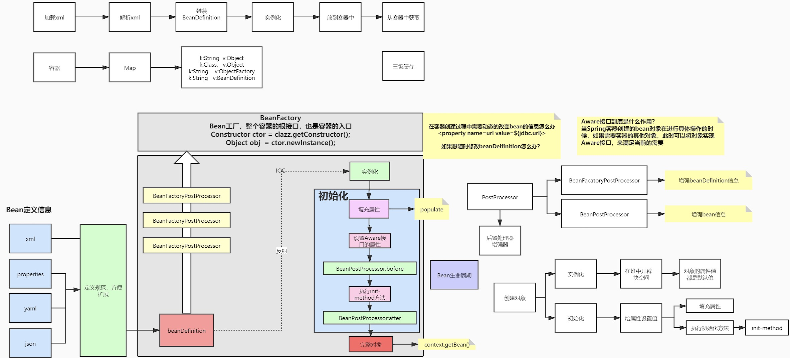
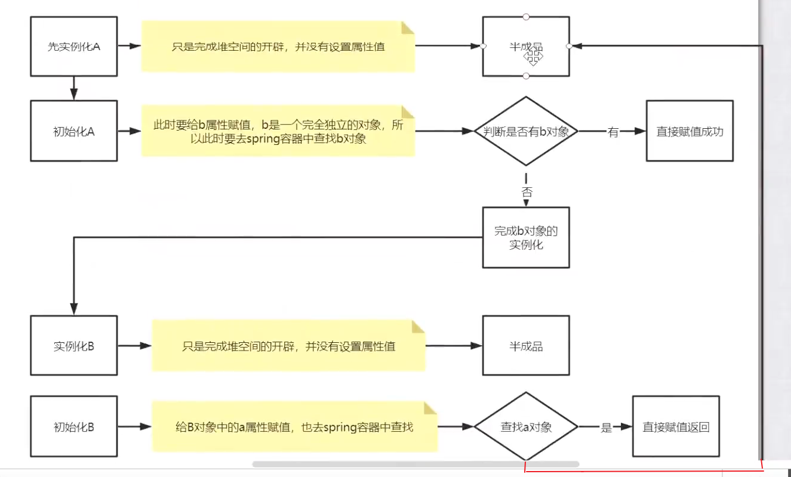
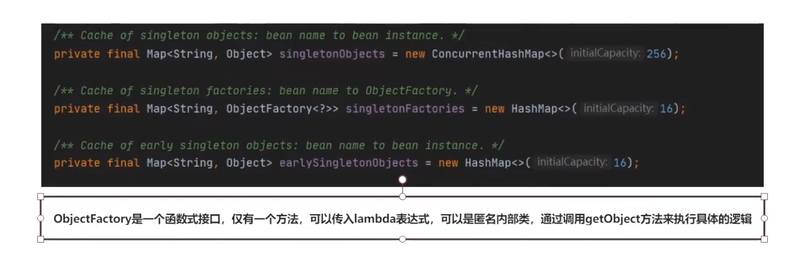
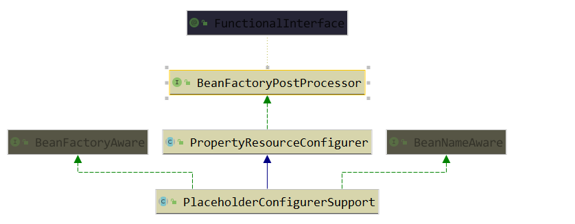
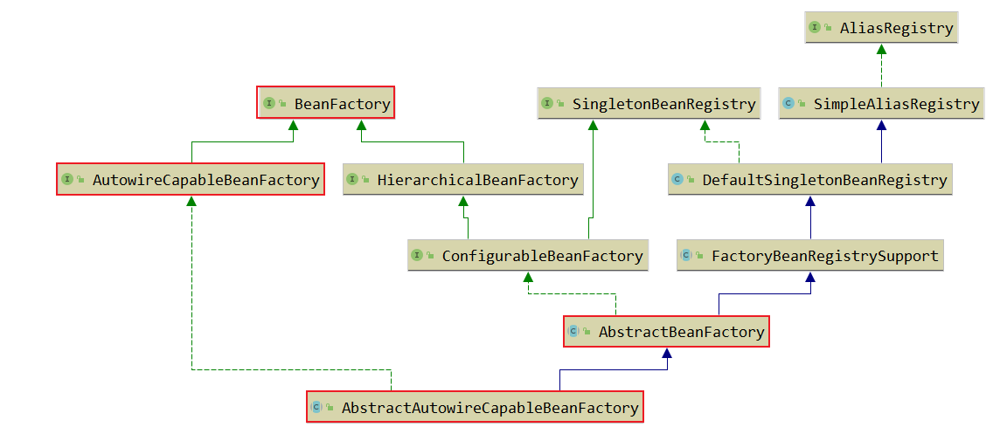
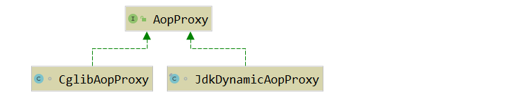
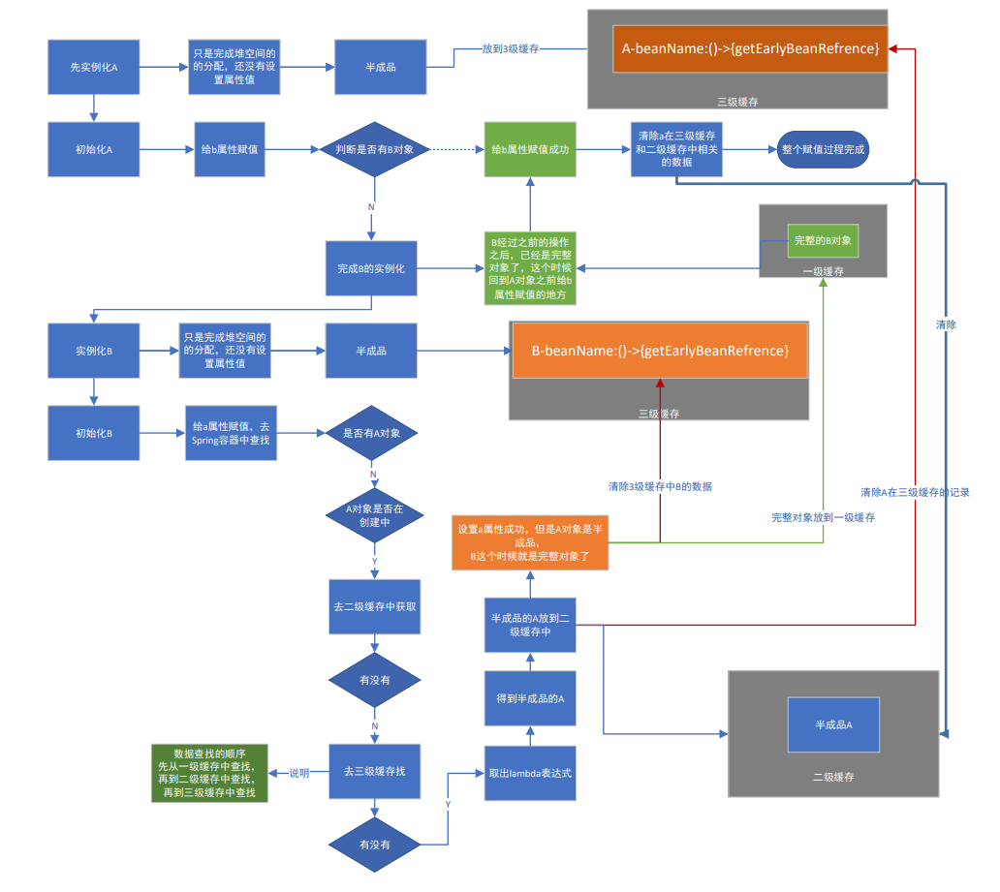

### 1、我们写在xml配置文件中的`${}`这种动态取值的方法，spring底层是怎么实现的？

和这个直接相关的就是PlaceholderConfigurerSupport这个类，它的集成体系如下：




### 2、 Bean的生命周期

**Spring的源码中，在BeanFactory接口中的注释中就有对Bean的生命周期有着很明确的定义。**

Bean 工厂实现应尽可能支持标准的 Bean 生命周期接口。 全套初始化方法及其标准顺序是：

1. BeanNameAware 的setBeanName
2. BeanClassLoaderAware 的setBeanClassLoader
3. BeanFactoryAware 的setBeanFactory
4. EnvironmentAware 的setEnvironment
5. EmbeddedValueResolverAware 的setEmbeddedValueResolver
6. ResourceLoaderAware 的setResourceLoader （仅在应用程序上下文中运行时适用）
7. ApplicationEventPublisherAware 的setApplicationEventPublisher （仅在应用程序上下文中运行时适用）
8. MessageSourceAware 的setMessageSource （仅在应用程序上下文中运行时适用）
9. ApplicationContextAware 的setApplicationContext （仅在应用程序上下文中运行时适用）
10. ServletContextAware 的setServletContext （仅在 web 应用上下文中运行时适用）
11. BeanPostProcessors 的postProcessBeforeInitialization方法
12. InitializingBean 的afterPropertiesSet
13. 自定义初始化方法定义
14. BeanPostProcessors 的postProcessAfterInitialization方法
    在关闭 bean 工厂时，以下生命周期方法适用：
15. DestructionAwareBeanPostProcessors 的postProcessBeforeDestruction方法
16. DisposableBean 的destroy
17. 自定义销毁方法定义

#### **aware**到底是什么？

存在的意义，方便通过Spring中的bean对象，来获取对应容器中的相关属性值。

举个例子：

```java
import org.springframework.context.EnvironmentAware;
import org.springframework.core.env.Environment;

public class Teacher implements EnvironmentAware {
   private Environment environment;

   @Override
   public void setEnvironment(Environment environment) {
      this.environment = environment;
   }

   public Environment getEnvironment() {
      return environment;
   }
}
//这样我们在得到bean的时候就能拿到Environment信息

	@Test
	public void TestAware(){
		final ApplicationContext ac = new ClassPathXmlApplicationContext("classpath:spring-config.xml");
		final Teacher bean = ac.getBean(Teacher.class);
		final Environment environment = bean.getEnvironment();
		System.out.println(environment);
	}
```


### 3、Bean初始化源码细读



```java
/**
 * Populate the bean instance in the given BeanWrapper with the property values
 * from the bean definition.
 * @param beanName the name of the bean
 * @param mbd the bean definition for the bean
 * @param bw the BeanWrapper with bean instance
 * 属性填充  对应bean生命周期里的第二步
*/
protected void populateBean(String beanName, RootBeanDefinition mbd, @Nullable BeanWrapper bw) {
    ...}
```


### 4、BeanPostProcessor

这个接口可以对已经初始化后的bean进行改造，AOP其实就是在这里实现的。

org.springframework.aop.framework.autoproxy.AbstractAutoProxyCreator#postProcessAfterInitialization

```java
@Override
public Object postProcessAfterInitialization(@Nullable Object bean, String beanName) {
   if (bean != null) {
      Object cacheKey = getCacheKey(bean.getClass(), beanName);
      if (this.earlyProxyReferences.remove(cacheKey) != bean) {
         return wrapIfNecessary(bean, beanName, cacheKey);
      }
   }
   return bean;
}

protected Object wrapIfNecessary(Object bean, String beanName, Object cacheKey) {
		if (StringUtils.hasLength(beanName) && this.targetSourcedBeans.contains(beanName)) {
			return bean;
		}
		if (Boolean.FALSE.equals(this.advisedBeans.get(cacheKey))) {
			return bean;
		}
		if (isInfrastructureClass(bean.getClass()) || shouldSkip(bean.getClass(), beanName)) {
			this.advisedBeans.put(cacheKey, Boolean.FALSE);
			return bean;
		}

		// Create proxy if we have advice.
		Object[] specificInterceptors = getAdvicesAndAdvisorsForBean(bean.getClass(), beanName, null);
		if (specificInterceptors != DO_NOT_PROXY) {
			this.advisedBeans.put(cacheKey, Boolean.TRUE);
			//这里就是AOP相关逻辑，继续跟进这个方法
			Object proxy = createProxy(
					bean.getClass(), beanName, specificInterceptors, new SingletonTargetSource(bean));
			this.proxyTypes.put(cacheKey, proxy.getClass());
			return proxy;
		}

		this.advisedBeans.put(cacheKey, Boolean.FALSE);
		return bean;
	}
	
protected Object createProxy(Class<?> beanClass, @Nullable String beanName,
			@Nullable Object[] specificInterceptors, TargetSource targetSource) {

		if (this.beanFactory instanceof ConfigurableListableBeanFactory) {
			AutoProxyUtils.exposeTargetClass((ConfigurableListableBeanFactory) this.beanFactory, beanName, beanClass);
		}

		ProxyFactory proxyFactory = new ProxyFactory();
		proxyFactory.copyFrom(this);

		if (!proxyFactory.isProxyTargetClass()) {
			if (shouldProxyTargetClass(beanClass, beanName)) {
				proxyFactory.setProxyTargetClass(true);
			}
			else {
				evaluateProxyInterfaces(beanClass, proxyFactory);
			}
		}

		Advisor[] advisors = buildAdvisors(beanName, specificInterceptors);
		proxyFactory.addAdvisors(advisors);
		proxyFactory.setTargetSource(targetSource);
		customizeProxyFactory(proxyFactory);

		proxyFactory.setFrozen(this.freezeProxy);
		if (advisorsPreFiltered()) {
			proxyFactory.setPreFiltered(true);
		}

		return proxyFactory.getProxy(getProxyClassLoader());
	}

public Object getProxy(@Nullable ClassLoader classLoader) {
		return createAopProxy().getProxy(classLoader);
}

public interface AopProxy {

	/**
	 * Create a new proxy object.
	 * <p>Uses the AopProxy's default class loader (if necessary for proxy creation):
	 * usually, the thread context class loader.
	 * @return the new proxy object (never {@code null})
	 * @see Thread#getContextClassLoader()
	 */
	Object getProxy();

	/**
	 * Create a new proxy object.
	 * <p>Uses the given class loader (if necessary for proxy creation).
	 * {@code null} will simply be passed down and thus lead to the low-level
	 * proxy facility's default, which is usually different from the default chosen
	 * by the AopProxy implementation's {@link #getProxy()} method.
	 * @param classLoader the class loader to create the proxy with
	 * (or {@code null} for the low-level proxy facility's default)
	 * @return the new proxy object (never {@code null})
	 */
	Object getProxy(@Nullable ClassLoader classLoader);

}
```





### 5、我想在Bean的生命周期的不同阶段做不同的事，该怎么办呢？

观察者模式：监听器，监听事件，多播器


### 6、三级缓存解决循环依赖的关键是什么？

```java
public class DefaultSingletonBeanRegistry extends SimpleAliasRegistry implements SingletonBeanRegistry {

	/** 一级缓存 */
	private final Map<String, Object> singletonObjects = new ConcurrentHashMap<>(256);

	/** 三级缓存 */
	private final Map<String, ObjectFactory<?>> singletonFactories = new HashMap<>(16);

	/** 二级缓存 */
	private final Map<String, Object> earlySingletonObjects = new ConcurrentHashMap<>(16);
    ...
}
```

通过提前暴露对象解决的，实例化和初始化分开操作，中间过程中给其它对象赋值时，并不是一个完整的对象，而是把半成品对象赋值给其它对象。


### 7、如果只使用一级缓存,能不能解决问题？

不能，整个过程中成品对象和半成品对象需要分开存放，如果只使用一级缓存，那么半成品和成品对象都在一级缓存中，有可能在获取对象的过程中获取到半成品对象。

### 8、只使用二级缓存可不可以，为什么需要三级缓存？

如果我能保证所有的bean都不调用`getEarlyBeanReference`方法，可以不适用三级缓存。使用三级缓存本质是在解决aop代理问题。

### 9、如果创建了代理类对象，那当前这个对象要创建吗？

需要。需要把对象准备好，如果需要代理的话，用代理对象再把她覆盖掉。

### 10、为什么使用三级缓存能解决aop代理问题？

当一个对象需要被代理的时候，在整个创建过程中是包含两个对象，一个是普通对象，一个是代理对象，由于bean默认都是单例的，在bean的生命周期中，一个beanName只能对应一个对象，所以需要在使用的时候加一层判断，是否需要代理。

### 11、怎么知道什么时候调用呢？

就是因为不知道什么时候调用，所以通过一个匿名内部类的方式，在使用的时候对普通对象进行覆盖操作，保证全局唯一。

### 12、三级缓存都放了什么？

一级缓存放成品对象，二级缓存放半成品对象，三级缓存放lambda表达式，来完成代理对象的覆盖过程。

注释之前的值 08080

### 13、循环依赖解决的流程



