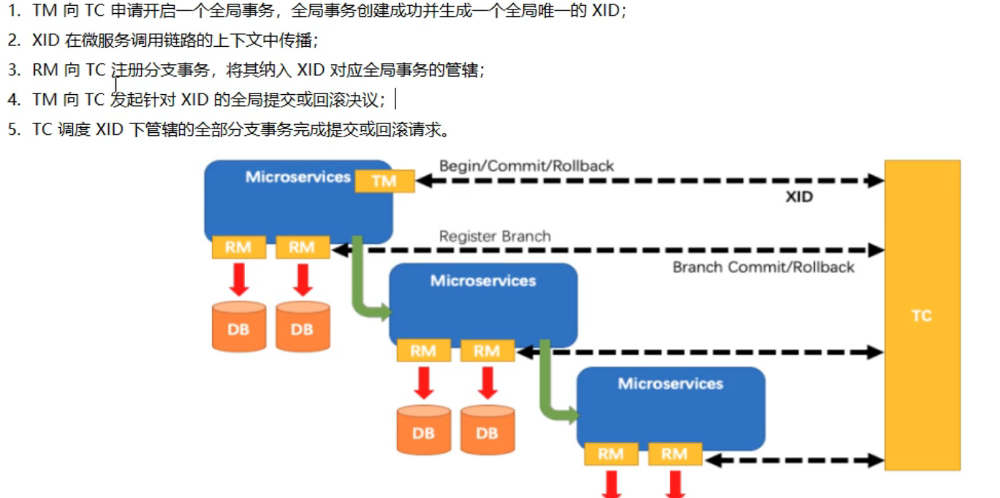

## 什么是事务？

事务是由一组SQL组成的执行单元，要么全部成功，要么全部失败。

## 不可重复读和幻读的区别是什么？

不可重复读：A事务中读取到了B事务中修改的已提交的数据。 

幻读：A事务中读取到了B事务中新增或者删除的数据，总的数据条目发生了变化。

## 本地事务和分布式事务的区别？

分布式事务涉及到不同的数据库

## 什么分布式CAP定理？

C    一致性    

A    可用性

P    分区容错性

## 基于XA协议的两阶段提交

## 基于activemq的分布式事务解决方案

# seata

## 简单描述下Seata

Seata是一款开源的分布式事务解决方案，致力于在微服务架构下提供高性能和简单易用的分布式事务服务

## Seata的核心模块

> 分布式事务处理过程的全局唯一的事务ID+三组件模型

**Transaction ID XID   全局唯一的事务ID**

**Transaction Coordinator(TC)     事务协调器，维护全局事务的运行状态，负责协调并驱动全局事务的提交或回滚;**

**Transaction  Manager(TM)    控制全局事务的边界，负责开启一个全局事务，并最终发起全局提交或全局回滚的决议;**

**Resource Manager(RM)   控制分支事务，负责分支注册，状态汇报，并接收事务协调器的指令，驱动分支（本地）事务的提交和回滚；**

